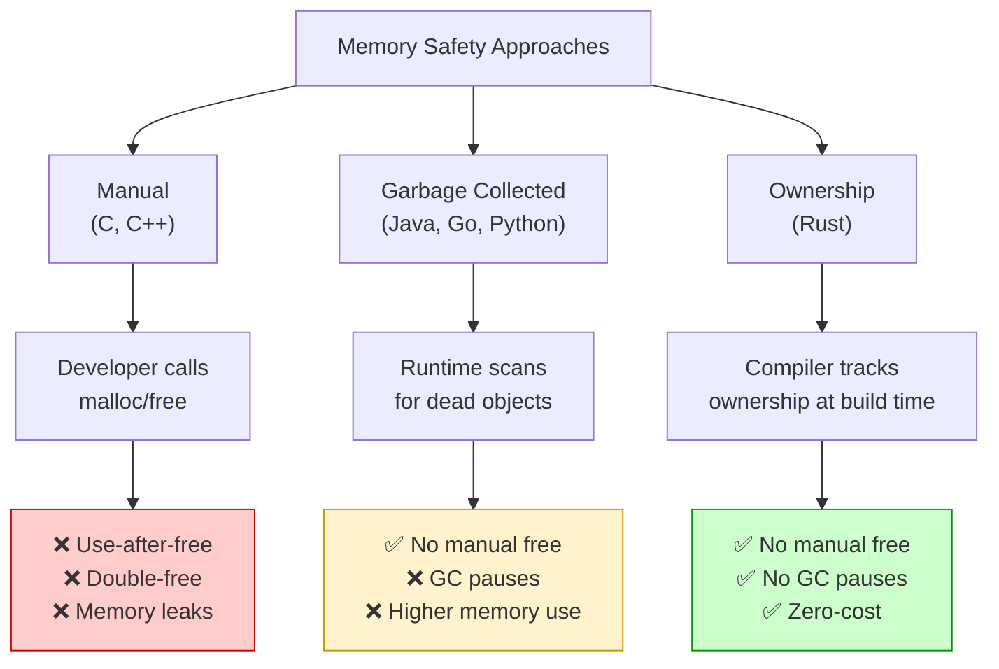

# Why Rust? 🦀

> **The language that says: "You can have it all — speed, safety, AND great developer experience."**

---

## Table of Contents

- [The Problem Rust Solves](#the-problem-rust-solves)
- [A Brief History](#a-brief-history)
- [The Three Pillars of Rust](#the-three-pillars-of-rust)
- [Who Uses Rust?](#who-uses-rust)
- [What Can You Build with Rust?](#what-can-you-build-with-rust)
- [The "Most Loved Language"](#the-most-loved-language)
- [Common Myths About Rust](#common-myths-about-rust)
- [Is Rust Right for You?](#is-rust-right-for-you)
- [Summary](#summary)

---

## The Problem Rust Solves

To understand *why* Rust exists, let's first understand the problem.

### The Old Dilemma: Speed vs Safety

For decades, programmers faced a painful choice:

```
Option A: Use C or C++
  ✅ Blazing fast (direct hardware access)
  ✅ No garbage collector slowing things down
  ❌ Memory bugs (segfaults, buffer overflows, use-after-free)
  ❌ These bugs cause ~70% of security vulnerabilities (Microsoft, Google data)
  ❌ Hard to write correct concurrent code

Option B: Use Python, Java, Go, JavaScript, etc.
  ✅ Memory safe (garbage collector handles cleanup)
  ✅ Easier to write
  ❌ Slower (garbage collector pauses, runtime overhead)
  ❌ Higher memory usage
  ❌ Less control over hardware
```

### Real-World Consequences

These aren't theoretical problems. They cause real damage:

- **The Heartbleed Bug (2014)**: A buffer over-read in OpenSSL (written in C) exposed passwords and private keys for ~17% of the internet's secure web servers.
- **WannaCry Ransomware (2017)**: Exploited a buffer overflow in Windows (C/C++ codebase) and infected 200,000+ computers across 150 countries.
- **Microsoft's Data**: Microsoft reported that **~70% of all security vulnerabilities** in their products are memory safety issues from C/C++ code.
- **Google Chrome**: Google found that **~70% of serious security bugs** in Chrome are memory safety problems.

### How Other Languages Handle Memory — A Deep Comparison

To truly appreciate what Rust does, let's understand every approach to memory management that has ever been tried:

#### 1. Manual Memory Management (C, C++)

You, the programmer, explicitly allocate and free memory:

```c
// C example
int *data = malloc(100 * sizeof(int));  // YOU allocate
// ... use data ...
free(data);                              // YOU free — forget this and memory leaks!
data = NULL;                             // YOU nullify — forget this and use-after-free!
```

**The problem:** Humans forget. In a codebase with millions of lines, someone WILL forget to call `free()`, or they'll call it twice (double-free), or they'll use the pointer after freeing (use-after-free). These bugs can lurk for years before exploding in production.

**Where it's stored in memory:** When you call `malloc()`, the operating system's memory allocator finds a free chunk on the **heap** — a large, unstructured region of memory. The allocator maintains a free list (or more complex data structures like buddy allocators or slab allocators) to track which chunks are in use. When you call `free()`, the chunk is returned to the free list. If you forget, that chunk is permanently lost until the program exits — that's a memory leak.

#### 2. Reference Counting (Objective-C ARC, Swift, Python's CPython)

Every object keeps a counter of how many references point to it. When the count reaches zero, the object is freed:

```python
# Python uses reference counting internally
a = [1, 2, 3]    # refcount = 1
b = a             # refcount = 2
del a             # refcount = 1
del b             # refcount = 0 → freed!
```

**The problem:** Circular references. If object A points to object B and B points to A, both refcounts stay at 1 even when nothing else references them — they'll never be freed (memory leak). Python solves this with a backup garbage collector, but that's extra overhead.

**Where it's stored in memory:** The reference count is typically stored as an integer right next to the object's data on the heap — often as a header before the actual payload. In CPython, every object starts with `ob_refcnt` (a `Py_ssize_t`) and `ob_type` (a type pointer). This means every single Python object has at least 16 bytes of overhead just for bookkeeping.

#### 3. Tracing Garbage Collection (Java, C#, Go, JavaScript)

A runtime component periodically scans all of memory, finds objects that are no longer reachable from any "root" (local variable, static variable), and frees them:

```java
// Java — the GC handles everything
String name = new String("Alice");  // Allocated on heap
name = null;                         // The old String is now unreachable
// At some point, the GC will find it and free it
```

**The problem:** GC pauses. When the garbage collector runs, it may need to stop your program briefly (a "stop-the-world" pause). For most applications this is fine, but for real-time systems (games at 60fps, trading systems, audio processing), these pauses cause jank, missed deadlines, or dropped audio frames. Modern GCs (like Java's ZGC) have reduced pauses dramatically, but they still exist and add complexity.

**Where it's stored in memory:** GC'd objects live on a managed heap that the runtime controls entirely. Java's heap is divided into generations — young generation (Eden space, survivor spaces) and old generation. New objects go in Eden; if they survive a GC cycle, they're promoted to survivor space, then eventually to old generation. The GC uses algorithms like mark-and-sweep, mark-and-compact, or copying collection to find and free dead objects. All of this is invisible to the programmer but consumes CPU time and memory.

#### 4. Ownership (Rust — a completely new approach)

Rust's insight: **the compiler can figure out when to free memory by analyzing the structure of your code at compile time.** No runtime overhead, no GC pauses, no manual free calls, no reference counting.

```rust
fn main() {
    let name = String::from("Alice");  // Allocated on heap
    println!("{}", name);
}  // `name` goes out of scope here — Rust automatically frees the memory
   // No GC, no free(), no reference counting. The compiler inserts the
   // deallocation code at exactly the right place.
```

**Where it's stored in memory:** Same as C — data can be on the stack (for fixed-size types) or the heap (for dynamic sizes like `String`, `Vec`). But unlike C, the compiler tracks ownership and inserts deallocation calls (`drop()`) at exactly the right point based on scope analysis. There is literally ZERO runtime overhead compared to hand-written C code that does memory management perfectly.

### The Historical Origins of the Memory Safety Problem

The root of the problem goes back to **1972**, when Dennis Ritchie created C at Bell Labs. C was designed to be a "portable assembly language" — it gives you raw pointers that are just memory addresses. This was revolutionary for writing Unix, but it meant the programmer was responsible for using those pointers correctly.

For 50 years, billions of dollars in damage and countless security breaches have resulted from this single design decision. In 2019, Alex Gaynor and Geoffrey Thomas presented data showing that **~70% of all serious security vulnerabilities** in large C/C++ codebases (Microsoft, Google, Mozilla) are memory safety issues.

Rust was born from this realization: **we can have the speed of C without the danger, if we're willing to let the compiler enforce the rules.**

### The Question

> "Can we have the speed and control of C/C++ WITHOUT the memory safety nightmares?"

**Rust's answer: Yes.**

---

## A Brief History

| Year | Event |
|------|-------|
| 2006 | Graydon Hoare starts Rust as a personal project at Mozilla |
| 2009 | Mozilla officially sponsors Rust development |
| 2010 | First public announcement of Rust |
| 2012 | First numbered alpha release |
| 2015 | **Rust 1.0 released** — the first stable version |
| 2016 | Rust starts winning "Most Loved Language" on Stack Overflow |
| 2021 | The **Rust Foundation** is formed (backed by AWS, Google, Microsoft, Mozilla, Huawei) |
| 2022 | Rust is adopted into the **Linux kernel** (first new language besides C in 30+ years!) |
| 2023 | The White House recommends Rust for memory-safe software |
| 2024+ | Rust adoption accelerates in industry, government, and open source |

### Why "Rust"?

The language is named after the **rust fungi** — organisms that are robust, resilient, and distributed. Also, Graydon Hoare liked that it was a short, four-letter word not taken by any other programming language.

### The Design Influences — Where Rust's Ideas Come From

Rust didn't invent everything from scratch. It's a carefully curated blend of ideas from decades of programming language research:

| Concept | Borrowed From | How Rust Adapted It |
|---------|--------------|-------------------|
| **Ownership & move semantics** | C++ (unique_ptr, RAII) | Made it the core of the language, enforced by the compiler |
| **Pattern matching** | ML, Haskell, OCaml | Exhaustive matching on enums with data |
| **Traits** | Haskell (typeclasses) | No inheritance — composition via traits |
| **Algebraic data types** | ML, Haskell | `enum` with associated data (like Haskell's `data`) |
| **Zero-cost abstractions** | C++ (Bjarne Stroustrup's principle) | Iterators, closures, generics compile to optimal code |
| **No null** | Tony Hoare's regret | `Option<T>` forces handling the "no value" case |
| **Hygiene macros** | Scheme | `macro_rules!` prevents accidental variable capture |
| **Lifetimes** | Region-based memory (Cyclone, MLKit) | Annotations describe how long references are valid |
| **Affine types** | Linear logic (substructural type theory) | Values can be used at most once (moved, not copied) |
| **Closures/lambdas** | LISP, ML, JavaScript | Three closure traits: `Fn`, `FnMut`, `FnOnce` |

Graydon Hoare (Rust's creator) was deeply influenced by the ML family of languages. He wanted to bring the safety guarantees of academic languages to systems programming, a domain traditionally dominated by C and C++. The result is a language that feels modern and expressive while compiling to code that's as fast as anything hand-written in C.

> **The key insight:** Rust proves that "safe" and "fast" are not opposites. For decades, the programming world assumed you had to choose. Rust shows that the right type system, enforced at compile time, gives you both for free.

---

## The Three Pillars of Rust

Rust is built on three core promises:

### 1. 🚀 Performance (As Fast as C/C++)

Rust compiles to native machine code, just like C and C++. There is:
- **No garbage collector** — Rust manages memory at compile time
- **No runtime overhead** — no virtual machine, no interpreter
- **Zero-cost abstractions** — high-level features compile down to the same code you'd write by hand

```
What does "zero-cost abstraction" mean?

It means: If you use a nice, readable high-level feature (like iterators),
the compiled code is JUST AS FAST as if you wrote an ugly, manual low-level loop.
You get readability AND performance. No trade-off.
```

#### How Zero-Cost Abstractions Actually Work

This isn't marketing — let's see it in action. Consider this Rust iterator chain:

```rust
let sum: i32 = (1..=1000).filter(|x| x % 2 == 0).sum();
```

This reads beautifully: "take numbers 1 to 1000, keep the even ones, sum them." You might expect this to create intermediate collections, allocate memory for each step, and be slow. But Rust compiles this to nearly the same assembly as:

```rust
let mut sum = 0i32;
let mut i = 1;
while i <= 1000 {
    if i % 2 == 0 { sum += i; }
    i += 1;
}
```

The compiler **inlines** the iterator methods, **removes** the closure overhead, and **optimizes** the loop — producing machine code that is identical (or within a few instructions) of the hand-written version. This is Bjarne Stroustrup's original vision for C++ ("what you don't use, you don't pay for"), but Rust achieves it more consistently because the compiler has better guarantees about aliasing and mutation.

#### What "Native Machine Code" Means

When Python runs `print("hello")`, this happens:
1. The Python interpreter (written in C) reads your `.py` file
2. It compiles it to bytecode (`.pyc`)
3. The Python virtual machine executes the bytecode, interpreting each instruction
4. Every variable access goes through dictionaries, type checks happen at runtime

When Rust runs `println!("hello")`, this happened (past tense — at compile time):
1. `rustc` compiled your `.rs` file directly to x86-64 (or ARM) machine instructions
2. No interpreter exists at runtime — the CPU executes your code directly
3. Variables are memory addresses, types are erased (the CPU doesn't know about types)
4. The resulting binary is a standalone executable that needs nothing else to run

This is why Rust is 10-100x faster than Python for most tasks. There's simply less work happening at runtime.

### 2. 🛡️ Safety (No More Memory Bugs)

Rust's **ownership system** eliminates entire categories of bugs at **compile time** (before your program even runs):

- ❌ No null pointer dereferences (Rust has no null!)
- ❌ No use-after-free
- ❌ No double-free
- ❌ No buffer overflows
- ❌ No data races in concurrent code

The **borrow checker** — Rust's compile-time analyzer — enforces these rules. If your code compiles, these bugs are **impossible**.

```
Think of it this way:

C/C++:   "I trust you, programmer. Don't mess up."     → Bugs found at 3 AM in production
Python:  "I'll clean up after you with a garbage collector." → Slower, uses more memory
Rust:    "I'll check your work at compile time."         → Bugs caught before you even run the code
```

#### What Exactly Does the Borrow Checker Prevent?

Let's see concrete examples of bugs that are **impossible** in Rust but plague C/C++:

**Use-after-free (impossible in Rust):**
```c
// C — compiles fine, crashes at runtime
char *str = malloc(10);
strcpy(str, "hello");
free(str);
printf("%s", str);  // 💥 Use-after-free! Reading freed memory. 
                     // Could print garbage, crash, or be exploited by hackers.
```

In Rust, the compiler would reject this at compile time — once you transfer ownership or a value goes out of scope, you simply cannot use it anymore.

**Data race (impossible in safe Rust):**
```c
// C — two threads modifying the same data
int counter = 0;
// Thread 1: counter++;  (reads 0, calculates 1, writes 1)
// Thread 2: counter++;  (reads 0, calculates 1, writes 1)
// Result: counter = 1, not 2! A silent data corruption.
```

In Rust, the type system ensures that if one thread can write to data, no other thread can read or write to it simultaneously. This is enforced at compile time through the ownership and borrowing rules.

**Null pointer dereference (impossible in Rust):**
```java
// Java — the "billion dollar mistake"
String name = null;
System.out.println(name.length());  // 💥 NullPointerException at runtime
```

Rust has no null. If a value might be absent, you must use `Option<T>`, which forces you to handle both `Some(value)` and `None` before you can access the inner value. The compiler won't let you forget.

### 3. 🤝 Concurrency Without Fear

Modern programs need to do multiple things at once (use all CPU cores). But concurrent code is **notoriously bug-prone** in most languages:

- **Data races**: Two threads accessing the same data, one writing → corruption
- **Deadlocks**: Two threads waiting for each other forever
- **Race conditions**: Program behavior depends on unpredictable timing

Rust prevents **data races at compile time**. The same ownership system that prevents memory bugs also prevents shared mutable access across threads.

```
In Rust, if your concurrent code compiles, data races are IMPOSSIBLE.
That's what "fearless concurrency" means.
```

---

## Who Uses Rust?

Rust isn't a toy language. It's used in production by the biggest companies in the world:

### Tech Giants

| Company | How They Use Rust |
|---------|------------------|
| **Microsoft** | Windows kernel components, Azure IoT Edge, VS Code search (ripgrep) |
| **Google** | Android (Bluetooth, networking), Chrome, Fuchsia OS |
| **Amazon (AWS)** | Firecracker (runs Lambda & Fargate), Bottlerocket OS |
| **Meta (Facebook)** | Source control (Mononoke), Libra/Diem blockchain |
| **Apple** | Undisclosed systems work (many Rust job postings) |
| **Cloudflare** | HTTP proxy (Pingora handles ~1 trillion requests/day) |
| **Discord** | Rewrote Go services in Rust — 10x performance improvement |
| **Dropbox** | File sync engine |
| **Mozilla** | Servo browser engine, parts of Firefox |
| **Figma** | Real-time multiplayer server |

### Notable Projects

- **Linux Kernel**: Rust is the second language ever allowed in the Linux kernel (after C, in 30+ years)
- **Android**: Google mandated that new Android code favoring memory safety should use Rust
- **npm**: The npm registry uses Rust for critical performance paths
- **1Password**: The core engine is written in Rust

### Startups & Open Source

Thousands of startups and open source projects use Rust:
- **Deno** (JavaScript runtime, alternative to Node.js)
- **SurrealDB** (database)
- **Tauri** (alternative to Electron for desktop apps)
- **Polars** (dataframes library, faster than pandas)

---

## What Can You Build with Rust?

Rust is a **general-purpose** language. You can build almost anything:

| Domain | Examples |
|--------|----------|
| **Command-line tools** | ripgrep, bat, exa, fd, procs, tokei |
| **Web servers & APIs** | Axum, Actix-web, Rocket |
| **Systems programming** | Operating systems, drivers, embedded |
| **WebAssembly** | Run Rust in the browser at near-native speed |
| **Game development** | Bevy engine, Veloren (open world RPG) |
| **Blockchain** | Solana, Polkadot, Near Protocol |
| **Networking** | Cloudflare Pingora, linkerd proxy |
| **Databases** | SurrealDB, TiKV (used by TiDB) |
| **Machine Learning** | Hugging Face's tokenizers, burn, candle |
| **Desktop Apps** | Tauri (Electron alternative), Slint |
| **Embedded/IoT** | Microcontrollers, real-time systems |

---

## The "Most Loved Language"

Rust has been the **#1 most loved/admired programming language** on Stack Overflow's Developer Survey for **8 consecutive years** (2016–2023). In 2024, it remains at the top.

What does "most loved" mean? It measures the percentage of developers who **used the language and want to continue using it**. For Rust, that number is consistently above **80%**.

### Why Do Developers Love It?

1. **The compiler is your friend** — Rust's error messages are famously helpful. They don't just say "ERROR", they tell you *why* it's wrong and *how to fix it*.

2. **If it compiles, it (usually) works** — The strict type system and borrow checker catch so many bugs that Rust programs are remarkably correct once they compile.

3. **Cargo** — The best package manager in any language (we'll cover this in tutorial 4).

4. **Amazing documentation** — The Rust community values docs. The standard library, popular crates, and official tutorials are excellent.

5. **Welcoming community** — The Rust community has an official Code of Conduct and is known for being helpful to newcomers.

---

## Common Myths About Rust

### Myth 1: "Rust is too hard to learn"

**Reality**: Rust has a learning curve, but it's not as steep as people claim. The concepts (ownership, borrowing) are new, but once they click (usually in 2-4 weeks), everything makes sense. This tutorial series is designed to make that "click" happen as painlessly as possible.

### Myth 2: "Rust is only for systems programming"

**Reality**: While Rust excels at systems programming, it's used for web APIs, CLI tools, WebAssembly, games, data processing, and much more. If anything, it's a great **general-purpose** language.

### Myth 3: "Fighting the borrow checker wastes time"

**Reality**: Yes, the borrow checker rejects some code. But it rejects code that **would have bugs** in other languages. The time you "lose" fighting the borrow checker is time you would have spent debugging memory corruption, data races, or segfaults. It's a net time savings.

### Myth 4: "You need to know C/C++ first"

**Reality**: Absolutely not. You can learn Rust as your first systems-level language. This tutorial assumes no C/C++ knowledge.

### Myth 5: "Rust doesn't have a big ecosystem"

**Reality**: [crates.io](https://crates.io) has over **140,000+** packages (called "crates"). There are excellent crates for web servers, databases, serialization, HTTP clients, command-line parsing, and everything else you'd need.

---

## Is Rust Right for You?

### Rust is a GREAT choice if you want to:

- ✅ Build **fast** software (performance-critical applications)
- ✅ Write **reliable** software (fewer bugs in production)
- ✅ Learn a language that makes you a **better programmer** (ownership concepts transfer to any language)
- ✅ Work on **systems-level** projects (OS, embedded, networking)
- ✅ Build **CLI tools** that are fast and dependency-free
- ✅ Write **web services** that handle massive scale
- ✅ Learn a language in **high demand** with great salaries

### Rust might not be the best choice if you:

- ❌ Need the fastest possible development speed for a prototype (Python is faster to write)
- ❌ Are building a simple CRUD app with no performance needs (Go or any language works fine)
- ❌ Need to work in an ecosystem where Rust has limited libraries (mobile development, for example)

### Rust Salaries

Rust developers are among the **highest-paid** in the industry. According to Stack Overflow's survey, Rust developers have a median salary higher than C++, Java, Python, and JavaScript developers.

---

## Quick Visual Summary: How Languages Handle Memory Safety



### What You'd Expect vs What Rust Does

Most programmers coming from other languages expect that safety requires a runtime cost. Here is a side-by-side comparison:

```rust
// Python-style thinking: "I'll just let the GC handle it"
// Java-style thinking:   "new String() — GC will clean up"
// C-style thinking:      "malloc, use, free — hope I don't forget"

// Rust-style: ownership makes it automatic AND zero-cost
fn main() {
    let name = String::from("Alice"); // allocated on heap
    println!("Hello, {name}!");
} // `name` is automatically freed here — no GC, no manual free
  // The compiler inserted the cleanup code at compile time!
```

```rust
// What you'd expect: "Can I use a value after giving it away?"
fn main() {
    let greeting = String::from("hello");
    let moved = greeting; // ownership transferred

    // println!("{greeting}"); // ❌ COMPILE ERROR — not a runtime crash!
    // Rust catches this BEFORE your program runs.

    println!("{moved}"); // ✅ This works — `moved` owns the data now
}
```

```rust
// What you'd expect: "Can two things modify the same data?"
fn main() {
    let mut data = vec![1, 2, 3];
    // let r1 = &mut data;
    // let r2 = &mut data; // ❌ COMPILE ERROR — no two mutable refs!
    // In C, this compiles fine and causes a data race at runtime.

    let r1 = &mut data;
    r1.push(4);
    println!("{:?}", r1); // ✅ One mutable ref at a time — safe!
}
```

---

## Summary

| Point | Detail |
|-------|--------|
| **Problem** | C/C++ is fast but unsafe. Managed languages are safe but slower. |
| **Solution** | Rust gives you BOTH speed and safety via compile-time ownership checks. |
| **Speed** | As fast as C/C++, compiles to native code, no garbage collector. |
| **Safety** | No null, no use-after-free, no data races — enforced by the compiler. |
| **Concurrency** | Data races are impossible if your code compiles. |
| **Ecosystem** | 140,000+ crates, Cargo (best package manager), great docs. |
| **Adoption** | Microsoft, Google, Amazon, Meta, Cloudflare, Discord, Linux kernel. |
| **Community** | #1 most loved language 8 years running, welcoming community. |

### Key Takeaway

> Rust doesn't make you choose between speed and safety. It gives you both, and it proves it at compile time. That's why the world is rewriting critical infrastructure in Rust.

---

## What's Next?

Now that you know *why* Rust exists and what it's capable of, let's get it installed on your machine.

**Next Tutorial:** [Installing Rust →](./02-installing-rust.md)

---

<p align="center">
  <i>Tutorial 1 of 6 — Stage 1: The Starting Line</i>
</p>
