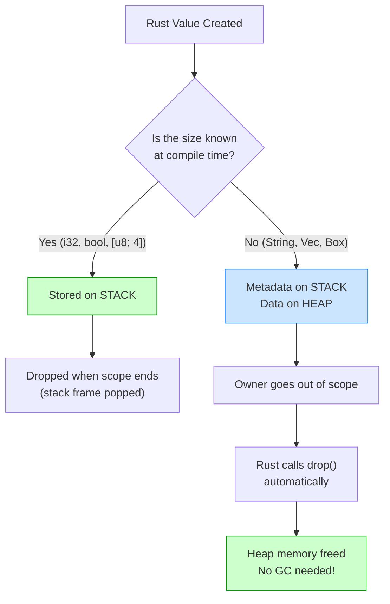

# Memory 101 — Stack & Heap 🧠

> **Before you can understand ownership, you need to understand WHERE your data lives. Rust makes you think about memory — and that's what makes it powerful.**

---

## Table of Contents

- [Why Memory Matters](#why-memory-matters)
- [The Big Picture: How Programs Use Memory](#the-big-picture-how-programs-use-memory)
- [The Stack](#the-stack)
  - [How the Stack Works](#how-the-stack-works)
  - [Stack Frames](#stack-frames)
  - [Stack Overflow](#stack-overflow)
  - [What Lives on the Stack](#what-lives-on-the-stack)
- [The Heap](#the-heap)
  - [How Heap Allocation Works](#how-heap-allocation-works)
  - [What Lives on the Heap](#what-lives-on-the-heap)
  - [The Cost of Heap Allocation](#the-cost-of-heap-allocation)
- [Stack vs Heap — Side by Side](#stack-vs-heap--side-by-side)
- [How Rust Uses the Stack and Heap](#how-rust-uses-the-stack-and-heap)
  - [Integers and Booleans: Stack](#integers-and-booleans-stack)
  - [String: Stack + Heap](#string-stack--heap)
  - [Vec: Stack + Heap](#vec-stack--heap)
  - [References: Pointers on the Stack](#references-pointers-on-the-stack)
- [Memory Layout Diagrams](#memory-layout-diagrams)
- [The Memory Lifecycle](#the-memory-lifecycle)
- [How Other Languages Handle Memory](#how-other-languages-handle-memory)
- [Why Rust's Approach is Special](#why-rusts-approach-is-special)
- [Pointers — A Brief Introduction](#pointers--a-brief-introduction)
- [Common Misconceptions](#common-misconceptions)
- [Exercises](#exercises)
- [Summary](#summary)

---

## The History of Memory Management in Computing

Before diving into the stack and heap, it's worth understanding **how we got here**. Memory management is one of the oldest problems in computing, and every generation of languages has tried a different approach.

### A Timeline of Memory Management

```
1940s ──── 1950s ──── 1960s ──── 1970s ──── 1990s ──── 2010s ────→
  │          │          │          │          │          │
ENIAC    Assembly    LISP &     C lang     Java &     Rust
raw       manual    Algol60    malloc()     GC      ownership
memory    tracking  call stack  /free()   automatic  compile-time
```

### The Raw Memory Era (1940s–1950s)

The earliest computers — ENIAC (1945), EDVAC, UNIVAC — had **no concept of stack or heap**. Programs were sequences of instructions operating on **raw memory addresses**. Programmers loaded values into specific numbered memory cells and retrieved them by address. There was no abstraction at all — if you wanted to store a number at address 1042, you wrote it there and remembered that 1042 was "your variable."

```
ENIAC-era "programming":

  Address:  [1000] [1001] [1002] [1003] [1004] ...
  Data:     [ 17 ] [ 42 ] [  0 ] [  0 ] [  0 ] ...

  Instruction: "Add contents of 1000 to 1001, store result in 1002"
  Result:       [1002] = 59

  No stack. No heap. No functions. Just raw numbered cells.
```

Assembly language improved readability (addresses got names like `ACC` or `REG1`), but programmers still **manually tracked every byte**. Forget an address? Overwrite the wrong cell? Your program silently corrupted itself.

### The Invention of the Call Stack (1950s–1960s)

The breakthrough came from two languages: **LISP (1958)** and **Algol 60 (1960)**. These languages introduced **functions that could call other functions**, including recursion. This required an automatic way to manage function-local storage — and the **call stack** was born.

The call stack solved a critical problem: when function `A` calls function `B`, where do `B`'s local variables go? Answer: push a new frame on top of the stack. When `B` returns, pop the frame. Elegant, automatic, and fast.

| Year | Language | Memory Innovation |
|------|----------|-------------------|
| 1945 | ENIAC machine code | Raw memory addresses, no abstraction |
| 1949 | Assembly languages | Named addresses, still manual |
| 1958 | LISP | Call stack, automatic function-local storage |
| 1960 | Algol 60 | Block-scoped stack allocation |
| 1972 | C | `malloc()`/`free()` — explicit heap management |
| 1983 | C++ | `new`/`delete` + destructors (RAII) |
| 1995 | Java | Garbage collection — automatic heap management |
| 2003 | Go | Concurrent garbage collector |
| 2015 | Rust | Ownership — compile-time memory management |

### malloc/free and the C Revolution (1970s)

Dennis Ritchie's **C language (1972)** gave programmers the heap via `malloc()` and `free()`. For the first time, programs could request arbitrary amounts of memory at runtime. This was incredibly powerful — and incredibly dangerous. The programmer was **solely responsible** for freeing every allocation. Forget to free? Memory leak. Free too early? Use-after-free. Free twice? Heap corruption. These bugs plague C codebases to this day.

### Garbage Collection (1990s–2000s)

Java (1995) popularized **garbage collection**: a runtime process that automatically scans the heap and frees objects no longer in use. This eliminated entire categories of bugs — no more manual `free()`. The cost? Unpredictable pauses, higher memory usage, and a runtime that must constantly do bookkeeping. Python, JavaScript, Go, and C# all followed this model.

### Rust's Innovation (2015)

Rust asked: *what if the compiler itself could figure out when to free memory?* The ownership system analyzes your code at compile time to determine exactly when each value is no longer needed, and inserts the cleanup code automatically. **Zero runtime cost, zero GC pauses, zero memory leaks** — enforced by the compiler before your program ever runs.

This is the world we're about to explore.

---

## Why Memory Matters

Every piece of data in your program — every number, every string, every struct — lives somewhere in your computer's RAM. There are **two main places** data can live:

1. **The Stack** — fast, automatic, limited
2. **The Heap** — flexible, manual, slower

Most languages hide this from you. Rust makes it explicit because understanding it is the key to understanding **ownership**, **borrowing**, and why Rust can guarantee memory safety without a garbage collector.

```
Your Program's Memory
┌─────────────────────────┐
│     Code (Text)         │  ← Your compiled instructions
├─────────────────────────┤
│   Static/Global Data    │  ← Constants, string literals
├─────────────────────────┤
│                         │
│        Heap             │  ← Dynamic data (grows ↓)
│          ↓              │
│                         │
│        (free)           │
│                         │
│          ↑              │
│        Stack            │  ← Local variables (grows ↑)
│                         │
└─────────────────────────┘
```

---

## The Big Picture: How Programs Use Memory

When your operating system launches a program, it gives that program a chunk of memory divided into sections:

| Section | Contains | Lifetime |
|---------|----------|----------|
| **Code (Text)** | The compiled machine instructions | Entire program |
| **Static Data** | Constants, string literals, `static` variables | Entire program |
| **Heap** | Dynamically allocated data | Until explicitly freed |
| **Stack** | Local variables, function call information | Until the function returns |

The two sections we care about most are the **stack** and the **heap**.

---

## The Stack

The stack is like a **stack of plates** in a cafeteria — you can only add or remove from the **top**.

### How the Stack Works

```
Adding (push):               Removing (pop):

    ┌─────┐                     ┌─────┐
    │  C  │ ← push C            │  C  │ ← pop C (removed)
    ├─────┤                     ├─────┤
    │  B  │                     │  B  │ ← now the top
    ├─────┤                     ├─────┤
    │  A  │                     │  A  │
    └─────┘                     └─────┘
```

The technical term is **LIFO** — Last In, First Out. The last thing pushed is the first thing popped.

### Why the Stack is Fast

The stack is incredibly fast for two reasons:

1. **No searching needed:** The stack pointer always points to the top. Pushing = move the pointer up, popping = move the pointer down. It's just incrementing/decrementing a single number.

2. **No fragmentation:** Data is always contiguous (packed together). The CPU can predict and cache it efficiently.

```
Stack pointer (SP) always knows where to put the next thing:

Before push:         After push:
    SP → ┌─────┐           ┌─────┐
         │     │           │  42 │ ← new data
         ├─────┤    SP → ├─────┤
         │ old │           │ old │
         └─────┘           └─────┘

Push = write data at SP, then move SP up
Pop  = move SP down (data is just abandoned, no cleanup needed!)
```

### Stack Frames

Every time you call a function, a **stack frame** is pushed onto the stack. The frame contains:
- The function's local variables
- The function's parameters
- The return address (where to go back to)

```rust
fn main() {
    let x = 10;        // main's stack frame
    let y = 20;
    let result = add(x, y);
    println!("{}", result);
}

fn add(a: i32, b: i32) -> i32 {
    let sum = a + b;    // add's stack frame
    sum
}
```

Here's what the stack looks like at each point:

```
Step 1: main() starts          Step 2: add() called          Step 3: add() returns
┌─────────────────┐            ┌─────────────────┐           ┌─────────────────┐
│                  │            │ add's frame:     │           │                  │
│                  │            │   sum = 30       │           │                  │
│                  │            │   b = 20         │           │                  │
│                  │            │   a = 10         │           │                  │
│                  │            │   return → main  │           │                  │
├─────────────────┤            ├─────────────────┤           ├─────────────────┤
│ main's frame:    │            │ main's frame:    │           │ main's frame:    │
│   result = ???   │            │   result = ???   │           │   result = 30    │
│   y = 20         │            │   y = 20         │           │   y = 20         │
│   x = 10         │            │   x = 10         │           │   x = 10         │
└─────────────────┘            └─────────────────┘           └─────────────────┘

SP points here ↑               SP points here ↑              SP points here ↑
(top of main frame)            (top of add frame)            (back to main frame)
```

When `add()` returns:
1. The return value (30) is copied to where `main()` expects it
2. The stack pointer moves back down 
3. `add()`'s frame is effectively gone (the memory is simply abandoned)

### Stack Overflow

The stack has a **fixed size** (typically 1-8 MB depending on the OS). If you use too much, you get a **stack overflow**:

```rust
// ❌ This will crash with a stack overflow!
fn infinite_recursion() {
    infinite_recursion();  // Each call adds a stack frame
}                          // Eventually we run out of stack space

fn main() {
    infinite_recursion();
    // thread 'main' has overflowed its stack
}
```

```
After thousands of recursive calls:

┌─────────────────┐ ← Stack limit reached! 💥
│ recursion frame  │
│ recursion frame  │
│ recursion frame  │
│ recursion frame  │
│ recursion frame  │
│ recursion frame  │
│ ... hundreds ... │
│ recursion frame  │
│ main frame       │
└─────────────────┘
```

### What Lives on the Stack

Data goes on the stack when the compiler **knows its size at compile time**:

| Type | Size | Stack? |
|------|------|--------|
| `i32` | 4 bytes | ✅ Yes |
| `f64` | 8 bytes | ✅ Yes |
| `bool` | 1 byte | ✅ Yes |
| `char` | 4 bytes | ✅ Yes |
| `(i32, f64)` | 12 bytes (with padding: 16) | ✅ Yes |
| `[i32; 5]` | 20 bytes | ✅ Yes |
| `&str` (reference) | 16 bytes (ptr + len) | ✅ Yes |
| `String` metadata | 24 bytes (ptr + len + capacity) | ✅ Yes (but data is on heap) |

---

## The Heap

The heap is like a **warehouse** — you can store things anywhere, but you need to keep track of where you put them.

### How Heap Allocation Works

When you need memory on the heap:

1. **Request:** Your program asks the memory allocator for some bytes
2. **Search:** The allocator finds a free block big enough
3. **Return:** The allocator gives you a **pointer** — the address of that block
4. **Use:** You read/write through the pointer
5. **Free:** When done, you tell the allocator that block is free again

```
Heap (simplified):

Before allocation:
┌──────┬───────────┬──────┬────────────┐
│ used │   free    │ used │   free     │
└──────┴───────────┴──────┴────────────┘

Request: "I need 20 bytes"

After allocation:
┌──────┬─────┬─────┬──────┬────────────┐
│ used │ NEW │free │ used │   free     │
└──────┴──┬──┴─────┴──────┴────────────┘
          │
          └── Pointer returned to you: 0x7f3a (example address)
```

### What Lives on the Heap

Data goes on the heap when its **size is unknown at compile time** or when it needs to **outlive the current function**:

| Type | Why Heap? |
|------|-----------|
| `String` | Text length unknown at compile time |
| `Vec<T>` | Number of elements unknown at compile time |
| `Box<T>` | Explicitly heap-allocated value |
| `HashMap<K, V>` | Dynamic size |
| Any dynamically sized data | Can't predict size |

### The Cost of Heap Allocation

The heap is **slower** than the stack for several reasons:

```
Stack allocation:  ~1 nanosecond  (just move a pointer)
Heap allocation:   ~25-100+ ns    (search for space, bookkeeping)
                   ↑
                   25-100x slower!
```

Why is the heap slower?

1. **Searching for space:** The allocator must find a free block large enough
2. **Bookkeeping:** The allocator tracks which blocks are used/free
3. **Fragmentation:** Free blocks may be scattered, causing inefficiency
4. **Cache misses:** Heap data can be anywhere in memory, breaking CPU cache predictions
5. **Synchronization:** In multi-threaded programs, the heap allocator needs locks

```
CPU Cache Efficiency:

Stack (data is contiguous):
[A][B][C][D][E][F]  ← CPU loads entire cache line, all useful!

Heap (data is scattered):
[A]...[gap]...[B]...[gap]...[C]  ← Cache loads gaps too, wasteful!
```

---

## Stack vs Heap — Side by Side

| Property | Stack | Heap |
|----------|-------|------|
| **Speed** | Very fast (~1ns) | Slower (~25-100ns) |
| **Size** | Fixed (1-8 MB typical) | Limited only by system RAM |
| **Allocation** | Automatic (push/pop) | Manual (alloc/free) |
| **Access pattern** | LIFO (last in, first out) | Random access via pointers |
| **Fragmentation** | None | Can fragment over time |
| **Data size** | Must be known at compile time | Can be dynamic |
| **Lifetime** | Until function returns | Until explicitly freed |
| **Thread safety** | Each thread has its own stack | Shared (needs synchronization) |
| **Cache friendly** | Yes (contiguous) | Often no (scattered) |

---

## How Other Languages Handle Memory — A Deep Comparison

Every language must answer the question: *who is responsible for freeing heap memory?* The answer defines the language's character. Let's look at how six major languages solve this problem, along with their real-world consequences.

### C/C++: Manual Management

In C, the programmer calls `malloc()` to allocate and `free()` to deallocate. In C++, `new`/`delete` serve the same role (with constructors/destructors added). The programmer has **total control** — and total responsibility.

A 2019 Microsoft study found that **~70% of all security vulnerabilities** in their codebase were memory safety issues: use-after-free, buffer overflows, double frees. Google reported similar numbers for Chromium. Manual memory management is the **#1 source of critical bugs** in systems software.

```c
// C: Every malloc needs a matching free. Miss one? Memory leak.
char *buf = malloc(1024);
process(buf);
free(buf);       // Forget this line → leak. Use buf after → crash.
```

### Java/C#: Stop-the-World Garbage Collection

Java and C# use **tracing garbage collectors** that periodically pause the entire program to scan the heap for unreachable objects. Modern JVM GCs (G1, ZGC, Shenandoah) have reduced pause times, but they still exist. A typical Java application uses **2–5x more memory** than the equivalent C program because dead objects accumulate between GC cycles.

```
Java GC cycle (simplified):

  [Program runs]  →  [GC PAUSE: scan heap, find dead objects]  →  [Program resumes]
      100ms                   5-50ms pause                           100ms
                                  ↑
                     "Stop the world" — ALL threads freeze
```

### Python: Reference Counting + Cycle Detector

Python attaches a **reference count** to every single object. When a variable points to an object, the count increments. When it stops pointing, the count decrements. When the count reaches zero, the object is freed immediately. A secondary **cycle-detecting GC** handles circular references.

The overhead: every object carries an 8-byte reference count. Every assignment, function call, and scope exit updates the count. This is why Python is **50–100x slower** than C for compute-heavy tasks — the refcount bookkeeping pervades everything.

### Go: Concurrent Tri-Color Mark-and-Sweep

Go's garbage collector runs **concurrently** with the program using a tri-color mark-and-sweep algorithm. It classifies objects as white (unreachable), gray (reachable, children not scanned), and black (reachable, children scanned). This minimizes pause times to **sub-millisecond** in most cases — but still consumes CPU cycles for scanning.

### JavaScript (V8): Generational Collection

V8 (Chrome/Node.js) splits the heap into a **young generation** (short-lived objects) and an **old generation** (long-lived objects). Young-gen collection is fast and frequent; old-gen collection is slower and rarer. This is optimized for the typical web workload where most objects die young.

### Rust: Ownership — Compile-Time Management

Rust resolves all memory management decisions **at compile time**. The compiler inserts `drop()` calls at exactly the right points in the generated code. There is no runtime scanner, no reference counting, no pauses.

### The Grand Comparison

| Language | Strategy | Runtime Cost | Memory Safety | Predictability | Typical Overhead |
|----------|----------|-------------|---------------|----------------|------------------|
| **C** | Manual `malloc`/`free` | Zero | ❌ None | ★★★★★ | 0% (baseline) |
| **C++** | Manual + RAII destructors | Near zero | ⚠️ Partial (RAII helps) | ★★★★☆ | ~0–2% |
| **Java** | Tracing GC (G1/ZGC) | Moderate | ✅ Full | ★★☆☆☆ | 10–30% CPU + 2–5x RAM |
| **Python** | Refcount + cycle GC | High | ✅ Full | ★★★☆☆ | 50–100x slower (interpreted) |
| **Go** | Concurrent mark-sweep | Low–moderate | ✅ Full | ★★★☆☆ | 5–15% CPU |
| **JavaScript** | Generational GC (V8) | Moderate | ✅ Full | ★★☆☆☆ | 10–20% CPU |
| **Rust** | Ownership (compile-time) | **Zero** | ✅ **Full** | ★★★★★ | **0%** |

```
Memory Safety vs Performance — Where Languages Fall:

  Safety
    ▲
    │  Java  Python
    │    ●     ●        Go ●     Rust ●  ← Safe AND fast
    │                JS ●
    │
    │
    │        C++ ●
    │   C ●                      ← Fast but unsafe
    └──────────────────────────────────→ Performance
```

Rust occupies a unique position: it sits in the **top-right corner** — maximum safety with maximum performance. This is why it's increasingly adopted for systems programming, web infrastructure, game engines, and embedded systems.

---

## How Rust Uses the Stack and Heap

### Integers and Booleans: Stack

Simple scalar types live entirely on the stack:

```rust
fn main() {
    let x: i32 = 42;
    let y: bool = true;
    let z: f64 = 3.14;
}
```

```
Stack:
┌────────────────┐
│ z: 3.14 (f64)  │  8 bytes
├────────────────┤
│ y: true (bool)  │  1 byte (+7 padding)
├────────────────┤
│ x: 42 (i32)    │  4 bytes (+4 padding)
└────────────────┘
```

### `String`: Stack + Heap

A `String` is split between the stack and heap:

```rust
fn main() {
    let s = String::from("hello");
}
```

```
Stack                          Heap
┌──────────────────┐          ┌───┬───┬───┬───┬───┐
│ s:               │          │ h │ e │ l │ l │ o │
│   ptr ───────────│─────────→│   │   │   │   │   │
│   len: 5         │          └───┴───┴───┴───┴───┘
│   capacity: 5    │          Address: 0x7f3a
└──────────────────┘
       24 bytes                      5 bytes
```

The **stack** holds three pieces of metadata:
- **ptr** (8 bytes): Pointer to the start of the text data on the heap
- **len** (8 bytes): How many bytes are currently used
- **capacity** (8 bytes): Total heap memory allocated (can be > len)

The **heap** holds the actual character bytes.

### Why Split Across Stack and Heap?

Because the text could be any length! A string might be "hi" (2 bytes) or an entire book (millions of bytes). The stack needs to know the size of every variable at compile time, so it stores a fixed 24-byte **handle** (pointer + length + capacity) that points to the variable-length data on the heap.

### `Vec<T>`: Stack + Heap

Vectors work exactly like strings:

```rust
fn main() {
    let v = vec![10, 20, 30, 40, 50];
}
```

```
Stack                          Heap
┌──────────────────┐          ┌────┬────┬────┬────┬────┐
│ v:               │          │ 10 │ 20 │ 30 │ 40 │ 50 │
│   ptr ───────────│─────────→│    │    │    │    │    │
│   len: 5         │          └────┴────┴────┴────┴────┘
│   capacity: 5    │          (5 × 4 bytes = 20 bytes)
└──────────────────┘
       24 bytes
```

### References: Pointers on the Stack

A reference (`&T`) is just a pointer — an address stored on the stack:

```rust
fn main() {
    let x: i32 = 42;
    let r: &i32 = &x;    // r stores the address of x
    
    println!("{}", r);    // Follows the pointer to read 42
}
```

```
Stack:
┌──────────────────┐
│ r: &i32 ─────┐   │  8 bytes (just a pointer)
├──────────────│───┤
│ x: 42        ←───┘  4 bytes
└──────────────────┘
```

---

## Memory Layout Diagrams

### Multiple Variables

```rust
fn main() {
    let a: i32 = 1;
    let b: f64 = 2.5;
    let c: bool = true;
    let name = String::from("Alice");
    let nums = vec![10, 20, 30];
}
```

```
Stack (grows upward)                       Heap

┌─────────────────────────┐
│ nums:                   │
│   ptr ──────────────────│─────→ [10, 20, 30]  (12 bytes)
│   len: 3                │
│   capacity: 3           │
├─────────────────────────┤
│ name:                   │
│   ptr ──────────────────│─────→ "Alice"  (5 bytes)
│   len: 5                │
│   capacity: 5           │
├─────────────────────────┤
│ c: true                 │  1 byte
├─────────────────────────┤
│ b: 2.5                  │  8 bytes
├─────────────────────────┤
│ a: 1                    │  4 bytes
└─────────────────────────┘
```

### Function Call with String Parameter

```rust
fn greet(name: String) {
    println!("Hello, {}!", name);
}

fn main() {
    let s = String::from("World");
    greet(s);
    // s is no longer valid here! (moved into greet)
}
```

```
Step 1: Before greet() call      Step 2: During greet() call

Stack:                            Stack:
┌─────────────────┐              ┌─────────────────┐
│ main's frame:    │              │ greet's frame:   │
│   s:             │              │   name:          │ ← s's data MOVED here
│     ptr ─────────│─→ "World"   │     ptr ─────────│─→ "World"
│     len: 5       │              │     len: 5       │
│     cap: 5       │              │     cap: 5       │
└─────────────────┘              ├─────────────────┤
                                  │ main's frame:    │
                                  │   s: INVALID     │ ← no longer owns the data
                                  └─────────────────┘

Step 3: After greet() returns

Stack:                            Heap:
┌─────────────────┐              "World" ← FREED! (greet's name was dropped)
│ main's frame:    │
│   s: INVALID     │
└─────────────────┘
```

This is **ownership** in action — we'll cover it deeply in the next tutorial!

---

## The Memory Lifecycle

Every piece of memory goes through three stages:

```
1. ALLOCATE  →  2. USE  →  3. FREE

   "Give me        "Read      "I'm done,
    some space"     and         take it
                    write"      back"
```

The critical question is: **who decides when to free?**

| Language | Who Frees Memory? | How? |
|----------|-------------------|------|
| C | The programmer | `malloc()` / `free()` |
| C++ | The programmer (or RAII) | `new` / `delete`, destructors |
| Java, Python, Go, JS | Garbage collector | Automatic, periodic scanning |
| **Rust** | **The compiler** | **Ownership rules (Drop at end of scope)** |

---

## How Other Languages Handle Memory

### C: Manual Memory Management

```c
// C code — you're responsible for EVERYTHING
char *name = malloc(6);     // 1. Allocate
strcpy(name, "Alice");      // 2. Use
printf("%s\n", name);       // 2. Use
free(name);                 // 3. Free
// Forget free? → MEMORY LEAK
// Use after free? → UNDEFINED BEHAVIOR (crash, security hole)
// Free twice? → UNDEFINED BEHAVIOR
```

Problems:
- **Use-after-free:** Accessing memory after freeing it → crashes, security holes
- **Double free:** Freeing memory twice → heap corruption
- **Memory leaks:** Forgetting to free → program slowly eats all RAM
- **Dangling pointers:** Pointer to freed memory

### Java/Python/Go/JavaScript: Garbage Collection

```python
# Python — garbage collector handles everything
name = "Alice"      # 1. Allocate (automatic)
print(name)         # 2. Use
# 3. Free → happens "sometime later" when GC runs
```

Problems:
- **GC pauses:** The program freezes briefly while GC scans memory (can be 10-100+ ms)
- **Unpredictable:** You can't control WHEN memory is freed
- **Higher memory usage:** Dead objects exist until GC finds them
- **Not suitable for:** Real-time systems, embedded devices, OS kernels

### Rust: Compile-Time Ownership

```rust
fn main() {
    let name = String::from("Alice");  // 1. Allocate
    println!("{}", name);              // 2. Use
}   // 3. Free — automatically, deterministically, at this exact point
```

Advantages:
- **No GC pauses:** Memory is freed at predictable, exact points
- **No leaks:** The compiler guarantees all memory is freed
- **No use-after-free:** The compiler prevents this at compile time
- **No double-free:** Only one owner, so only one drop
- **Zero runtime cost:** All checking happens at compile time

---

## Why Rust's Approach is Special

```
        Manual (C)           GC (Java/Python)        Ownership (Rust)
        ──────────           ────────────────        ────────────────
Speed:  ★★★★★               ★★★☆☆                   ★★★★★
Safety: ★☆☆☆☆               ★★★★☆                   ★★★★★
Control:★★★★★               ★★☆☆☆                   ★★★★★
Easy:   ★☆☆☆☆               ★★★★★                   ★★★☆☆

        Fast but             Safe but                Fast AND safe
        dangerous            slow pauses             (but must learn rules)
```

Rust gives you the **speed of C** with the **safety of garbage-collected languages**. The tradeoff is that you must learn the ownership rules (which is what we're doing in this stage!).

---

## Pointers — A Brief Introduction

A pointer is simply a **memory address** — a number that tells the CPU where to look in memory.

```
RAM (simplified):
Address:  0x1000  0x1004  0x1008  0x100C  0x1010
         ┌───────┬───────┬───────┬───────┬───────┐
Data:    │  42   │  ???  │  ???  │ 0x1000│  ???  │
         └───────┴───────┴───────┴───────┴───────┘
                                    ↑
                            This is a pointer!
                            It stores the ADDRESS 0x1000,
                            which is where 42 lives.
```

In Rust, you'll mainly encounter these pointer types:

| Pointer Type | Syntax | Description |
|-------------|--------|-------------|
| Shared reference | `&T` | Read-only pointer. Cannot modify data. |
| Mutable reference | `&mut T` | Read-write pointer. Exclusive access. |
| Raw pointer | `*const T`, `*mut T` | Unsafe. Used in FFI and advanced code. |
| Smart pointer | `Box<T>`, `Rc<T>`, etc. | Pointer + automatic cleanup logic. |

For now, just remember: **a reference (`&`) is a pointer that Rust guarantees is always valid.**

---

## Common Misconceptions

### Misconception 1: "Everything on the heap is slow"

Not true. Reading/writing heap data is the same speed as stack data. What's slow is the **allocation** (asking the allocator for memory) and **cache misses** (if heap data is scattered). Once you have a pointer to heap data, accessing it is fast.

### Misconception 2: "I should avoid the heap"

No! The heap is essential for dynamic data. You can't put a user's input on the stack because you don't know the size at compile time. Use the heap when you need to. Rust's ownership model ensures heap usage is safe.

### Misconception 3: "The stack is always better"

The stack is fixed size (usually 1-8 MB). If you try to put a 10 MB array on the stack, you'll get a stack overflow. Large data belongs on the heap.

```rust
// ❌ This might stack overflow!
// let huge_array: [u8; 10_000_000] = [0; 10_000_000];

// ✅ Use a Vec (heap-allocated) for large data
let huge_vec: Vec<u8> = vec![0; 10_000_000];
```

### Misconception 4: "Rust doesn't use pointers"

Rust uses pointers everywhere! References (`&T`) are pointers. `String`, `Vec`, `Box` — all contain pointers. The difference is that Rust's compiler **validates** that pointers are used correctly.

### Misconception 5: "Stack memory is freed by calling free()"

No. Stack memory is freed automatically when the stack pointer moves back. There's no explicit free step. This is why stack allocation is so fast — it's just arithmetic on a single register.

---

## What Actually Happens in Hardware — CPU Caches and Memory Hierarchy

Understanding stack vs heap at the software level is only half the story. The **real** reason the stack is fast comes down to how modern CPUs access memory through a hierarchy of caches.

### The Memory Hierarchy Pyramid

Modern CPUs don't access RAM directly for every operation — that would be far too slow. Instead, frequently-used data is copied into progressively smaller and faster caches:

```
                    ┌─────────┐
                    │  CPU    │
                    │Registers│  ~0.3ns   (bytes, fastest)
                    ├─────────┤
                   ╱           ╲
                  ╱   L1 Cache  ╲    ~1ns     (32–64 KB)
                 ╱───────────────╲
                ╱                 ╲
               ╱    L2 Cache      ╲   ~4ns    (256 KB–1 MB)
              ╱───────────────────╲
             ╱                     ╲
            ╱      L3 Cache        ╲  ~12ns   (4–32 MB)
           ╱───────────────────────╲
          ╱                         ╲
         ╱        Main RAM (DRAM)    ╲  ~100ns  (8–64 GB)
        ╱─────────────────────────────╲
       ╱         Disk / SSD            ╲ ~10,000–100,000ns
      ╱─────────────────────────────────╲
```

Notice the **100x difference** between L1 cache (1ns) and RAM (100ns). Hitting L1 cache vs missing all caches and going to RAM is the difference between a function taking microseconds vs milliseconds.

### Why the Stack is Cache-Friendly

The stack wins at cache performance because of two principles:

**Spatial locality:** Stack data is packed contiguously. When the CPU loads one stack variable into cache, adjacent variables come along for free (an entire **cache line** of 64 bytes is loaded at once).

**Temporal locality:** Stack variables are used repeatedly in tight loops and then discarded. The same cache lines are reused continuously.

```
Stack access pattern (cache-friendly):

  Cache line (64 bytes):
  ┌──────┬──────┬──────┬──────┬──────┬──────┬──────┬──────┐
  │ x:i32│ y:i32│ z:i32│ w:i32│ a:f64      │ b:f64      │...
  └──────┴──────┴──────┴──────┴──────┴──────┴──────┴──────┘
  ↑ CPU loads ALL of this in one memory fetch (~1ns)
  ↑ Every variable in this line is now instantly accessible

Heap access pattern (cache-unfriendly):

  ptr1 → [ data at 0x1000 ]          cache line 1  ← LOAD (~100ns)
  ptr2 → [ data at 0x5F00 ]          cache line 47 ← MISS, LOAD (~100ns)
  ptr3 → [ data at 0x2A80 ]          cache line 21 ← MISS, LOAD (~100ns)
  ↑ Each pointer chase may cause a cache miss!
```

### Cache Lines and Contiguous Data

The CPU never reads a single byte from memory — it always reads a full **cache line** (typically 64 bytes). This means:

| Data Layout | Cache Behavior | Effective Cost per Element |
|-------------|----------------|---------------------------|
| Stack array `[i32; 16]` (64 bytes) | 1 cache line load → all 16 ints available | ~0.06ns each |
| Heap-scattered pointers to 16 ints | Up to 16 separate cache loads | ~100ns each |
| Ratio | | **~1,600x slower** in the worst case |

This is why `Vec<i32>` (contiguous heap array) is fast despite being on the heap — its elements are packed together, filling cache lines efficiently. The real performance killer is **pointer chasing**: following a chain of pointers to scattered heap locations.

### TLB — The Virtual Memory Tax

Your program uses **virtual addresses**, not physical RAM addresses. The CPU must translate virtual → physical addresses using a **TLB (Translation Lookaside Buffer)** — a small cache of recent translations.

Stack data, being contiguous, uses few virtual pages and rarely causes TLB misses. Scattered heap allocations can span many virtual pages, causing frequent TLB misses — each costing an extra ~10–20ns for a page table walk.

```
Virtual → Physical translation:

  Virtual Address  →  TLB lookup  →  Physical Address
  0x7FFE_1234           HIT (0ns)      0x3A01_1234     ← Stack (same page, cached)
  0x5601_ABCD           MISS (~15ns)   0x8F20_ABCD     ← Heap (new page, page walk)
```

### How This Relates to Rust

Rust's ownership model naturally encourages **stack allocation** and **contiguous heap structures**:

- Values are stack-allocated by default — no `new` keyword like Java
- `Vec<T>` stores elements contiguously (cache-friendly), unlike linked lists
- Ownership prevents aliasing, enabling the compiler to optimize memory layout
- No GC means no "object headers" inflating data size (Java adds 12–16 bytes per object)
- `#[repr(C)]` and `#[repr(packed)]` give explicit control over memory layout

```rust
// Rust defaults favor cache performance:
let nums: [i32; 8] = [1, 2, 3, 4, 5, 6, 7, 8];  // Stack: one cache line, blazing fast
let vec_nums = vec![1, 2, 3, 4, 5, 6, 7, 8];     // Heap but contiguous: still cache-friendly

// Compare with a language like Java:
// Integer[] nums = {1, 2, 3, 4, 5, 6, 7, 8};
// Each Integer is a separate heap object with a 16-byte header!
// 8 objects × 16 bytes overhead = 128 bytes of pure waste, scattered across the heap.
```

This hardware reality is the **physical reason** Rust programs are fast. Ownership isn't just about safety — it produces code that **plays well with modern CPU architecture**.

---

## Exercises

### Exercise 1: Stack or Heap?

For each variable, determine if the data lives on the stack, the heap, or both:

```rust
let a: i32 = 100;
let b: f64 = 3.14;
let c: bool = false;
let d: [i32; 4] = [1, 2, 3, 4];
let e: String = String::from("Rust");
let f: Vec<i32> = vec![1, 2, 3];
let g: &str = "hello";
let h: (i32, f64) = (10, 2.5);
let i: &i32 = &a;
```

<details>
<summary>Answer</summary>

| Variable | Stack | Heap | Explanation |
|----------|-------|------|-------------|
| `a: i32` | ✅ | ❌ | Fixed-size integer |
| `b: f64` | ✅ | ❌ | Fixed-size float |
| `c: bool` | ✅ | ❌ | Fixed-size boolean |
| `d: [i32; 4]` | ✅ | ❌ | Fixed-size array |
| `e: String` | ✅ (metadata) | ✅ (text) | Stack has ptr+len+cap, heap has "Rust" |
| `f: Vec<i32>` | ✅ (metadata) | ✅ (elements) | Stack has ptr+len+cap, heap has [1,2,3] |
| `g: &str` | ✅ | ❌ | Pointer to static data (in binary, not heap) |
| `h: (i32, f64)` | ✅ | ❌ | Fixed-size tuple |
| `i: &i32` | ✅ | ❌ | A pointer (reference) to `a` |

</details>

### Exercise 2: Draw the Memory

Draw the stack and heap layout for this code:

```rust
fn main() {
    let age: i32 = 25;
    let name = String::from("Bob");
    let scores = vec![95, 88, 72];
    let active: bool = true;
}
```

### Exercise 3: Stack Frame Visualization

Trace through these function calls and draw the stack at the point where `multiply` is executing:

```rust
fn multiply(a: i32, b: i32) -> i32 {
    a * b  // ← Draw the stack HERE
}

fn square(n: i32) -> i32 {
    multiply(n, n)
}

fn main() {
    let x = 4;
    let result = square(x);
    println!("{}", result);
}
```

<details>
<summary>Answer</summary>

```
Stack at the moment multiply() is executing:

┌─────────────────────┐
│ multiply's frame:    │
│   b = 4              │
│   a = 4              │
│   return → square    │
├─────────────────────┤
│ square's frame:      │
│   n = 4              │
│   return → main      │
├─────────────────────┤
│ main's frame:        │
│   result = ???       │
│   x = 4              │
└─────────────────────┘
```

</details>

### Exercise 4: Why Does This Matter?

Explain in your own words why a `String` needs both stack and heap memory, while an `i32` only needs stack memory.

---

## Summary

### Key Concepts

| Concept | Description |
|---------|-------------|
| **Stack** | Fast, LIFO, fixed-size data, automatic cleanup |
| **Heap** | Flexible, any-size data, manual/ownership cleanup |
| **Stack frame** | Block of stack memory for one function call |
| **Pointer** | A memory address stored in a variable |
| **Allocation** | Requesting memory from the allocator |
| **Deallocation** | Returning memory to the allocator |

### What Goes Where

| Stack | Heap |
|-------|------|
| `i32`, `f64`, `bool`, `char` | `String` data |
| Fixed-size arrays `[T; N]` | `Vec<T>` elements |
| Tuples | `HashMap` entries |
| References (`&T`) | `Box<T>` data |
| Struct metadata (if contains heap types) | Any dynamically sized data |

### Quick Visual Summary: Memory Flow in Rust



### What You'd Expect vs What Rust Does

```rust
// In C: you must manually free heap memory
// int *p = malloc(sizeof(int)); free(p);

// In Java: garbage collector finds and frees unreachable objects
// String s = new String("hello"); // GC handles it... eventually

// In Rust: the compiler inserts free at exactly the right place
fn main() {
    let s = String::from("hello"); // allocates on heap
    println!("{s}");
} // ← Rust automatically calls `drop(s)` here. Heap freed instantly.
  // No GC scan. No manual free. No leak possible.
```

```rust
// What you'd expect: "Can I return a reference to a local variable?"
// In C: yes, and it compiles — then crashes at runtime (dangling pointer!)
// In Rust: the compiler stops you cold.

// fn dangling() -> &String {     // ❌ WON'T COMPILE
//     let s = String::from("hi");
//     &s                          // s is freed when function returns!
// }                               // Returning &s would be a dangling pointer.

// Instead, return the owned value:
fn not_dangling() -> String {
    let s = String::from("hi");
    s // ownership moves to the caller — no dangling reference!
}

fn main() {
    let result = not_dangling();
    println!("{result}"); // ✅ safe!
}
```

### Key Takeaways

1. **Stack = fast, fixed-size, automatic.** Data is cleaned up when the function returns.
2. **Heap = flexible, dynamic, slower to allocate.** Data persists until explicitly freed.
3. **Types like `String` and `Vec` use BOTH:** metadata on stack, data on heap.
4. **Rust uses ownership to manage heap memory** — no GC, no manual free, no leaks.
5. **References are safe pointers** — the compiler guarantees they're valid.
6. **Understanding memory is the foundation** for everything else in Rust.

---

## What's Next?

Now that you understand where data lives, let's learn the **rules** that govern who owns that data and what happens when ownership changes.

**Next Tutorial:** [The Three Rules of Ownership →](./02-ownership-rules.md)

---

<p align="center">
  <i>Tutorial 1 of 8 — Stage 3: Ownership</i>
</p>
