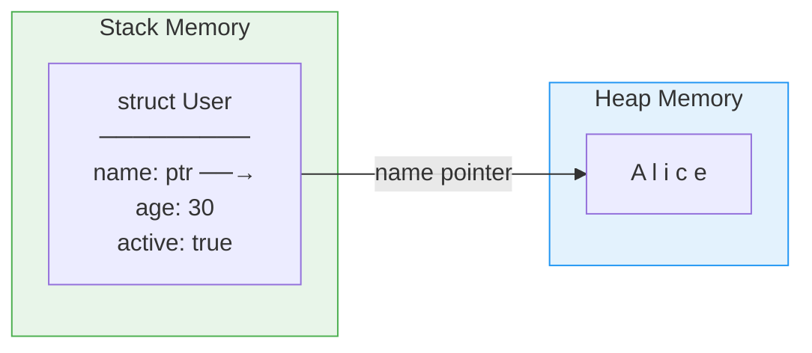

# Defining Structs 🏗️

> **Structs let you group related data together into a single, named type. They are the foundation of custom data types in Rust — think of them as blueprints for your data.**

---

## Table of Contents

- [Why Structs?](#why-structs)
- [Named-Field Structs](#named-field-structs)
  - [Defining a Struct](#defining-a-struct)
  - [Creating Instances](#creating-instances)
  - [Accessing Fields](#accessing-fields)
  - [Mutability](#mutability)
  - [Field Init Shorthand](#field-init-shorthand)
  - [Struct Update Syntax](#struct-update-syntax)
- [Tuple Structs](#tuple-structs)
  - [Newtype Pattern](#newtype-pattern)
- [Unit Structs](#unit-structs)
- [Struct Memory Layout](#struct-memory-layout)
  - [Stack vs Heap](#stack-vs-heap)
  - [Field Ordering and Padding](#field-ordering-and-padding)
- [Ownership and Structs](#ownership-and-structs)
  - [Structs That Own Data](#structs-that-own-data)
  - [Moving Structs](#moving-structs)
  - [Cloning Structs](#cloning-structs)
- [Printing Structs with Debug](#printing-structs-with-debug)
- [Common Patterns](#common-patterns)
- [Exercises](#exercises)
- [Summary](#summary)

---

## The History of Structured Data in Programming

Before we dive into Rust structs, it helps to understand *why* they exist. Structs didn't appear from nothing — they are the result of 60+ years of programming language evolution, each generation improving on the last.

### The Timeline

**Assembly (1940s–50s):** There were no structured types at all. Programmers worked with raw memory addresses and offsets. "Field access" meant calculating a byte offset by hand:

```
; Pseudo-assembly: accessing a "name" field at offset 0, "age" at offset 32
LOAD R1, [R0 + 0]    ; name
LOAD R2, [R0 + 32]   ; age
; Hope you got the offset right... there's no compiler to check.
```

**COBOL (1959):** The first language with named **record types**. Designed for business data processing, COBOL let you define structured data with readable field names — revolutionary at the time:

```cobol
01 EMPLOYEE-RECORD.
   05 EMPLOYEE-NAME    PIC X(30).
   05 EMPLOYEE-AGE     PIC 99.
   05 EMPLOYEE-SALARY  PIC 9(7)V99.
```

**Pascal (1970):** Niklaus Wirth introduced `record` types with stronger typing than C. Pascal enforced type safety more strictly, but records were still just passive data containers.

**C (1972):** Dennis Ritchie created the `struct` keyword — a minimalist abstraction that groups data fields together. C structs have no methods, no access control, and no inheritance. They are exactly what they look like: a named bag of fields.

```c
struct User {
    char name[50];
    int age;
    int active;
};
// No methods. No constructors. Just data.
```

**C++ (1983):** Bjarne Stroustrup extended C's `struct` into `class` — adding methods, access control (`public`/`private`/`protected`), constructors, destructors, and inheritance. A `struct` in C++ is actually just a `class` with everything `public` by default.

**Java (1995):** James Gosling made *everything* a class. There were no standalone structs — even simple data containers required full class ceremony with object headers, heap allocation, and garbage collection overhead. (Java didn't get lightweight `record` types until Java 14 in 2020!)

**Go (2009):** Go brought structs back to basics — no inheritance, no classes. Methods are attached externally via receiver syntax. This philosophy is strikingly similar to Rust's approach.

**Rust (2015):** Structs with `impl` blocks for methods, no inheritance whatsoever, and traits for polymorphism. Rust structs give you full control over memory layout, ownership semantics, and zero-cost abstractions.

### The Evolution at a Glance

```
Assembly       → raw bytes, manual offsets
    ↓
COBOL/Pascal   → named fields, passive records
    ↓
C              → struct keyword, still no methods
    ↓
C++            → struct + methods + inheritance = class
    ↓
Java           → everything is a class (heavyweight)
    ↓
Go / Rust      → structs + external methods, NO inheritance
```

### Comparison Table

| Language | Type Name | Has Methods? | Has Inheritance? | Memory Control? |
|----------|-----------|:------------:|:----------------:|:---------------:|
| Assembly | (none)    | —            | —                | Total (manual)  |
| COBOL    | Record    | No           | No               | None            |
| Pascal   | Record    | No           | No               | Minimal         |
| C        | struct    | No           | No               | Yes (manual)    |
| C++      | class     | Yes          | Yes              | Yes (manual)    |
| Java     | class     | Yes          | Yes              | No (GC)         |
| Go       | struct    | Yes (external)| No              | Partial (GC)    |
| Rust     | struct    | Yes (impl)   | No (uses traits) | Yes (ownership) |

The trend is clear: the industry moved from "bags of bytes" → "types with behavior" → **"types with behavior AND guarantees."** Rust sits at the end of this arc — structs that are safe, efficient, and expressive without the complexity of class hierarchies.

---

## Why Structs?

Without structs, you'd pass data around as separate variables — messy and error-prone:

```rust
// ❌ Unorganized — which string is which?
fn print_user(name: &str, email: &str, age: u32, active: bool) {
    println!("{} ({}) — age {}, active: {}", name, email, age, active);
}
```

With structs, related data is grouped together:

```rust
struct User {
    name: String,
    email: String,
    age: u32,
    active: bool,
}

// ✅ Clear, organized, self-documenting
fn print_user(user: &User) {
    println!("{} ({}) — age {}, active: {}", user.name, user.email, user.age, user.active);
}
```

---

## Named-Field Structs

### Defining a Struct

```rust
struct User {
    name: String,
    email: String,
    age: u32,
    active: bool,
}
```

Rules:
- Each field has a name and a type
- Fields are separated by commas
- Trailing comma is allowed (and encouraged by convention)
- Struct names use `PascalCase`, field names use `snake_case`

### Creating Instances

```rust
fn main() {
    let user = User {
        name: String::from("Alice"),
        email: String::from("alice@example.com"),
        age: 30,
        active: true,
    };
}
```

**You must set every field.** There's no default:

```rust
// ❌ Missing fields
// let user = User {
//     name: String::from("Alice"),
// };  // ERROR: missing email, age, active
```

### Accessing Fields

Use dot notation:

```rust
fn main() {
    let user = User {
        name: String::from("Alice"),
        email: String::from("alice@example.com"),
        age: 30,
        active: true,
    };
    
    println!("Name: {}", user.name);
    println!("Email: {}", user.email);
    println!("Age: {}", user.age);
    println!("Active: {}", user.active);
}
```

### Mutability

The entire struct instance is mutable or not — you can't mark individual fields as mutable:

```rust
fn main() {
    let mut user = User {
        name: String::from("Alice"),
        email: String::from("alice@example.com"),
        age: 30,
        active: true,
    };
    
    user.age = 31;  // ✅ Instance is mut
    user.email = String::from("alice@newmail.com");
    
    println!("{}, age {}", user.name, user.age);
}
```

### Field Init Shorthand

When a variable has the same name as a struct field, you can use shorthand:

```rust
fn create_user(name: String, email: String) -> User {
    User {
        name,     // Same as name: name
        email,    // Same as email: email
        age: 0,
        active: true,
    }
}
```

### Struct Update Syntax

Create a new struct based on an existing one, changing only some fields:

```rust
fn main() {
    let user1 = User {
        name: String::from("Alice"),
        email: String::from("alice@example.com"),
        age: 30,
        active: true,
    };
    
    // Create user2, changing only email
    let user2 = User {
        email: String::from("bob@example.com"),
        ..user1  // Fill remaining fields from user1
    };
    
    // ⚠️ user1.name was MOVED into user2!
    // println!("{}", user1.name);   // ❌ Error: value moved
    println!("{}", user1.age);       // ✅ u32 is Copy
    println!("{}", user1.active);    // ✅ bool is Copy
    println!("{}", user2.name);      // "Alice"
    println!("{}", user2.email);     // "bob@example.com"
}
```

**Important:** Struct update syntax uses **move** for non-Copy fields. Only Copy types (like `u32`, `bool`) remain usable on the original.

---

## Tuple Structs

Structs with unnamed fields — accessed by index instead of name:

```rust
struct Color(u8, u8, u8);
struct Point(f64, f64, f64);

fn main() {
    let red = Color(255, 0, 0);
    let origin = Point(0.0, 0.0, 0.0);
    
    println!("R: {}, G: {}, B: {}", red.0, red.1, red.2);
    println!("x: {}, y: {}, z: {}", origin.0, origin.1, origin.2);
}
```

Tuple structs create **distinct types**:

```rust
struct Meters(f64);
struct Kilometers(f64);

fn main() {
    let m = Meters(100.0);
    let km = Kilometers(5.0);
    
    // let x: Meters = km;  // ❌ Type mismatch! Even though both wrap f64
}
```

### Newtype Pattern

Wrapping a single value in a tuple struct to create a new type. This gives type safety at zero runtime cost:

```rust
struct UserId(u64);
struct OrderId(u64);

fn process_order(order_id: OrderId, user_id: UserId) {
    println!("Order {} for user {}", order_id.0, user_id.0);
}

fn main() {
    let user = UserId(42);
    let order = OrderId(1001);
    
    process_order(order, user);
    // process_order(user, order);  // ❌ Can't swap by accident!
}
```

---

## Unit Structs

Structs with no fields at all:

```rust
struct Marker;
struct AlwaysEqual;

fn main() {
    let m = Marker;
    let eq = AlwaysEqual;
}
```

Unit structs have zero size. They're useful when:
- Implementing a trait without storing data
- Using them as marker types
- Acting as sentinel values in type-level programming

---

## Struct Memory Layout

### Stack vs Heap

```rust
struct Point {
    x: f64,  // 8 bytes
    y: f64,  // 8 bytes
}

struct User {
    name: String,    // 24 bytes (ptr + len + cap)
    age: u32,        // 4 bytes
    active: bool,    // 1 byte
}
```

```
Point (entirely on stack):
┌─────────────┐
│ x: f64 (8B) │
│ y: f64 (8B) │
└─────────────┘
Total: 16 bytes on stack, 0 bytes on heap

User (stack metadata + heap data):
Stack:                              Heap:
┌─────────────────────┐            ┌───────────────┐
│ name.ptr ───────────────────────→│ A l i c e     │
│ name.len: 5         │            └───────────────┘
│ name.cap: 5         │
│ age: 30             │
│ active: true        │
└─────────────────────┘
```

### Field Ordering and Padding

Rust may **reorder fields** in memory for better alignment (unless you use `#[repr(C)]`):

```rust
// Logical order:
struct Example {
    a: u8,    // 1 byte
    b: u64,   // 8 bytes
    c: u8,    // 1 byte
}

// Without reordering (C layout): 24 bytes due to padding
// ┌────┬───────┬────────┬────┬───────┐
// │ a  │ pad7  │   b    │ c  │ pad7  │
// └────┴───────┴────────┴────┴───────┘
// 1 + 7 + 8 + 1 + 7 = 24 bytes

// With Rust's reordering: 16 bytes
// ┌────────┬────┬────┬──────┐
// │   b    │ a  │ c  │ pad6 │
// └────────┴────┴────┴──────┘
// 8 + 1 + 1 + 6 = 16 bytes
```

You can check sizes:

```rust
use std::mem;

fn main() {
    println!("Point: {} bytes", mem::size_of::<Point>());   // 16
    println!("User: {} bytes", mem::size_of::<User>());     // 56 (approx)
    println!("bool: {} bytes", mem::size_of::<bool>());     // 1
}
```

---

## Struct Memory Layout Deep Dive — Alignment, Padding, and `repr`

The section above showed that Rust may reorder fields. Let's go deeper into *why* and *how* — and how you can take control when it matters.

### Why CPU Alignment Matters

Modern CPUs don't read memory one byte at a time. They read in **aligned chunks** (typically 4 or 8 bytes). If a 4-byte `u32` sits at address `0x03` instead of `0x04`, the CPU may need **two** memory reads instead of one — or on some architectures (ARM, MIPS), it causes a **hardware fault**.

```
Memory addresses:
0x00  0x04  0x08  0x0C
  |     |     |     |
  ▼     ▼     ▼     ▼
┌─────┬─────┬─────┬─────┐
│     │     │     │     │  ← CPU reads in 4-byte chunks
└─────┴─────┴─────┴─────┘

Aligned u32 at 0x04:   ✅ One read
Unaligned u32 at 0x03: ❌ Spans two chunks → slow or crash
```

To prevent this, compilers insert **padding bytes** to keep fields aligned.

### Default Rust Layout vs C Layout

Here's the critical difference: **Rust may reorder fields to minimize padding. C never does.**

```rust
struct Example {
    a: u8,   // 1 byte
    b: u32,  // 4 bytes (needs 4-byte alignment)
    c: u8,   // 1 byte
}
```

**C layout** (fields stay in declaration order):
```
┌──────┬─────────────┬──────────────┬──────┬─────────────┐
│ a    │ pad (3)     │ b            │ c    │ pad (3)     │
│ 1B   │ 3B          │ 4B           │ 1B   │ 3B          │
└──────┴─────────────┴──────────────┴──────┴─────────────┘
Total: 12 bytes
```

**Rust layout** (compiler reorders to: b, a, c):
```
┌──────────────┬──────┬──────┬──────────┐
│ b            │ a    │ c    │ pad (2)  │
│ 4B           │ 1B   │ 1B   │ 2B       │
└──────────────┴──────┴──────┴──────────┘
Total: 8 bytes — 33% smaller!
```

You can verify this yourself:

```rust
use std::mem;

struct Example { a: u8, b: u32, c: u8 }

fn main() {
    println!("Size: {} bytes", mem::size_of::<Example>());  // 8 (Rust reordered)
    println!("Align: {} bytes", mem::align_of::<Example>()); // 4
}
```

### The `repr` Attributes

Sometimes you *need* to control the layout precisely:

#### `#[repr(C)]` — C-Compatible Layout

Forces fields to stay in declaration order with C's padding rules. **Required for FFI** (Foreign Function Interface) when passing structs to C libraries:

```rust
#[repr(C)]
struct FFIPoint {
    x: f32,
    y: f32,
}
// Guaranteed to match C's: struct FFIPoint { float x; float y; };
```

#### `#[repr(packed)]` — No Padding At All

Removes all padding, saving space at the cost of unaligned access:

```rust
#[repr(packed)]
struct Packed {
    a: u8,
    b: u32,
    c: u8,
}
// Size: 6 bytes (1 + 4 + 1, no padding)
// ⚠️ Taking a reference to `b` is UNSAFE — it may be unaligned!
```

#### `#[repr(align(N))]` — Force Minimum Alignment

Useful for cache-line optimization (a typical cache line is 64 bytes):

```rust
#[repr(align(64))]
struct CacheAligned {
    data: [u8; 32],
}
// Size: 64 bytes (padded to fill one cache line)
// Prevents false sharing in concurrent programs
```

### Real-World Use: Network Protocols

Network packet headers have exact byte layouts defined by RFCs. You need `repr(C)` (and sometimes `repr(packed)`) to match them:

```rust
#[repr(C, packed)]
struct EthernetHeader {
    dst_mac: [u8; 6],
    src_mac: [u8; 6],
    ether_type: u16,
}
// Exactly 14 bytes — matches the wire format
```

### Quick Reference

| Attribute | Field Order | Padding | Use Case |
|-----------|:-----------:|:-------:|----------|
| (default) | Compiler chooses | Optimized | Normal Rust code |
| `repr(C)` | Declaration order | C rules | FFI, interop with C |
| `repr(packed)` | Declaration order | None | Wire protocols, space-critical |
| `repr(align(N))` | Compiler chooses | ≥ N alignment | Cache optimization |
| `repr(C, packed)` | Declaration order | None | Exact binary layouts |

> **Rule of thumb:** Use the default layout unless you're doing FFI or binary serialization. Rust's optimizer is smarter than manual field ordering in most cases.

---

## Ownership and Structs

### Structs That Own Data

When a struct contains `String`, `Vec`, or other owned types, it **owns** that data:

```rust
struct Article {
    title: String,
    body: String,
    tags: Vec<String>,
}

fn main() {
    let article = Article {
        title: String::from("Hello Rust"),
        body: String::from("Rust is great!"),
        tags: vec![String::from("rust"), String::from("programming")],
    };
    
    // article owns title, body, and tags
    // When article goes out of scope, all are dropped
}
```

### Moving Structs

Structs with non-Copy fields are **moved**, not copied:

```rust
fn main() {
    let user1 = User {
        name: String::from("Alice"),
        email: String::from("alice@example.com"),
        age: 30,
        active: true,
    };
    
    let user2 = user1;  // MOVE! user1 is now invalid
    // println!("{}", user1.name);  // ❌ Error
    println!("{}", user2.name);     // ✅ "Alice"
}
```

### Cloning Structs

To deep copy, derive `Clone`:

```rust
#[derive(Clone)]
struct User {
    name: String,
    email: String,
    age: u32,
    active: bool,
}

fn main() {
    let user1 = User {
        name: String::from("Alice"),
        email: String::from("alice@example.com"),
        age: 30,
        active: true,
    };
    
    let user2 = user1.clone();  // Deep copy
    println!("{} {}", user1.name, user2.name);  // Both work!
}
```

---

## Printing Structs with Debug

By default, structs can't be printed. Derive `Debug` to enable `{:?}`:

```rust
#[derive(Debug)]
struct Point {
    x: f64,
    y: f64,
}

fn main() {
    let p = Point { x: 3.0, y: 4.0 };
    
    println!("{:?}", p);    // Point { x: 3.0, y: 4.0 }
    println!("{:#?}", p);   // Pretty-printed:
    // Point {
    //     x: 3.0,
    //     y: 4.0,
    // }
    
    // dbg! macro — prints to stderr with file and line info
    dbg!(&p);
    // [src/main.rs:15] &p = Point {
    //     x: 3.0,
    //     y: 4.0,
    // }
}
```

---

## Common Patterns

### Builder Pattern (Simple Version)

```rust
struct Config {
    host: String,
    port: u16,
    max_connections: u32,
    timeout_secs: u64,
}

impl Config {
    fn new(host: &str) -> Config {
        Config {
            host: host.to_string(),
            port: 8080,
            max_connections: 100,
            timeout_secs: 30,
        }
    }
}

fn main() {
    let config = Config::new("localhost");
    println!("{}:{}", config.host, config.port);
}
```

### Nested Structs

```rust
#[derive(Debug)]
struct Address {
    street: String,
    city: String,
    country: String,
}

#[derive(Debug)]
struct Person {
    name: String,
    age: u32,
    address: Address,
}

fn main() {
    let person = Person {
        name: String::from("Alice"),
        age: 30,
        address: Address {
            street: String::from("123 Main St"),
            city: String::from("Rustville"),
            country: String::from("Ferris Land"),
        },
    };
    
    println!("{} lives in {}", person.name, person.address.city);
}
```

---

## Structs and the Type System — Zero-Cost Abstractions

One of Rust's core promises is **zero-cost abstractions**: you shouldn't pay runtime overhead for using high-level types. Structs are the poster child for this philosophy.

### The Newtype Pattern Is Truly Free

When you write `struct Meters(f64)`, the compiler produces **exactly the same machine code** as using a raw `f64`. The wrapper is completely erased at compile time:

```rust
struct Meters(f64);
struct Seconds(f64);

fn speed(distance: Meters, time: Seconds) -> f64 {
    distance.0 / time.0
}

fn main() {
    let d = Meters(100.0);
    let t = Seconds(9.58);
    println!("Speed: {:.2} m/s", speed(d, t));
}
```

In the compiled binary, `Meters` and `Seconds` don't exist. It's just `f64` arithmetic. You get type safety **for free**.

```
Source code:          Compiled assembly:
─────────────         ─────────────────
Meters(100.0)    →    movsd xmm0, [100.0]   ; just a float
Seconds(9.58)    →    movsd xmm1, [9.58]    ; just a float
distance.0 / t.0 →    divsd xmm0, xmm1      ; just a division
```

### Contrast: Java's Wrapper Overhead

In Java, wrapping a primitive in a class is **not** free:

```java
// Java: wrapping a double
class Meters {
    final double value;  // 8 bytes for the double
    // + 16 bytes object header (mark word + class pointer)
    // + heap allocation + GC tracking
    Meters(double v) { this.value = v; }
}
// Total: ~24 bytes per instance, heap allocated, GC-managed
```

```
Rust Meters(f64):     Java new Meters(100.0):
┌───────────────┐     ┌────────────────────────┐
│ f64: 8 bytes  │     │ Object header: 16 bytes│
└───────────────┘     │ value: 8 bytes         │
Total: 8 bytes        └────────────────────────┘
(stack, no GC)        Total: 24 bytes (heap, GC)
```

Rust's newtypes: **8 bytes, stack-allocated, no overhead.**
Java's wrappers: **24 bytes, heap-allocated, GC-managed.**

### PhantomData — The Zero-Sized Type Marker

Sometimes a struct needs to *logically* be associated with a type without actually storing it. `PhantomData<T>` is a zero-sized type (ZST) that tells the compiler "this struct conceptually owns a `T`":

```rust
use std::marker::PhantomData;

struct Slice<'a, T> {
    start: *const T,
    len: usize,
    _marker: PhantomData<&'a T>,  // 0 bytes! Just a type-level marker.
}
```

`PhantomData` adds **zero bytes** to your struct. It exists purely for the type system — the compiler uses it for lifetime and ownership checks, then erases it entirely.

### Unit Structs — Zero Bytes, Real Power

Unit structs like `struct Marker;` occupy **zero bytes** in memory. They're useful as:

- **Trait implementors:** Implement a trait on a type that needs no data
- **State markers:** In typestate patterns, different unit structs represent different states
- **Map values:** Use as map values when you only care about keys (like a `HashSet`)

```rust
struct Locked;
struct Unlocked;

struct Door<State> {
    _state: PhantomData<State>,
}

impl Door<Locked> {
    fn unlock(self) -> Door<Unlocked> {
        Door { _state: PhantomData }
    }
}

impl Door<Unlocked> {
    fn lock(self) -> Door<Locked> {
        Door { _state: PhantomData }
    }
    fn open(&self) { println!("Door opened!"); }
}
// Door<Locked> and Door<Unlocked> are different types!
// You CAN'T call .open() on a locked door — the compiler prevents it.
// Total runtime cost of this state tracking: ZERO bytes.
```

### Real-World Example: Units of Measurement

The newtype pattern prevents catastrophic unit confusion (like the [Mars Climate Orbiter](https://en.wikipedia.org/wiki/Mars_Climate_Orbiter) crash, caused by a metric/imperial mixup):

```rust
struct Meters(f64);
struct Feet(f64);
struct Kilograms(f64);
struct Pounds(f64);

fn calculate_thrust(mass: Kilograms, distance: Meters) -> f64 {
    mass.0 * distance.0  // simplified
}

fn main() {
    let mass = Kilograms(500.0);
    let dist = Meters(1000.0);
    // calculate_thrust(Pounds(500.0), dist);  // ❌ Compile error!
    // calculate_thrust(mass, Feet(1000.0));   // ❌ Compile error!
    calculate_thrust(mass, dist);              // ✅ Types match
}
```

### The Rust Philosophy

> **"Types are free at runtime. An expressive type system is the sign of a good model."**

In Rust, adding more types (newtypes, unit structs, phantom markers) costs you **nothing** at runtime. The compiler works hard during compilation so the CPU does less work during execution. This is the opposite of many languages where more abstraction = more overhead.

| Abstraction | Runtime Size | Runtime Cost | Compiler Cost |
|-------------|:------------:|:------------:|:-------------:|
| `struct Meters(f64)` | 8 bytes (= raw f64) | Zero | Type checking |
| `struct Marker;` | 0 bytes | Zero | Type checking |
| `PhantomData<T>` | 0 bytes | Zero | Lifetime/ownership checking |
| Typestate pattern | 0 bytes | Zero | State machine verification |

---

## Exercises

### Exercise 1: Define and Use a Struct

Create a `Rectangle` struct with `width` and `height` fields (both `f64`). Write a function `area` that takes a `&Rectangle` and returns its area.

```rust
fn main() {
    let rect = Rectangle { width: 10.0, height: 5.0 };
    println!("Area: {}", area(&rect));  // 50.0
}
```

<details>
<summary>Solution</summary>

```rust
struct Rectangle {
    width: f64,
    height: f64,
}

fn area(rect: &Rectangle) -> f64 {
    rect.width * rect.height
}
```

</details>

### Exercise 2: Struct Update Syntax

Given this code, predict what prints and why:

```rust
#[derive(Debug)]
struct Config {
    debug: bool,
    level: u32,
    name: String,
}

fn main() {
    let c1 = Config {
        debug: true,
        level: 3,
        name: String::from("app"),
    };
    
    let c2 = Config {
        level: 5,
        ..c1
    };
    
    println!("{}", c1.debug);   // ?
    println!("{}", c1.level);   // ?
    // println!("{}", c1.name); // ?
    println!("{:?}", c2);       // ?
}
```

<details>
<summary>Answer</summary>

- `c1.debug` → `true` (bool is Copy)
- `c1.level` → `3` (u32 is Copy)
- `c1.name` → ❌ ERROR — `name` was moved into `c2`
- `c2` → `Config { debug: true, level: 5, name: "app" }`

</details>

---

## Summary

| Struct Kind | Syntax | Access | Use Case |
|-------------|--------|--------|----------|
| Named fields | `struct S { x: T }` | `s.x` | Most data types |
| Tuple struct | `struct S(T, U)` | `s.0, s.1` | Newtype pattern, quick grouping |
| Unit struct | `struct S;` | N/A | Marker types, trait impl |

### Quick Visual Summary: Struct Memory Layout



**What You'd Expect vs What Rust Does:**

```rust
// In most languages, structs/objects can have uninitialized fields:
// C:    struct User u;   // all fields are garbage!
// Java: User u = new User(); // fields get defaults (null, 0, false)

// In Rust: EVERY field must be initialized. No exceptions.
#[derive(Debug)]
struct User {
    name: String,
    age: u32,
}

fn main() {
    // let u = User { name: String::from("Alice") };
    // ❌ COMPILE ERROR: missing field `age`

    let u = User {
        name: String::from("Alice"),
        age: 30,
    }; // ✅ Every field initialized — no surprise nulls!
    println!("{:?}", u);
}
```

```rust
// Struct update syntax can surprise you with moves:
#[derive(Debug)]
struct Config {
    name: String,
    debug: bool,
}

fn main() {
    let c1 = Config { name: String::from("app"), debug: true };
    let c2 = Config { debug: false, ..c1 }; // `name` is MOVED from c1!

    // println!("{}", c1.name);  // ❌ c1.name was moved into c2
    println!("{}", c1.debug);    // ✅ bool is Copy — still accessible
    println!("{:?}", c2);        // ✅ c2 owns the String now
}
```

**Key Takeaways:**
1. Structs group related data under a single type
2. All fields must be initialized — no defaults
3. `mut` applies to the entire instance, not individual fields
4. Structs with non-Copy fields are moved, not copied
5. Derive `Debug` to print, `Clone` to deep copy
6. Struct update syntax (`..other`) moves non-Copy fields

---

**Next:** [Methods & Associated Functions →](./02-methods-and-impl.md)

<p align="center"><i>Tutorial 1 of 8 — Stage 4: Structuring Data</i></p>
