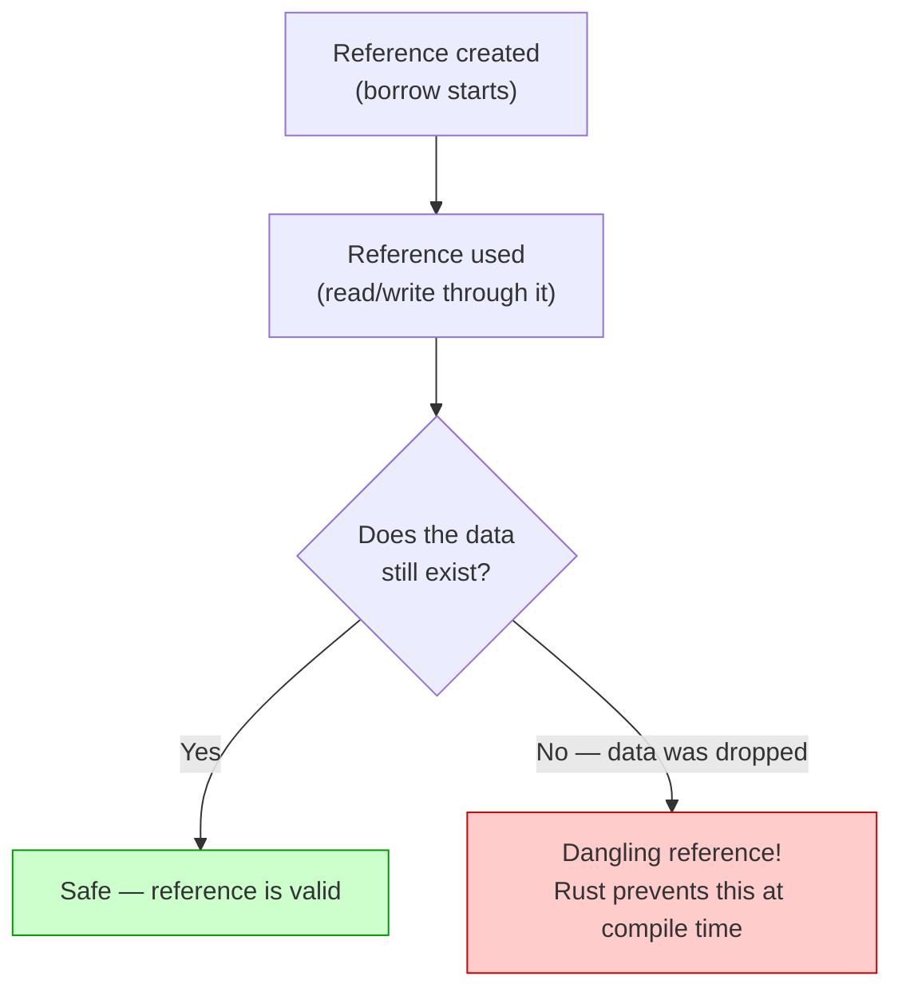
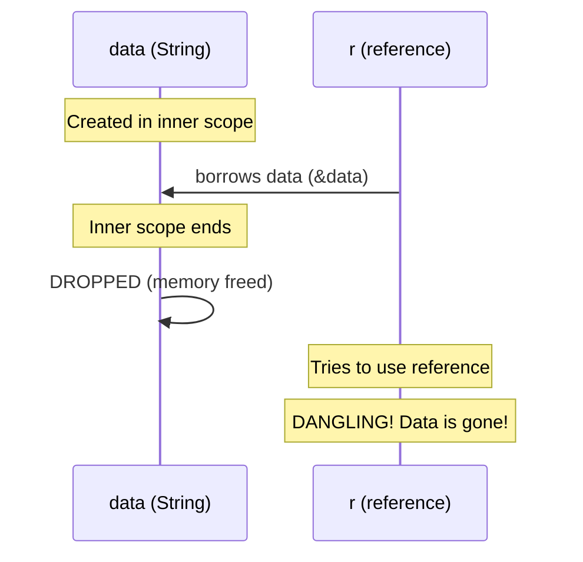
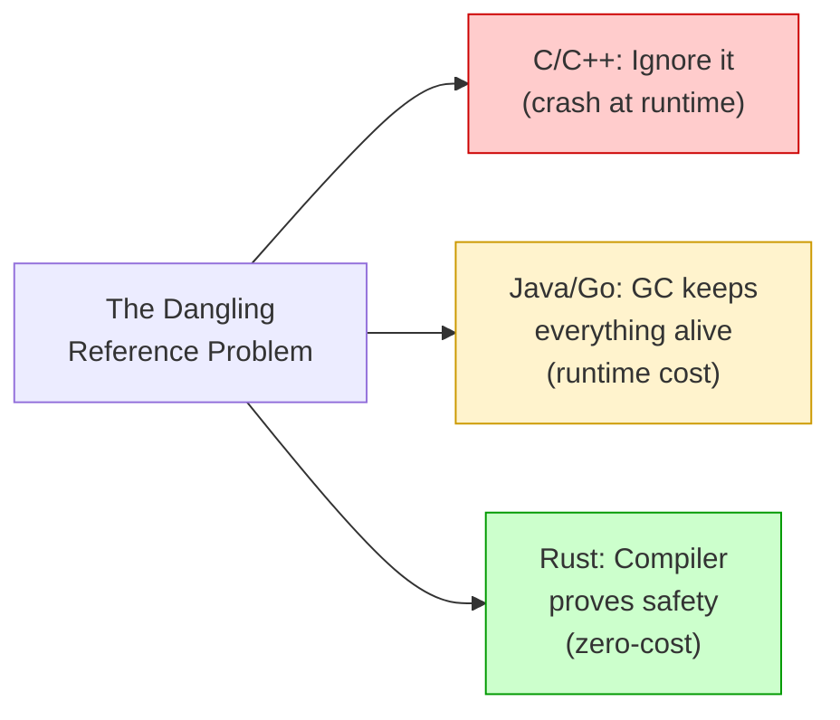

# Why Lifetimes Exist 🛡️

> **"Every reference has a lifetime — the scope for which that reference is valid. Most of the time, lifetimes are implicit and inferred. But when the compiler can't figure it out, you need to step in."**
> — *The Rust Programming Language*

---

## Table of Contents

- [The Core Problem: Dangling References](#the-core-problem-dangling-references)
- [A History of Dangling Pointers](#a-history-of-dangling-pointers)
- [What Lifetimes Actually Are](#what-lifetimes-actually-are)
- [The Borrow Checker — Rust's Librarian](#the-borrow-checker--rusts-librarian)
- [Visualizing Lifetimes](#visualizing-lifetimes)
- [Lifetimes Prevent Real Bugs](#lifetimes-prevent-real-bugs)
- [How Other Languages Handle This](#how-other-languages-handle-this)
- [Common Misconceptions](#common-misconceptions)
- [Common Mistakes](#common-mistakes)
- [Try It Yourself](#try-it-yourself)
- [Summary](#summary)

---

## The Core Problem: Dangling References

The **entire reason** lifetimes exist in Rust is to prevent **dangling references** — pointers that refer to memory that has already been freed.

Here is the classic example that Rust prevents:

```rust
// ❌ This will NOT compile in Rust
fn main() {
    let r;                // declare a reference variable
    {
        let x = 5;       // x lives in this inner scope
        r = &x;          // r borrows x
    }                     // x is dropped here — its memory is freed!

    // println!("{r}");   // ❌ r would point to freed memory!
    // This is a "dangling reference" — the data r points to is GONE.
}
```

The compiler error:

```
error[E0597]: `x` does not live long enough
 --> src/main.rs:5:13
  |
4 |         let x = 5;
  |             - binding `x` declared here
5 |         r = &x;
  |             ^^ borrowed value does not live long enough
6 |     }
  |     - `x` dropped here while still borrowed
7 |
8 |     println!("{r}");
  |               - borrow later used here
```

### What Would Happen Without This Check?

In C, the equivalent code **compiles and runs** — with unpredictable results:

```c
// C code — compiles fine, but is DANGEROUS
#include <stdio.h>

int* dangling() {
    int x = 42;
    return &x;       // returning address of local variable!
}

int main() {
    int *p = dangling();
    printf("%d\n", *p);  // might print 42, might print garbage,
                          // might crash — undefined behavior!
    return 0;
}
```

This is **undefined behavior** — one of the most dangerous categories of bugs in C/C++. The program might appear to work for weeks, then crash in production at 3 AM.

### ASCII Art: The Dangling Reference Problem

```
 BEFORE x is dropped:          AFTER x is dropped:

 ┌────────┐    ┌────────┐     ┌────────┐    ┌────────┐
 │   r    │───→│   x    │     │   r    │───→│ ?????? │
 │ (&x)   │    │   5    │     │ (&x)   │    │ freed! │
 └────────┘    └────────┘     └────────┘    └────────┘
  reference     data OK        reference     data GONE!
  is valid                     is DANGLING    (use-after-free)
```

---

## A History of Dangling Pointers

Dangling pointers have been one of computing's most persistent problems:

| Year | Event | Impact |
|------|-------|--------|
| 1972 | C introduces pointers | Raw pointers with zero safety checks |
| 1988 | Morris Worm | First major internet worm, exploited buffer overflows |
| 2003 | SQL Slammer | Infected 75,000 servers in 10 minutes via buffer overflow |
| 2014 | Heartbleed | Buffer over-read in OpenSSL exposed passwords for 17% of web servers |
| 2015 | Rust 1.0 | First systems language to prevent dangling references at compile time |
| 2019 | Microsoft | Reports 70% of their CVEs are memory safety issues |
| 2022 | NSA | Recommends transitioning to memory-safe languages like Rust |

Every generation of languages has tried to solve this problem differently. Rust's approach — lifetimes checked at compile time — is the first that achieves safety with zero runtime cost.

---

## What Lifetimes Actually Are

A **lifetime** is the span of code during which a reference is valid. Think of it as the "shelf life" of a reference — how long you can safely use it before the data it points to expires.

```rust
fn main() {
    let x = 5;            // ─────────┐ x's lifetime starts
    let r = &x;           // ──┐      │ r's lifetime starts (borrows x)
    println!("{r}");       //   │      │ r is used here
                           // ──┘      │ r's lifetime ends (last use)
}                          // ─────────┘ x's lifetime ends
```

### The Golden Rule

> **A reference must never outlive the data it refers to.**

That is it. That is what the borrow checker enforces. Every lifetime annotation, every error message, every compiler check — it all comes back to this one rule.

```
┌─────────────────────────────────────────────────────────┐
│                    THE GOLDEN RULE                       │
│                                                         │
│   The lifetime of a REFERENCE must be SHORTER than      │
│   (or equal to) the lifetime of the DATA it points to.  │
│                                                         │
│   reference lifetime  <=  data lifetime                 │
│                                                         │
│   If this is violated -> COMPILE ERROR (not a crash!)   │
└─────────────────────────────────────────────────────────┘
```

### Lifetime Decision Flow



---

## The Borrow Checker — Rust's Librarian

Think of the borrow checker as a **strict librarian**:

```
┌──────────────────────────────────────────────────────────┐
│                  THE BORROW CHECKER                       │
│              (Rust's Lifetime Librarian)                  │
│                                                          │
│  You:     "I'd like to borrow this book (reference)."    │
│  Checker: "Sure. When will you return it?"               │
│  You:     "I need it until the end of main()."           │
│  Checker: "Hmm, but the book (data) gets destroyed       │
│            at the end of this inner block. DENIED."       │
│                                                          │
│  The librarian NEVER lets you keep a book reference       │
│  after the book itself has been shredded.                │
└──────────────────────────────────────────────────────────┘
```

The borrow checker runs **at compile time** — it costs nothing at runtime. It examines every reference in your program and verifies that no reference outlives its data.

### What the Borrow Checker Tracks

```
For every reference in your program, the borrow checker knows:

  1. WHEN the reference was created
  2. WHEN the reference is last used
  3. WHEN the referenced data goes out of scope

If (2) happens after (3) -> COMPILE ERROR
```

### A Valid Program — Lifetimes OK

```rust
fn main() {
    let data = String::from("hello");  // data created ─────────┐
    let r = &data;                     // r borrows data ──┐    │
    println!("{r}");                   // r used here       │    │
    // r's last use is above ──────────────────────────────┘    │
    // data still alive here                                     │
}                                      // data dropped ─────────┘
// r's lifetime is INSIDE data's lifetime — safe!
```

### An Invalid Program — Lifetimes Wrong

```rust
fn main() {
    let r;                             // r declared ──────────────┐
    {                                  //                          │
        let data = String::from("hi");// data created ──┐         │
        r = &data;                    // r borrows data  │         │
    }                                 // data dropped ───┘         │
    // println!("{r}");               // r used here ──────────────┘
    // data is gone but r still wants to use it!
}
```



---

## Visualizing Lifetimes

Rust developers often think about lifetimes using "lifetime regions" — spans of code where each variable is alive:

```
fn main() {
    let a = String::from("long");    // a: ──────────────────────────┐
    let result;                      // result: ─────────────────────┤
    {                                //                              │
        let b = String::from("hi"); // b: ─────────────┐            │
        result = longest(&a, &b);   //                  │            │
    }                                // b dropped ──────┘            │
    // println!("{result}");         // result might refer to b!     │
}                                    // a dropped ───────────────────┘

If longest() returned a ref to b, then result would be dangling
after b is dropped. The compiler must know which input lifetime
the return value is tied to — that is why we need lifetime annotations!
```

---

## Lifetimes Prevent Real Bugs

### Bug 1: Iterator Invalidation

```rust
fn main() {
    let mut names = vec!["Alice", "Bob", "Charlie"];

    // Get a reference to the first element
    // let first = &names[0];

    // Now try to modify the vector
    // names.push("Dave");  // Can't modify while borrowed!

    // println!("{first}"); // If push caused reallocation,
    //                      // first would point to freed memory!

    // Rust prevents this. In C++, this compiles and can crash.
    // The safe way:
    println!("{}", names[0]); // use it directly
    names.push("Dave");       // then modify
    println!("{:?}", names);
}
```

### Bug 2: Returning References to Locals

```rust
// This won't compile:
// fn make_greeting(name: &str) -> &str {
//     let greeting = format!("Hello, {name}!");
//     &greeting  // greeting is dropped when function returns!
// }

// Return an owned value instead:
fn make_greeting(name: &str) -> String {
    format!("Hello, {name}!")
}

fn main() {
    let g = make_greeting("Alice");
    println!("{g}"); // g owns the String — no dangling reference
}
```

### Bug 3: Storing References That Outlive Their Source

```rust
// Structs holding references need lifetime annotations:
struct Excerpt<'a> {
    text: &'a str,
}

fn main() {
    let novel = String::from("Call me Ishmael. Some years ago...");
    let first_sentence = &novel[..16];

    let excerpt = Excerpt { text: first_sentence };
    println!("Excerpt: {}", excerpt.text);
    // Safe — excerpt doesn't outlive novel
}
```

---

## How Other Languages Handle This

| Language | Approach | Tradeoff |
|----------|----------|----------|
| **C/C++** | No checks — programmer must be careful | Use-after-free, dangling pointers, undefined behavior |
| **Java** | Garbage collector keeps data alive as long as any reference exists | GC pauses, higher memory use, no control |
| **Python** | Reference counting + GC cycle collector | Overhead per object, GC pauses |
| **Go** | Garbage collector | GC pauses (lower latency than Java, but still present) |
| **Swift** | Automatic Reference Counting (ARC) | Runtime overhead for ref counting, can't catch cycles |
| **Rust** | Compile-time lifetime analysis | Zero runtime cost, but requires annotations sometimes |



---

## Common Misconceptions

### Misconception 1: "Lifetimes change how long data lives"

**Wrong.** Lifetimes don't change anything — they are **descriptive, not prescriptive**. They describe how long references are valid; they don't extend or shorten any variable's life.

```rust
fn main() {
    let x = 5;      // x lives until end of main — lifetime annotations
    let r = &x;     // don't change this! They just help the compiler
    println!("{r}"); // verify that r is used while x is still alive.
}
```

### Misconception 2: "I need to annotate lifetimes everywhere"

**Wrong.** The vast majority of Rust code needs **zero** explicit lifetime annotations. The compiler has **lifetime elision rules** (Chapter 4) that handle most cases automatically. You only annotate when the compiler cannot figure it out — typically in functions that take multiple references and return a reference.

### Misconception 3: "Lifetimes are a runtime concept"

**Wrong.** Lifetimes are **completely erased** at compile time. They exist only in the source code and in the compiler's analysis. The compiled binary contains zero lifetime information. There is no runtime cost.

### Misconception 4: "Lifetimes are unique to Rust"

**Partially true.** The *concept* of reference validity exists in every language with pointers. C programmers think about it informally. Rust is unique in making it **a first-class part of the type system** that the compiler checks automatically.

---

## Common Mistakes

### Mistake 1: Trying to return a reference to a local variable

```rust
// WON'T COMPILE:
// fn first_word(s: &str) -> &str {
//     let result = String::from("hello");
//     &result   // result is dropped when function returns!
// }

// FIX: Return a slice of the input (valid!) or an owned String
fn first_word(s: &str) -> &str {
    let bytes = s.as_bytes();
    for (i, &byte) in bytes.iter().enumerate() {
        if byte == b' ' {
            return &s[..i];
        }
    }
    s
}

fn main() {
    let sentence = String::from("hello world");
    let word = first_word(&sentence);
    println!("First word: {word}");
}
```

### Mistake 2: Using a reference after its data is dropped

```rust
fn main() {
    // BAD:
    // let r;
    // {
    //     let s = String::from("hello");
    //     r = &s;
    // }
    // println!("{r}"); // s is gone!

    // FIX: move s to the outer scope
    let s = String::from("hello");
    let r = &s;
    println!("{r}"); // s is still alive
}
```

### Mistake 3: Modifying data while it is borrowed

```rust
fn main() {
    let mut v = vec![1, 2, 3];
    let first = &v[0]; // immutable borrow

    // v.push(4); // Can't mutate while borrowed!
    // push might reallocate, making `first` a dangling pointer.

    println!("First: {first}"); // last use of `first`

    v.push(4); // Now OK — no active borrows
    println!("{:?}", v);
}
```

---

## Try It Yourself

### Exercise 1: Spot the Dangling Reference

Which of these functions will compile? Why or why not?

```rust
// Function A
fn func_a() -> String {
    let s = String::from("hello");
    s
}

// Function B — uncomment to test
// fn func_b() -> &str {
//     let s = String::from("hello");
//     &s
// }

// Function C
fn func_c(input: &str) -> &str {
    input
}

fn main() {
    println!("{}", func_a());
    println!("{}", func_c("hello"));
}
```

<details>
<summary><strong>Answer</strong></summary>

- **A compiles** — returns an owned `String`, transferring ownership to the caller.
- **B does NOT compile** — returns a reference to `s`, but `s` is dropped when the function returns.
- **C compiles** — returns a reference to the input, which lives in the caller's scope.

</details>

### Exercise 2: Fix the Dangling Reference

This code has a lifetime problem. Fix it so it compiles and prints the longest word:

```rust
fn longest_word(s: &str) -> &str {
    let mut longest = "";
    for word in s.split_whitespace() {
        if word.len() > longest.len() {
            longest = word;
        }
    }
    longest
}

fn main() {
    let result;
    {
        let sentence = String::from("the quick brown fox");
        result = longest_word(&sentence);
    }
    // println!("{result}"); // sentence was dropped!
}
```

<details>
<summary><strong>Answer</strong></summary>

Move `sentence` to the outer scope so it lives as long as `result`:

```rust
fn longest_word(s: &str) -> &str {
    let mut longest = "";
    for word in s.split_whitespace() {
        if word.len() > longest.len() {
            longest = word;
        }
    }
    longest
}

fn main() {
    let sentence = String::from("the quick brown fox");
    let result = longest_word(&sentence);
    println!("{result}"); // "quick" — sentence is still alive
}
```

</details>

### Exercise 3: Predict the Output

Will this compile? If so, what does it print?

```rust
fn main() {
    let string1 = String::from("long string is long");
    let result;
    {
        let string2 = String::from("xyz");
        result = string1.as_str();
    }
    println!("Result: {result}");
}
```

<details>
<summary><strong>Answer</strong></summary>

**Yes, it compiles.** `result` is assigned `string1.as_str()`, and `string1` lives until the end of `main()`. The inner block creates `string2` but `result` doesn't depend on it. Output:

```
Result: long string is long
```

</details>

### Exercise 4: Why Can't We Do This?

Explain why this code won't compile:

```rust
fn main() {
    let mut data = vec![1, 2, 3, 4, 5];
    let slice = &data[1..3];
    data.clear();
    println!("{:?}", slice);
}
```

<details>
<summary><strong>Answer</strong></summary>

`slice` is an immutable borrow of `data`. `data.clear()` requires a mutable borrow. Rust doesn't allow mutable access while an immutable borrow is active. If `clear()` were allowed, `slice` would be a dangling reference.

Fix: use `slice` before mutating `data`:

```rust
fn main() {
    let mut data = vec![1, 2, 3, 4, 5];
    let slice = &data[1..3];
    println!("{:?}", slice); // use borrow FIRST
    data.clear();            // now we can mutate
    println!("{:?}", data);  // []
}
```

</details>

---

## Summary

| Concept | Key Idea |
|---------|----------|
| **Dangling reference** | A pointer to memory that has been freed — the #1 bug lifetimes prevent |
| **Lifetime** | The scope during which a reference is valid |
| **Borrow checker** | Compiler pass that verifies all references are valid — zero runtime cost |
| **Golden rule** | A reference must not outlive the data it points to |
| **Not prescriptive** | Lifetimes describe validity; they don't extend or shorten how long data lives |
| **Mostly implicit** | The compiler infers lifetimes in most cases (elision rules) |
| **History** | Dangling pointers plagued C/C++ for 50+ years; Rust eliminates them at compile time |
| **vs GC** | Garbage collectors prevent dangling refs at runtime cost; Rust does it at compile time for free |

### Key Takeaway

> Lifetimes are the compiler's way of ensuring every reference is valid. They prevent an entire class of bugs — dangling references — that have caused billions of dollars in damage across the software industry. And they cost absolutely nothing at runtime.

---

<p align="center">
  <strong>Tutorial 1 of 7 — Stage 9: Lifetimes</strong>
</p>

<p align="center">
  <a href="../08-generics-and-traits/">← Previous: Stage 8 — Generics & Traits</a> | <a href="./02-lifetime-syntax.md">Next: Lifetime Annotation Syntax →</a>
</p>
