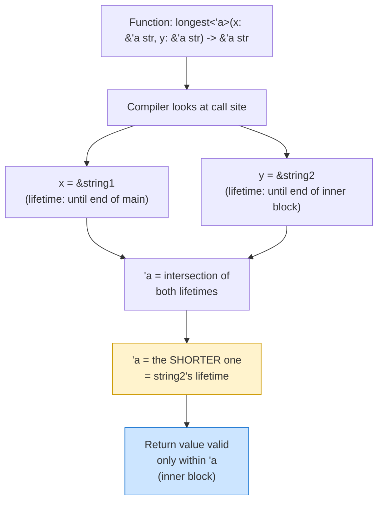

# Lifetime Annotation Syntax 🏷️

> **"Lifetime annotations don't change how long any references live. They describe the relationships of the lifetimes of multiple references to each other."**
> — *The Rust Programming Language*

---

## Table of Contents

- [Why We Need Annotations](#why-we-need-annotations)
- [The Syntax: Tick and a Name](#the-syntax-tick-and-a-name)
- [Where Annotations Go](#where-annotations-go)
- [Reading Lifetime Annotations](#reading-lifetime-annotations)
- [Multiple Lifetimes](#multiple-lifetimes)
- [The Relationship Analogy](#the-relationship-analogy)
- [Lifetime Annotations in the Wild](#lifetime-annotations-in-the-wild)
- [How Other Languages Compare](#how-other-languages-compare)
- [Common Mistakes](#common-mistakes)
- [Try It Yourself](#try-it-yourself)
- [Summary](#summary)

---

## Why We Need Annotations

Most of the time, lifetimes are inferred by the compiler — just like types. But sometimes the compiler encounters ambiguity:

```rust
// Which input does the return value borrow from?
// The compiler can't tell from the function body alone!
fn longest(x: &str, y: &str) -> &str {
    if x.len() > y.len() { x } else { y }
}
```

This code won't compile:

```
error[E0106]: missing lifetime specifier
 --> src/main.rs:1:33
  |
1 | fn longest(x: &str, y: &str) -> &str {
  |               ----     ----      ^ expected named lifetime parameter
  |
  = help: this function's return type contains a borrowed value,
          but the signature does not say whether it is borrowed from `x` or `y`
```

The compiler is asking: **"The return value is a reference — but a reference to WHAT? Does it come from `x` or `y`?"** Without this information, the compiler can't verify that the returned reference is valid.

### The Ambiguity Visualized

```
fn longest(x: &str, y: &str) -> &str
                                  ^
                                  │
                          ┌───────┴───────┐
                          │  Where does   │
                          │  this come    │
                          │  from?        │
                          ├───────────────┤
                          │  Option A: x  │
                          │  Option B: y  │
                          │  Option C: both│
                          └───────────────┘

The compiler needs to know so it can check that the
caller keeps the right data alive long enough!
```

---

## The Syntax: Tick and a Name

A lifetime annotation starts with an **apostrophe** (tick) followed by a short, lowercase name:

```
'a    ← the most common lifetime name
'b    ← a second lifetime
'c    ← a third lifetime
'input    ← a descriptive name (less common but valid)
'static   ← a special built-in lifetime (covered in Chapter 6)
```

### Naming Conventions

| Name | Typical Use |
|------|-------------|
| `'a` | First (and often only) lifetime parameter |
| `'b` | Second lifetime when you need two different ones |
| `'c`, `'d` | Rarely needed — if you have this many, reconsider your design |
| `'src` | Descriptive: "lifetime of the source data" |
| `'de` | Common in serde: "lifetime of the deserializer" |
| `'static` | Special: data lives for the entire program |

### The Apostrophe is Required

The apostrophe distinguishes lifetimes from types:

```rust
// T is a type parameter
// 'a is a lifetime parameter
fn example<'a, T>(reference: &'a T) -> &'a T {
    reference
}
```

---

## Where Annotations Go

Lifetime annotations appear in **three places**: references, function signatures, and struct/enum definitions.

### On References

```rust
&i32        // a reference (implicit lifetime)
&'a i32     // a reference with explicit lifetime 'a
&'a mut i32 // a mutable reference with explicit lifetime 'a
```

### In Function Signatures

The lifetime parameter is declared in angle brackets after the function name, just like generic type parameters:

```rust
fn longest<'a>(x: &'a str, y: &'a str) -> &'a str {
    if x.len() > y.len() { x } else { y }
}
```

Let's break this down piece by piece:

```
fn longest<'a>(x: &'a str, y: &'a str) -> &'a str
          ^^^^    ^^^          ^^^          ^^^
           │       │            │            │
           │       │            │            └── return value lives at least as long as 'a
           │       │            └── y lives at least as long as 'a
           │       └── x lives at least as long as 'a
           └── declare a lifetime parameter named 'a
```

### ASCII Art: Lifetime Flow

```
┌─────────────────────────────────────────────────────┐
│  fn longest<'a>(x: &'a str, y: &'a str) -> &'a str │
│                                                     │
│    'a = the SHORTER of x's and y's lifetimes        │
│                                                     │
│    x ────────────────────────── (lives long)        │
│    y ──────────────── (lives shorter)               │
│    'a ─────────────── (= y's lifetime, the shorter) │
│    return ─────────── (guaranteed valid for 'a)     │
│                                                     │
│    The return value is valid for AT LEAST as long    │
│    as the shorter-lived input reference.             │
└─────────────────────────────────────────────────────┘
```

### In Struct Definitions

When a struct holds a reference, it needs a lifetime parameter:

```rust
struct Excerpt<'a> {
    text: &'a str,
}
// Read as: "An Excerpt cannot outlive the string it references"
```

We'll cover this in detail in [Chapter 5: Lifetimes in Structs](./05-lifetimes-in-structs.md).

---

## Reading Lifetime Annotations

Learning to "read" lifetime annotations in English is the key to understanding them:

### Translation Guide

| Rust Code | English Translation |
|-----------|-------------------|
| `&'a str` | "a string reference that is valid for at least lifetime `'a`" |
| `fn foo<'a>(x: &'a str) -> &'a str` | "foo returns a reference that lives as long as its input" |
| `fn bar<'a, 'b>(x: &'a str, y: &'b str) -> &'a str` | "bar's return borrows from x, not from y" |
| `struct S<'a> { field: &'a str }` | "S holds a reference and cannot outlive the data it references" |
| `&'static str` | "a reference that is valid for the entire program" |

### Reading Practice

```rust
// "longest takes two string references with the same lifetime 'a,
//  and returns a reference valid for that same lifetime."
fn longest<'a>(x: &'a str, y: &'a str) -> &'a str {
    if x.len() > y.len() { x } else { y }
}

fn main() {
    let string1 = String::from("abcde");       // string1 lives ─────────────┐
    let result;                                 //                            │
    {                                           //                            │
        let string2 = String::from("xyz");      // string2 lives ──────┐     │
        result = longest(&string1, &string2);   //                     │     │
        println!("Longest: {result}");          // OK! Both alive here │     │
    }                                           // string2 dropped ────┘     │
    // println!("{result}");                    // Would be ERROR!            │
    // result's lifetime 'a = min(string1, string2) = string2's lifetime     │
}                                               // string1 dropped ──────────┘
```

### Mermaid: How Lifetime 'a is Determined



---

## Multiple Lifetimes

Sometimes different parameters have **genuinely different** lifetimes, and you need to express that:

```rust
// The return value ONLY borrows from `text`, not from `prefix`
fn find_after_prefix<'a, 'b>(text: &'a str, prefix: &'b str) -> &'a str {
    if let Some(rest) = text.strip_prefix(prefix) {
        rest
    } else {
        text
    }
}

fn main() {
    let book = String::from("Chapter 1: Introduction");
    let result;
    {
        let prefix = String::from("Chapter 1: ");
        result = find_after_prefix(&book, &prefix);
    }
    // prefix is dropped, but result only borrows from book — safe!
    println!("{result}"); // "Introduction"
}
```

### When Do You Need Multiple Lifetimes?

```
┌────────────────────────────────────────────────────────┐
│  Use ONE lifetime 'a when:                             │
│    - The return borrows from ALL inputs equally         │
│    - Example: longest(x: &'a str, y: &'a str)         │
│                                                        │
│  Use MULTIPLE lifetimes 'a, 'b when:                   │
│    - The return borrows from only SOME inputs           │
│    - You want to express that inputs are independent    │
│    - Example: fn f<'a, 'b>(x: &'a str, y: &'b str)   │
│               -> &'a str                               │
└────────────────────────────────────────────────────────┘
```

---

## The Relationship Analogy

Think of lifetime annotations as **labels on storage containers**:

```
Without lifetimes (the compiler's confusion):

  ┌──────────┐  ┌──────────┐  ┌──────────┐
  │ ITEM: ref│  │ ITEM: ref│  │ ITEM: ref│
  │ FROM: ???│  │ FROM: ???│  │ FROM: ???│
  │ UNTIL: ??│  │ UNTIL: ??│  │ UNTIL: ??│
  └──────────┘  └──────────┘  └──────────┘
  "Which of these expires first? I can't tell!"

With lifetimes (everything is clear):

  ┌──────────┐  ┌──────────┐  ┌──────────┐
  │ ITEM: ref│  │ ITEM: ref│  │ ITEM: ref│
  │ FROM:  x │  │ FROM:  y │  │ RETURN   │
  │ LIFE: 'a │  │ LIFE: 'a │  │ LIFE: 'a │
  └──────────┘  └──────────┘  └──────────┘
  "All labeled 'a — they all share the same expiration!"
```

---

## Lifetime Annotations in the Wild

### Standard Library Examples

The standard library uses lifetimes extensively. Here are some you'll encounter:

```rust
// str::split returns an iterator that borrows from the input string
// fn split<'a>(&'a self, pattern: &str) -> Split<'a, &str>

fn main() {
    let text = String::from("hello world rust");

    // The iterator borrows from `text`
    let words: Vec<&str> = text.split(' ').collect();
    println!("{:?}", words); // ["hello", "world", "rust"]

    // Each &str in `words` is a reference into `text`
    // If text were dropped, all of words would be dangling!
}
```

```rust
// HashMap::get returns an Option<&V> that borrows from the map
use std::collections::HashMap;

fn main() {
    let mut scores = HashMap::new();
    scores.insert("Alice", 100);
    scores.insert("Bob", 85);

    // The returned &i32 borrows from `scores`
    if let Some(score) = scores.get("Alice") {
        println!("Alice's score: {score}");
    }
}
```

### A Real-World Pattern: Config Parsing

```rust
/// A parsed configuration line that borrows from the input text
struct ConfigEntry<'a> {
    key: &'a str,
    value: &'a str,
}

fn parse_line<'a>(line: &'a str) -> Option<ConfigEntry<'a>> {
    let (key, value) = line.split_once('=')?;
    Some(ConfigEntry {
        key: key.trim(),
        value: value.trim(),
    })
}

fn main() {
    let config_text = String::from("name = Alice\nage = 30\ndebug = true");

    let entries: Vec<ConfigEntry> = config_text
        .lines()
        .filter_map(parse_line)
        .collect();

    for entry in &entries {
        println!("{} => {}", entry.key, entry.value);
    }
    // Output:
    // name => Alice
    // age => 30
    // debug => true
}
```

---

## How Other Languages Compare

| Language | Equivalent Concept | Syntax |
|----------|-------------------|--------|
| **C** | None — programmer tracks manually | (nothing) |
| **C++** | None built-in; addressed by coding conventions and static analyzers | (nothing) |
| **Java** | None needed — GC handles all references | (nothing) |
| **Swift** | Weak/unowned references (runtime checks) | `weak var`, `unowned let` |
| **Rust** | Lifetime parameters (compile-time checks) | `'a`, `'b`, `'static` |

Rust is the only mainstream language where reference validity is part of the **type system** and checked at compile time with zero runtime cost.

---

## Common Mistakes

### Mistake 1: Forgetting to declare the lifetime parameter

```rust
// WRONG — 'a is used but not declared
// fn first<'a>(list: &'a [i32]) -> &'a i32 { ... }
// Wait, that IS correct! Here's the wrong version:

// fn first(list: &'a [i32]) -> &'a i32 { ... }
// ERROR: use of undeclared lifetime name `'a`

// FIX: declare 'a in angle brackets
fn first<'a>(list: &'a [i32]) -> &'a i32 {
    &list[0]
}

fn main() {
    let nums = vec![10, 20, 30];
    println!("{}", first(&nums)); // 10
}
```

### Mistake 2: Using the same lifetime when returns only borrow from one input

```rust
// This works but is overly restrictive:
// fn get_first<'a>(data: &'a str, _unused: &'a str) -> &'a str {
//     &data[..1]
// }
// 'a must be the intersection of BOTH inputs — unnecessarily limiting

// Better: separate lifetimes since return only borrows from data
fn get_first<'a>(data: &'a str, _unused: &str) -> &'a str {
    &data[..1]
}

fn main() {
    let data = String::from("hello");
    let result;
    {
        let temp = String::from("ignore me");
        result = get_first(&data, &temp);
    }
    // temp is dropped, but result only borrows from data — safe!
    println!("{result}"); // "h"
}
```

### Mistake 3: Adding lifetime annotations when they're not needed

```rust
// Unnecessary — the compiler can infer this (elision rules)
// fn first_char<'a>(s: &'a str) -> &'a str {
//     &s[..1]
// }

// Just write this — lifetimes are inferred:
fn first_char(s: &str) -> &str {
    &s[..1]
}

fn main() {
    println!("{}", first_char("hello")); // "h"
}
```

---

## Try It Yourself

### Exercise 1: Add Lifetime Annotations

This function won't compile. Add the correct lifetime annotations:

```rust
fn longer(s1: &str, s2: &str) -> &str {
    if s1.len() >= s2.len() { s1 } else { s2 }
}
```

<details>
<summary><strong>Solution</strong></summary>

```rust
fn longer<'a>(s1: &'a str, s2: &'a str) -> &'a str {
    if s1.len() >= s2.len() { s1 } else { s2 }
}

fn main() {
    let a = String::from("hello");
    let b = String::from("hi");
    let result = longer(&a, &b);
    println!("{result}"); // "hello"
}
```

</details>

### Exercise 2: Separate Lifetimes

This function only borrows from its first argument. Use separate lifetimes to express this:

```rust
fn first_word_after<'a>(text: &'a str, _marker: &'a str) -> &'a str {
    text.split_whitespace().next().unwrap_or("")
}
```

<details>
<summary><strong>Solution</strong></summary>

```rust
fn first_word_after<'a>(text: &'a str, _marker: &str) -> &'a str {
    text.split_whitespace().next().unwrap_or("")
}

fn main() {
    let text = String::from("hello world");
    let result;
    {
        let marker = String::from("ignored");
        result = first_word_after(&text, &marker);
    }
    println!("{result}"); // "hello" — marker can be dropped safely
}
```

</details>

### Exercise 3: Read the Signature

What does this function signature tell you?

```rust
fn extract<'a, 'b>(source: &'a str, pattern: &'b str) -> Option<&'a str>;
```

<details>
<summary><strong>Answer</strong></summary>

- The function takes two string references with **independent** lifetimes.
- The return value (if `Some`) borrows from **`source`** only (lifetime `'a`), **not** from `pattern`.
- This means the caller can drop `pattern` while still using the returned reference, as long as `source` is still alive.

</details>

### Exercise 4: Fix the Struct

This struct won't compile. Fix it:

```rust
struct TextWindow {
    content: &str,
    start: usize,
    end: usize,
}
```

<details>
<summary><strong>Solution</strong></summary>

```rust
struct TextWindow<'a> {
    content: &'a str,
    start: usize,
    end: usize,
}

impl<'a> TextWindow<'a> {
    fn visible(&self) -> &str {
        &self.content[self.start..self.end]
    }
}

fn main() {
    let text = String::from("hello world");
    let window = TextWindow {
        content: &text,
        start: 0,
        end: 5,
    };
    println!("{}", window.visible()); // "hello"
}
```

</details>

---

## Summary

| Concept | Key Idea |
|---------|----------|
| **Syntax** | `'a` — apostrophe + lowercase name |
| **Declaration** | `fn foo<'a>(...)` — in angle brackets like generics |
| **On references** | `&'a str` — "this reference is valid for at least `'a`" |
| **Same lifetime** | `(x: &'a str, y: &'a str)` — both must be valid for `'a` |
| **Different lifetimes** | `(x: &'a str, y: &'b str)` — independent lifetimes |
| **Return value** | `-> &'a str` — return borrows from inputs with lifetime `'a` |
| **On structs** | `struct S<'a>` — struct holds a reference and can't outlive it |
| **Descriptive** | Annotations describe relationships; they don't change how long anything lives |
| **Naming** | `'a`, `'b` by convention; descriptive names like `'src` are valid too |

### Key Takeaway

> Lifetime annotations tell the compiler HOW references relate to each other. They answer the question: "If I return a reference, which input's data does it borrow from?" The compiler uses this to ensure nothing dangles.

---

<p align="center">
  <strong>Tutorial 2 of 7 — Stage 9: Lifetimes</strong>
</p>

<p align="center">
  <a href="./01-why-lifetimes.md">← Previous: Why Lifetimes Exist</a> | <a href="./03-lifetimes-in-functions.md">Next: Lifetimes in Functions →</a>
</p>
