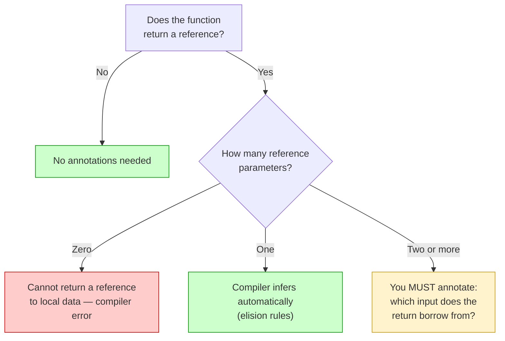
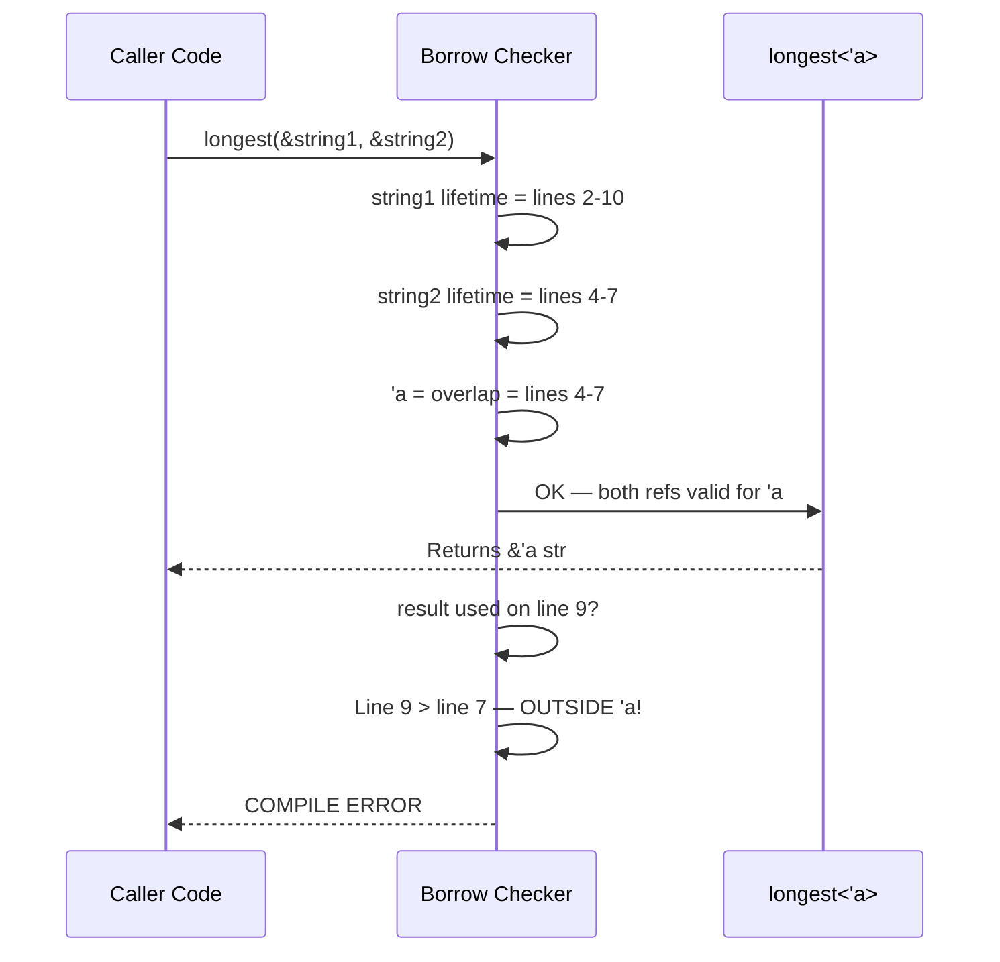

# Lifetimes in Functions 🔗

> **"Lifetime annotations in function signatures tell the borrow checker how the lifetimes of parameters relate to the lifetime of the return value."**
> — *The Rust Programming Language*

---

## Table of Contents

- [When Functions Need Lifetime Annotations](#when-functions-need-lifetime-annotations)
- [The Classic Example: longest](#the-classic-example-longest)
- [How the Borrow Checker Uses Annotations](#how-the-borrow-checker-uses-annotations)
- [Functions That Don't Need Annotations](#functions-that-dont-need-annotations)
- [Functions with Multiple Lifetimes](#functions-with-multiple-lifetimes)
- [Lifetime Bounds on Generic Types](#lifetime-bounds-on-generic-types)
- [Real-World Function Patterns](#real-world-function-patterns)
- [Cross-Language Comparison](#cross-language-comparison)
- [Common Mistakes](#common-mistakes)
- [Try It Yourself](#try-it-yourself)
- [Summary](#summary)

---

## When Functions Need Lifetime Annotations

A function needs explicit lifetime annotations when it:

1. Takes **multiple references** as parameters, AND
2. Returns a **reference**

The compiler needs to know: which input does the output borrow from?



### The Rule of Thumb

```
┌────────────────────────────────────────────────────────────────┐
│                    WHEN TO ANNOTATE                             │
│                                                                │
│  Returns a reference?  NO  → No annotations needed.            │
│                        YES → How many reference inputs?         │
│                              ONE  → Compiler infers it.         │
│                              MANY → You must annotate.          │
│                              ZERO → Can't return ref to local!  │
└────────────────────────────────────────────────────────────────┘
```

---

## The Classic Example: longest

This is the textbook example every Rust programmer should know:

### Without Annotations (Won't Compile)

```rust
// fn longest(x: &str, y: &str) -> &str {
//     if x.len() > y.len() { x } else { y }
// }
// ERROR: missing lifetime specifier
```

### With Annotations (Compiles)

```rust
fn longest<'a>(x: &'a str, y: &'a str) -> &'a str {
    if x.len() > y.len() { x } else { y }
}

fn main() {
    let string1 = String::from("abcde");
    let string2 = String::from("xyz");

    let result = longest(string1.as_str(), string2.as_str());
    println!("The longest string is: {result}");
    // Output: The longest string is: abcde
}
```

### What 'a Means Here

```
fn longest<'a>(x: &'a str, y: &'a str) -> &'a str

Translation:
  "For some lifetime 'a, both x and y are valid for at least 'a,
   and the return value is also valid for at least 'a."

In practice, 'a becomes the SHORTER of x's and y's lifetimes.

┌─────────────────────────────────────────────────────────────┐
│  string1 lives: ────────────────────────────── (long)       │
│  string2 lives: ──────────────────── (shorter)              │
│  'a = overlap:  ──────────────────── (= string2's lifetime) │
│  result valid:  ──────────────────── (within 'a)            │
│                                                             │
│  The return value is guaranteed valid only for the          │
│  OVERLAP of both input lifetimes.                           │
└─────────────────────────────────────────────────────────────┘
```

### The Borrow Checker in Action

```rust
fn longest<'a>(x: &'a str, y: &'a str) -> &'a str {
    if x.len() > y.len() { x } else { y }
}

fn main() {
    let string1 = String::from("long string is long");
    let result;
    {
        let string2 = String::from("xyz");
        result = longest(string1.as_str(), string2.as_str());
        println!("Inside: {result}"); // OK — both strings alive
    }
    // println!("Outside: {result}");
    // ERROR: string2 doesn't live long enough
    // 'a = string2's lifetime (the shorter one)
    // result is tied to 'a, so it can't be used after string2 drops
}
```

---

## How the Borrow Checker Uses Annotations

When you call a function with lifetime annotations, the borrow checker:

1. **Looks at the concrete lifetimes** of the arguments you pass
2. **Computes 'a** as the intersection (overlap) of those lifetimes
3. **Checks that the return value** is only used within that overlap



### A Case That Works

```rust
fn longest<'a>(x: &'a str, y: &'a str) -> &'a str {
    if x.len() > y.len() { x } else { y }
}

fn main() {
    let string1 = String::from("hello");
    let string2 = String::from("hi");
    // Both live until end of main — 'a covers everything
    let result = longest(&string1, &string2);
    println!("{result}"); // "hello" — perfectly safe
}
```

### A Case That Fails

```rust
fn longest<'a>(x: &'a str, y: &'a str) -> &'a str {
    if x.len() > y.len() { x } else { y }
}

fn main() {
    let string1 = String::from("hello");
    let result;
    {
        let string2 = String::from("hi");
        result = longest(&string1, &string2);
    } // string2 dropped — 'a ends here

    // println!("{result}"); // ERROR! result's lifetime 'a expired
}
```

---

## Functions That Don't Need Annotations

Thanks to **lifetime elision** (covered in detail in Chapter 4), many functions work without explicit annotations:

### One Reference In, One Reference Out

```rust
// Compiler infers: fn first_word<'a>(s: &'a str) -> &'a str
fn first_word(s: &str) -> &str {
    s.split_whitespace().next().unwrap_or("")
}

fn main() {
    let sentence = String::from("hello world");
    let word = first_word(&sentence);
    println!("{word}"); // "hello"
}
```

### No Reference Output

```rust
// No lifetime needed — returns an owned value
fn word_count(s: &str) -> usize {
    s.split_whitespace().count()
}

fn main() {
    println!("{}", word_count("hello world")); // 2
}
```

### Methods with &self

```rust
struct Document {
    content: String,
}

impl Document {
    // Compiler infers the return borrows from &self
    fn first_line(&self) -> &str {
        self.content.lines().next().unwrap_or("")
    }
}

fn main() {
    let doc = Document {
        content: String::from("Line 1\nLine 2\nLine 3"),
    };
    println!("{}", doc.first_line()); // "Line 1"
}
```

---

## Functions with Multiple Lifetimes

When the return value borrows from only ONE of the inputs, use separate lifetimes:

```rust
// Return borrows from `haystack`, not from `needle`
fn find_substr<'a>(haystack: &'a str, needle: &str) -> Option<&'a str> {
    haystack.find(needle).map(|i| &haystack[i..i + needle.len()])
}

fn main() {
    let text = String::from("hello world");
    let result;
    {
        let search = String::from("world");
        result = find_substr(&text, &search);
    }
    // search is dropped, but result borrows from text — safe!
    println!("{:?}", result); // Some("world")
}
```

### When to Use Multiple Lifetimes

```
Use the SAME lifetime 'a when:
  - The return could come from ANY input
  - Example: longest(x: &'a str, y: &'a str) -> &'a str

Use DIFFERENT lifetimes when:
  - The return only comes from ONE specific input
  - Example: find(haystack: &'a str, needle: &str) -> &'a str
  - This is LESS restrictive — the other input can be shorter-lived
```

### Side-by-Side Comparison

```rust
// Same lifetime — most restrictive
fn longest<'a>(x: &'a str, y: &'a str) -> &'a str {
    if x.len() > y.len() { x } else { y }
}

// Different lifetimes — less restrictive
fn get_greeting<'a>(name: &'a str, _template: &str) -> &'a str {
    name // only borrows from name
}

fn main() {
    let name = String::from("Alice");
    let greeting;
    {
        let template = String::from("Hello, {}!");
        greeting = get_greeting(&name, &template);
    }
    // template dropped — but greeting only borrows from name
    println!("{greeting}"); // "Alice"
}
```

---

## Lifetime Bounds on Generic Types

You can combine lifetimes with generic type parameters:

```rust
use std::fmt::Display;

fn longest_with_announcement<'a, T>(
    x: &'a str,
    y: &'a str,
    ann: T,
) -> &'a str
where
    T: Display,
{
    println!("Announcement: {ann}");
    if x.len() > y.len() { x } else { y }
}

fn main() {
    let s1 = String::from("hello");
    let s2 = String::from("world!");
    let result = longest_with_announcement(&s1, &s2, "comparing strings");
    println!("Longest: {result}");
    // Output:
    // Announcement: comparing strings
    // Longest: world!
}
```

### Lifetime Bounds on Generic References

Sometimes a generic type must outlive a lifetime:

```rust
fn print_ref<'a, T: 'a + std::fmt::Display>(data: &'a T) {
    println!("{data}");
}

fn main() {
    let x = 42;
    print_ref(&x); // 42
}
```

The `T: 'a` bound means "any references inside T must live at least as long as `'a`."

---

## Real-World Function Patterns

### Pattern 1: String Processing

```rust
/// Extract the domain from an email address
fn email_domain<'a>(email: &'a str) -> Option<&'a str> {
    email.split_once('@').map(|(_, domain)| domain)
}

fn main() {
    let email = String::from("alice@example.com");
    if let Some(domain) = email_domain(&email) {
        println!("Domain: {domain}"); // "example.com"
    }
}
```

### Pattern 2: Selecting from a Collection

```rust
/// Find the longest string in a slice
fn longest_in_list<'a>(items: &[&'a str]) -> &'a str {
    let mut longest = items[0];
    for &item in &items[1..] {
        if item.len() > longest.len() {
            longest = item;
        }
    }
    longest
}

fn main() {
    let words = vec!["short", "medium-length", "tiny", "extraordinarily"];
    let result = longest_in_list(&words);
    println!("Longest: {result}"); // "extraordinarily"
}
```

### Pattern 3: Splitting and Returning Parts

```rust
/// Split a "key=value" pair and return both parts
fn split_pair<'a>(input: &'a str) -> Option<(&'a str, &'a str)> {
    input.split_once('=').map(|(k, v)| (k.trim(), v.trim()))
}

fn main() {
    let config_line = "name = Alice";
    if let Some((key, value)) = split_pair(config_line) {
        println!("{key} => {value}"); // "name => Alice"
    }
}
```

---

## Cross-Language Comparison

### C: No Lifetime Checks

```c
// C: the compiler doesn't care — your problem!
const char* dangerous(const char* a, const char* b) {
    return strlen(a) > strlen(b) ? a : b;
    // What if `a` or `b` is freed after this returns?
    // C won't warn you. Crash at runtime.
}
```

### C++: No Built-in Checks (Until Static Analyzers)

```cpp
// C++: same problem as C — no lifetime tracking
std::string_view longest(std::string_view a, std::string_view b) {
    return a.size() > b.size() ? a : b;
    // string_view can dangle — C++ compilers don't catch it
    // Clang's -Wdangling can sometimes warn, but it's not guaranteed
}
```

### Go: Garbage Collector Prevents Dangling

```go
// Go: the GC keeps data alive as long as any reference exists
func longest(a, b string) string {
    if len(a) > len(b) { return a }
    return b
}
// No dangling possible — but GC pauses and memory overhead
```

### Rust: Compile-Time Proof

```rust
// Rust: the compiler PROVES safety at compile time
fn longest<'a>(a: &'a str, b: &'a str) -> &'a str {
    if a.len() > b.len() { a } else { b }
}
// Zero runtime cost. Zero GC. Zero dangling references.
```

---

## Common Mistakes

### Mistake 1: Returning a reference to data created inside the function

```rust
// WRONG — data is local to the function
// fn make_string<'a>() -> &'a str {
//     let s = String::from("hello");
//     &s   // s is dropped when function returns!
// }

// FIX: Return an owned value
fn make_string() -> String {
    String::from("hello")
}

fn main() {
    let s = make_string();
    println!("{s}");
}
```

### Mistake 2: Overly restrictive lifetimes

```rust
// OVERLY RESTRICTIVE — both inputs share 'a
// fn first_of<'a>(x: &'a str, y: &'a str) -> &'a str {
//     x // only uses x, never y!
// }

// BETTER — y doesn't need the same lifetime
fn first_of<'a>(x: &'a str, _y: &str) -> &'a str {
    x
}

fn main() {
    let x = String::from("hello");
    let result;
    {
        let y = String::from("temp");
        result = first_of(&x, &y);
    }
    println!("{result}"); // Works because result only borrows x
}
```

### Mistake 3: Annotating when the compiler can infer

```rust
// UNNECESSARY — compiler infers this via elision rules
// fn trim_spaces<'a>(s: &'a str) -> &'a str {
//     s.trim()
// }

// CLEAN — let the compiler do its job
fn trim_spaces(s: &str) -> &str {
    s.trim()
}

fn main() {
    println!("{}", trim_spaces("  hello  ")); // "hello"
}
```

---

## Try It Yourself

### Exercise 1: Annotate Correctly

Add lifetime annotations to make this compile:

```rust
fn first_or_second(a: &str, b: &str, use_first: bool) -> &str {
    if use_first { a } else { b }
}
```

<details>
<summary><strong>Solution</strong></summary>

```rust
fn first_or_second<'a>(a: &'a str, b: &'a str, use_first: bool) -> &'a str {
    if use_first { a } else { b }
}

fn main() {
    let x = String::from("hello");
    let y = String::from("world");
    let result = first_or_second(&x, &y, true);
    println!("{result}"); // "hello"
}
```

</details>

### Exercise 2: Multiple Lifetimes

This function returns a reference from `data` only. The `prefix` parameter is only used for comparison. Use appropriate lifetimes:

```rust
fn strip_if_starts_with(data: &str, prefix: &str) -> &str {
    data.strip_prefix(prefix).unwrap_or(data)
}
```

<details>
<summary><strong>Solution</strong></summary>

```rust
fn strip_if_starts_with<'a>(data: &'a str, prefix: &str) -> &'a str {
    data.strip_prefix(prefix).unwrap_or(data)
}

fn main() {
    let data = String::from("Hello, World!");
    let result;
    {
        let prefix = String::from("Hello, ");
        result = strip_if_starts_with(&data, &prefix);
    }
    println!("{result}"); // "World!"
}
```

</details>

### Exercise 3: Fix the Lifetime Error

This code won't compile. Fix it:

```rust
fn longest<'a>(x: &'a str, y: &'a str) -> &'a str {
    if x.len() > y.len() { x } else { y }
}

fn main() {
    let result;
    let string1 = String::from("hello");
    {
        let string2 = String::from("world!");
        result = longest(&string1, &string2);
    }
    println!("{result}");
}
```

<details>
<summary><strong>Solution</strong></summary>

Move `string2` to the same scope as `string1`, or use `result` inside the inner scope:

```rust
fn longest<'a>(x: &'a str, y: &'a str) -> &'a str {
    if x.len() > y.len() { x } else { y }
}

// Option A: Move string2 out
fn main() {
    let string1 = String::from("hello");
    let string2 = String::from("world!");
    let result = longest(&string1, &string2);
    println!("{result}"); // "world!"
}

// Option B: Use result inside the inner scope
// fn main() {
//     let string1 = String::from("hello");
//     {
//         let string2 = String::from("world!");
//         let result = longest(&string1, &string2);
//         println!("{result}"); // "world!"
//     }
// }
```

</details>

### Exercise 4: Write a Function with Lifetimes

Write a function `middle_word` that takes a sentence (&str) and returns a reference to the middle word (or the first word if there's only one). You should NOT need explicit lifetime annotations.

<details>
<summary><strong>Solution</strong></summary>

```rust
fn middle_word(sentence: &str) -> &str {
    let words: Vec<&str> = sentence.split_whitespace().collect();
    if words.is_empty() {
        ""
    } else {
        words[words.len() / 2]
    }
}

fn main() {
    println!("{}", middle_word("the quick brown fox jumps")); // "brown"
    println!("{}", middle_word("hello"));                      // "hello"
    println!("{}", middle_word("one two"));                    // "two"
}
```

No explicit lifetimes needed — the compiler infers that the return borrows from `sentence` (the only reference input).

</details>

---

## Summary

| Concept | Key Idea |
|---------|----------|
| **When to annotate** | Multiple reference inputs AND a reference return |
| **Same lifetime `'a`** | Return could come from any input — 'a is their overlap |
| **Different lifetimes** | Return comes from one specific input — less restrictive |
| **The `longest` pattern** | Classic example of needing shared lifetime `'a` |
| **Elision** | Compiler infers lifetimes for simple cases (1 ref in, 1 ref out) |
| **Generic + lifetime** | `fn foo<'a, T: Display>(x: &'a T)` — combine both |
| **No local refs** | You can never return a reference to data created inside the function |
| **Overlap rule** | `'a` becomes the shortest of all input lifetimes sharing it |

### Key Takeaway

> Lifetime annotations on functions answer one question: "Which input does the return value borrow from?" The compiler uses your answer to prove that no dangling references are possible.

---

## Real-World Lifetime Patterns in Functions

Now that you understand the mechanics, let's look at how lifetimes appear in real Rust codebases.

### Pattern 1 — Zero-Copy String Parsers

One of the most common uses of lifetime annotations is **zero-copy parsing** — reading a slice out of a larger string without allocating new memory.

```rust
/// Extract the value from a "key=value" pair.
/// The returned slice borrows from `input` — zero allocation.
fn parse_value<'a>(input: &'a str) -> Option<&'a str> {
    let pos = input.find('=')?;
    Some(&input[pos + 1..])
}

fn main() {
    let config = String::from("timeout=30");

    // `value` is a slice into `config`, same lifetime, no copy
    if let Some(value) = parse_value(&config) {
        println!("Value: {}", value); // "30"
    }
}
```

The `'a` tells the compiler: *"the returned slice is a window into the same string you passed in."* No `String` allocation, no cloning.

### Pattern 2 — Asymmetric Lifetimes (Output From One Input Only)

When a function takes multiple references but the output only borrows from *one* of them, use **separate lifetime parameters**:

```rust
/// Search for `needle` in `haystack`.
/// The returned slice (if found) borrows from `haystack`, not from `needle`.
fn find_in<'h, 'n>(haystack: &'h str, needle: &'n str) -> Option<&'h str> {
    let len = needle.len();
    for i in 0..=haystack.len().saturating_sub(len) {
        if &haystack[i..i + len] == needle {
            return Some(&haystack[i..i + len]);
        }
    }
    None
}

fn main() {
    let text = String::from("the quick brown fox");
    let result = {
        let pattern = String::from("quick");  // shorter-lived
        find_in(&text, &pattern)
        // `pattern` is dropped here — but that's fine!
        // The return type is `&'h str`, tied only to `text`
    };
    println!("{:?}", result); // Some("quick") — still valid!
}
```

If you had used a single `'a` for both parameters, the compiler would tie the return lifetime to the *shorter* of the two, and the code above would fail even though it's perfectly safe.

### Pattern 3 — Non-Lexical Lifetimes (NLL)

Before Rust 2018, borrows lasted until the **end of the enclosing block** regardless of when you last used the value. This caused many frustrating false positives.

```
Lexical lifetimes (pre-2018):

  let r;                   ← borrow declared here
  let first = &v[0];       ← borrow STARTS (lexical: lasts to end of block)
  println!("{}", first);   ← last actual use
  v.push(4);               ← ERROR even though first is dead!
  ...
}                          ← borrow ENDS (too late)
```

**With NLL (Rust 2018+, on by default today):**

```rust
fn main() {
    let mut v = vec![1, 2, 3];
    let first = &v[0];       // borrow starts
    println!("{}", first);   // last USE — borrow ends HERE under NLL
    v.push(4);               // ✅ OK — borrow already ended
    println!("{:?}", v);     // [1, 2, 3, 4]
}
```

NLL tracks the *last use* of a reference, not the end of its lexical scope. Today the compiler just does the right thing — you rarely need to think about it. But knowing it exists explains why code that "should work" sometimes failed in older Rust.

### Lifetime Troubleshooting Guide

Here are the 5 most common lifetime compiler errors and their fixes:

#### Error 1 — Ambiguous return lifetime (multiple inputs)

```rust
// ❌ ERROR: missing lifetime specifier
fn longer(a: &str, b: &str) -> &str {
    if a.len() > b.len() { a } else { b }
}

// ✅ FIX: annotate which input the output borrows from
fn longer<'a>(a: &'a str, b: &'a str) -> &'a str {
    if a.len() > b.len() { a } else { b }
}
```

#### Error 2 — Returning a reference to a local variable

```rust
// ❌ ERROR: `greeting` dropped at end of function
fn greet(name: &str) -> &str {
    let greeting = format!("Hello, {}!", name);
    &greeting  // dangling reference!
}

// ✅ FIX: return an owned String
fn greet(name: &str) -> String {
    format!("Hello, {}!", name)
}
```

#### Error 3 — Borrow outlives the owner

```rust
// ❌ ERROR: `x` does not live long enough
fn main() {
    let r;
    {
        let x = 5;
        r = &x;    // borrow of `x`
    }              // `x` dropped here
    println!("{}", r); // dangling reference!
}

// ✅ FIX: move the owner to the outer scope
fn main() {
    let x = 5;
    let r = &x;
    println!("{}", r); // fine — same scope
}
```

#### Error 4 — Struct holding a reference without lifetime

```rust
// ❌ ERROR: missing lifetime specifier
struct Excerpt {
    text: &str,
}

// ✅ FIX: declare the lifetime on the struct
struct Excerpt<'a> {
    text: &'a str,
}
```

#### Error 5 — Implicit method return tied to wrong input

```rust
struct Doc { content: String }

impl Doc {
    // ❌ ERROR: compiler can't tell if return borrows `self` or `fallback`
    fn get_or<'a>(&'a self, fallback: &'a str) -> &'a str {
        if self.content.is_empty() { fallback } else { &self.content }
    }
    // (actually this compiles — but if you change the return to only ever
    // come from `self`, you can drop the lifetime on `fallback` entirely:)

    // ✅ CLEANER when output always comes from `self`:
    fn get(&self) -> &str {  // elision handles it
        &self.content
    }
}
```

---

<p align="center">
  <strong>Tutorial 3 of 7 — Stage 9: Lifetimes</strong>
</p>

<p align="center">
  <a href="./02-lifetime-syntax.md">← Previous: Lifetime Annotation Syntax</a> | <a href="./04-lifetime-elision.md">Next: Lifetime Elision Rules →</a>
</p>
