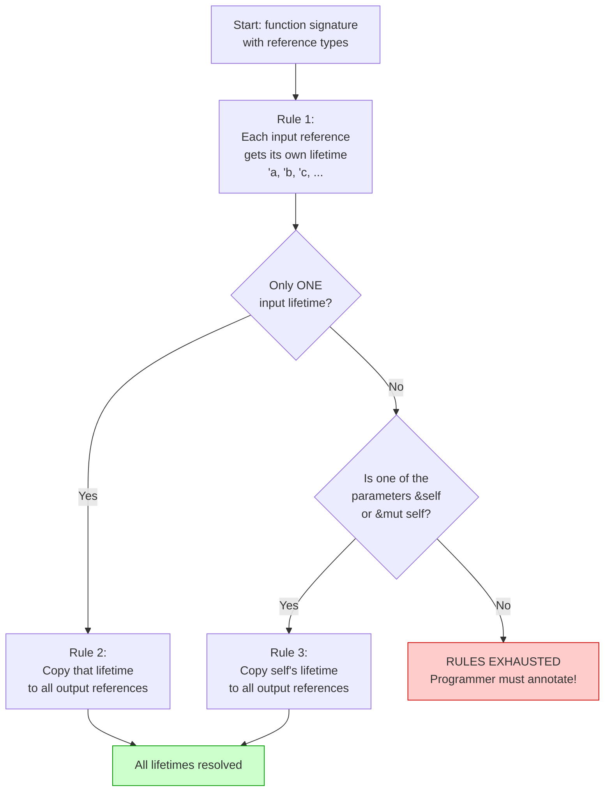

# Lifetime Elision Rules 🤖

> **"The patterns programmed into Rust's analysis of references are called the lifetime elision rules. These aren't rules for programmers to follow; they're rules the compiler will apply."**
> — *The Rust Programming Language*

---

## Table of Contents

- [What is Lifetime Elision?](#what-is-lifetime-elision)
- [A Brief History](#a-brief-history)
- [The Three Elision Rules](#the-three-elision-rules)
- [Rule 1: Each Parameter Gets Its Own Lifetime](#rule-1-each-parameter-gets-its-own-lifetime)
- [Rule 2: One Input Lifetime Maps to All Outputs](#rule-2-one-input-lifetime-maps-to-all-outputs)
- [Rule 3: &self Lifetime Maps to Output](#rule-3-self-lifetime-maps-to-output)
- [Walking Through Examples](#walking-through-examples)
- [When Elision Fails](#when-elision-fails)
- [Common Mistakes](#common-mistakes)
- [Try It Yourself](#try-it-yourself)
- [Summary](#summary)

---

## What is Lifetime Elision?

**Lifetime elision** is the compiler's ability to **infer lifetimes** automatically so you don't have to write them. It is like how the compiler infers types — you write `let x = 5;` instead of `let x: i32 = 5;`, and the compiler figures out the type.

Similarly, you write:

```rust
fn first_word(s: &str) -> &str { ... }
```

Instead of the fully annotated version:

```rust
fn first_word<'a>(s: &'a str) -> &'a str { ... }
```

The compiler applies **three deterministic rules** to figure out the lifetimes. If the rules produce a complete answer, no annotations are needed. If they don't, you get a compile error asking you to annotate.

### The Pipeline

```
┌─────────────────────────────────────────────────────┐
│            YOUR FUNCTION SIGNATURE                   │
│                                                     │
│   fn first_word(s: &str) -> &str                    │
│                                                     │
└─────────────────────┬───────────────────────────────┘
                      │
                      ▼
┌─────────────────────────────────────────────────────┐
│   STEP 1: Apply Rule 1                              │
│   Each input reference gets its own lifetime         │
│   fn first_word<'a>(s: &'a str) -> &str             │
└─────────────────────┬───────────────────────────────┘
                      │
                      ▼
┌─────────────────────────────────────────────────────┐
│   STEP 2: Apply Rule 2                              │
│   Only one input lifetime? Copy it to output.        │
│   fn first_word<'a>(s: &'a str) -> &'a str          │
└─────────────────────┬───────────────────────────────┘
                      │
                      ▼
┌─────────────────────────────────────────────────────┐
│   DONE! All lifetimes resolved.                      │
│   No annotations needed from the programmer.         │
└─────────────────────────────────────────────────────┘
```

---

## A Brief History

In Rust's early days (before 1.0), **every** function with references required explicit lifetime annotations. This made Rust code verbose and intimidating. The Rust team noticed that the same patterns appeared over and over:

- Functions with one reference input always returned something tied to that input
- Methods on `&self` always returned something tied to `self`

So they formalized these patterns into the three elision rules and added them to the compiler. This single change dramatically reduced the number of lifetime annotations in real Rust code — by some estimates, **over 80%** of functions that deal with references need zero explicit annotations.

| Before Elision (pre-2015) | After Elision (Rust 1.0+) |
|---------------------------|--------------------------|
| `fn len<'a>(s: &'a str) -> usize` | `fn len(s: &str) -> usize` |
| `fn first<'a>(s: &'a str) -> &'a str` | `fn first(s: &str) -> &str` |
| `fn name<'a>(&'a self) -> &'a str` | `fn name(&self) -> &str` |

---

## The Three Elision Rules



Let's examine each rule in detail.

---

## Rule 1: Each Parameter Gets Its Own Lifetime

**Rule 1:** Each parameter that is a reference gets its own distinct lifetime parameter.

This rule is applied **first**, always, to **every** function:

```
fn foo(x: &str)                 → fn foo<'a>(x: &'a str)
fn foo(x: &str, y: &str)       → fn foo<'a, 'b>(x: &'a str, y: &'b str)
fn foo(x: &str, y: &str, z: &str) → fn foo<'a, 'b, 'c>(x: &'a str, y: &'b str, z: &'c str)
```

Non-reference parameters are ignored:

```
fn foo(x: &str, n: usize)      → fn foo<'a>(x: &'a str, n: usize)
fn foo(x: i32, y: &str)        → fn foo<'a>(x: i32, y: &'a str)
```

---

## Rule 2: One Input Lifetime Maps to All Outputs

**Rule 2:** If there is exactly **one** input lifetime parameter, that lifetime is assigned to **all** output lifetime parameters.

```
BEFORE Rule 2:
  fn first_word<'a>(s: &'a str) -> &str
                 ^                  ^
              1 input lifetime    unresolved output

AFTER Rule 2:
  fn first_word<'a>(s: &'a str) -> &'a str
                 ^                   ^^
              1 input lifetime    resolved! copied from input
```

### More Examples

```
fn trim<'a>(s: &'a str) -> &str
  → Rule 2: fn trim<'a>(s: &'a str) -> &'a str ✅

fn to_bytes<'a>(s: &'a str) -> &[u8]
  → Rule 2: fn to_bytes<'a>(s: &'a str) -> &'a [u8] ✅

fn split_at<'a>(s: &'a str, mid: usize) -> (&str, &str)
  → Rule 2: fn split_at<'a>(s: &'a str, mid: usize) -> (&'a str, &'a str) ✅
```

---

## Rule 3: &self Lifetime Maps to Output

**Rule 3:** If one of the parameters is `&self` or `&mut self` (i.e., this is a method), the lifetime of `self` is assigned to all output lifetime parameters.

This makes sense because methods usually return data from the struct they belong to.

```rust
struct Parser {
    input: String,
}

impl Parser {
    // Rule 3 applies: output borrows from &self
    // Full signature: fn remaining<'a>(&'a self) -> &'a str
    fn remaining(&self) -> &str {
        &self.input
    }

    // Rule 3 applies even with other reference parameters
    // Full: fn find<'a, 'b>(&'a self, needle: &'b str) -> Option<&'a str>
    fn find(&self, needle: &str) -> Option<&str> {
        self.input.find(needle).map(|i| &self.input[i..])
    }
}

fn main() {
    let p = Parser {
        input: String::from("hello world"),
    };
    println!("{}", p.remaining());           // "hello world"
    println!("{:?}", p.find("world"));       // Some("world")
}
```

### Why Rule 3 Makes Sense

```
┌──────────────────────────────────────────────────────────┐
│  Methods typically return data FROM the struct itself.    │
│                                                          │
│  impl MyStruct {                                         │
│      fn get_name(&self) -> &str {                        │
│          &self.name  // <-- borrowing from self           │
│      }                                                   │
│  }                                                       │
│                                                          │
│  So the compiler assumes: output lifetime = self's       │
│  lifetime. This is correct 99% of the time.              │
│                                                          │
│  If it's wrong, you'll get a compile error and can       │
│  add explicit annotations.                               │
└──────────────────────────────────────────────────────────┘
```

---

## Walking Through Examples

Let's trace the elision rules step by step on several function signatures:

### Example 1: `fn first_word(s: &str) -> &str`

```
Step 0 (original):  fn first_word(s: &str) -> &str
Step 1 (Rule 1):    fn first_word<'a>(s: &'a str) -> &str      // 1 input ref → 1 lifetime
Step 2 (Rule 2):    fn first_word<'a>(s: &'a str) -> &'a str   // 1 input lifetime → copy to output
Result: ✅ All lifetimes resolved. No annotation needed!
```

### Example 2: `fn longest(x: &str, y: &str) -> &str`

```
Step 0 (original):  fn longest(x: &str, y: &str) -> &str
Step 1 (Rule 1):    fn longest<'a, 'b>(x: &'a str, y: &'b str) -> &str   // 2 input refs
Step 2 (Rule 2):    Does NOT apply — there are 2 input lifetimes, not 1
Step 3 (Rule 3):    Does NOT apply — no &self parameter
Result: ❌ Output lifetime unresolved! Programmer must annotate.
```

### Example 3: `fn name(&self) -> &str` (method)

```
Step 0 (original):  fn name(&self) -> &str
Step 1 (Rule 1):    fn name<'a>(&'a self) -> &str              // 1 input ref
Step 2 (Rule 2):    Could apply (1 input lifetime), but Rule 3 takes priority for methods
Step 3 (Rule 3):    fn name<'a>(&'a self) -> &'a str           // self's lifetime → output
Result: ✅ All lifetimes resolved!
```

### Example 4: `fn find(&self, needle: &str) -> Option<&str>`

```
Step 0 (original):  fn find(&self, needle: &str) -> Option<&str>
Step 1 (Rule 1):    fn find<'a, 'b>(&'a self, needle: &'b str) -> Option<&str>
Step 2 (Rule 2):    Does NOT apply — 2 input lifetimes
Step 3 (Rule 3):    APPLIES — &self present!
                    fn find<'a, 'b>(&'a self, needle: &'b str) -> Option<&'a str>
Result: ✅ Output gets self's lifetime!
```

### Example 5: `fn to_uppercase(s: &str) -> String`

```
Step 0 (original):  fn to_uppercase(s: &str) -> String
Step 1 (Rule 1):    fn to_uppercase<'a>(s: &'a str) -> String
No output references to resolve — the return type is owned (String).
Result: ✅ No output lifetimes needed!
```

### Quick Reference Table

| Signature | Rule 1 | Rule 2 | Rule 3 | Needs Annotation? |
|-----------|--------|--------|--------|-------------------|
| `fn f(s: &str) -> &str` | 1 lifetime | Applies | N/A | No |
| `fn f(a: &str, b: &str) -> &str` | 2 lifetimes | No | No | **Yes** |
| `fn f(&self) -> &str` | 1 lifetime | (Rule 3) | Applies | No |
| `fn f(&self, s: &str) -> &str` | 2 lifetimes | No | Applies | No |
| `fn f(s: &str) -> String` | 1 lifetime | N/A (no ref output) | N/A | No |
| `fn f(a: &str, b: &str, c: &str) -> &str` | 3 lifetimes | No | No | **Yes** |

---

## When Elision Fails

Elision fails when neither Rule 2 nor Rule 3 can determine the output lifetime:

```rust
// Elision can't figure this out — two inputs, no &self:
// fn longest(x: &str, y: &str) -> &str { ... }

// You must annotate:
fn longest<'a>(x: &'a str, y: &'a str) -> &'a str {
    if x.len() > y.len() { x } else { y }
}
```

### Why the Compiler Can't Guess

```
fn longest(x: &str, y: &str) -> &str
                                  │
                     ┌────────────┴────────────┐
                     │  Which input does this   │
                     │  borrow from?            │
                     │                          │
                     │  Could be x.             │
                     │  Could be y.             │
                     │  Could be either.        │
                     │                          │
                     │  The compiler can't look │
                     │  at the BODY to decide   │
                     │  — it only uses the      │
                     │  SIGNATURE.              │
                     └──────────────────────────┘
```

The borrow checker checks callers based on the **function signature alone** — it doesn't inspect the function body. This is by design: it means adding implementation details inside a function body can never break callers.

---

## Common Mistakes

### Mistake 1: Adding annotations when elision handles it

```rust
// VERBOSE — unnecessary annotations
// fn first_char<'a>(s: &'a str) -> &'a str {
//     &s[..1]
// }

// CLEAN — let elision do its job
fn first_char(s: &str) -> &str {
    &s[..1]
}

fn main() {
    println!("{}", first_char("hello")); // "h"
}
```

### Mistake 2: Expecting elision to work with two reference inputs

```rust
// WON'T COMPILE — elision can't help here
// fn pick(a: &str, b: &str, first: bool) -> &str {
//     if first { a } else { b }
// }

// FIX: Add explicit lifetime
fn pick<'a>(a: &'a str, b: &'a str, first: bool) -> &'a str {
    if first { a } else { b }
}

fn main() {
    let result = pick("hello", "world", true);
    println!("{result}"); // "hello"
}
```

### Mistake 3: Forgetting that methods get Rule 3 for free

```rust
struct Config {
    name: String,
    version: String,
}

impl Config {
    // No annotation needed! Rule 3 handles it.
    fn display_name(&self) -> &str {
        &self.name
    }

    // Even with another reference parameter — Rule 3 still works
    fn get_or_default(&self, _fallback: &str) -> &str {
        &self.name
    }
}

fn main() {
    let c = Config {
        name: String::from("MyApp"),
        version: String::from("1.0"),
    };
    println!("{}", c.display_name());              // "MyApp"
    println!("{}", c.get_or_default("Unknown"));   // "MyApp"
}
```

---

## Try It Yourself

### Exercise 1: Predict Elision

For each function, predict whether elision rules are sufficient or if you need annotations:

```rust
// A
fn trim_end(s: &str) -> &str { todo!() }

// B
fn combine(a: &str, b: &str) -> String { todo!() }

// C
fn max_ref(a: &i32, b: &i32) -> &i32 { todo!() }

// D
fn get_name(&self) -> &str { todo!() } // (inside an impl block)
```

<details>
<summary><strong>Answer</strong></summary>

- **A: Elision works.** One input ref → Rule 2 applies.
- **B: Elision works.** Returns `String` (owned) — no output lifetime needed.
- **C: Needs annotations.** Two input refs, returns a ref → neither Rule 2 nor 3 applies.
- **D: Elision works.** `&self` → Rule 3 applies.

</details>

### Exercise 2: Trace the Rules

Trace the three elision rules on this signature:

```rust
fn process(&self, input: &str, buffer: &mut Vec<u8>) -> &str
```

<details>
<summary><strong>Answer</strong></summary>

```
Step 0: fn process(&self, input: &str, buffer: &mut Vec<u8>) -> &str
Step 1 (Rule 1): fn process<'a, 'b, 'c>(&'a self, input: &'b str, buffer: &'c mut Vec<u8>) -> &str
Step 2 (Rule 2): Does not apply — 3 input lifetimes
Step 3 (Rule 3): &self is present — copy 'a to output
Result: fn process<'a, 'b, 'c>(&'a self, input: &'b str, buffer: &'c mut Vec<u8>) -> &'a str

Elision succeeds! The output borrows from &self.
```

</details>

### Exercise 3: When Does Elision Fail?

Write a function signature where elision fails. Then add the correct annotations.

<details>
<summary><strong>Solution</strong></summary>

```rust
// Elision fails: two reference inputs, reference output, no &self
// fn shorter(a: &str, b: &str) -> &str

// With annotations:
fn shorter<'a>(a: &'a str, b: &'a str) -> &'a str {
    if a.len() <= b.len() { a } else { b }
}

fn main() {
    let a = String::from("hi");
    let b = String::from("hello");
    println!("{}", shorter(&a, &b)); // "hi"
}
```

</details>

### Exercise 4: Elision in Methods

Does this method need annotations? Trace the rules to verify:

```rust
impl Database {
    fn query(&self, sql: &str) -> &[Row] {
        // returns rows stored in self
        todo!()
    }
}
```

<details>
<summary><strong>Answer</strong></summary>

```
Step 1 (Rule 1): &'a self, sql: &'b str → 2 input lifetimes
Step 2 (Rule 2): Does not apply (2 lifetimes)
Step 3 (Rule 3): &self present → output gets 'a
Result: fn query<'a, 'b>(&'a self, sql: &'b str) -> &'a [Row]

No annotations needed — Rule 3 handles it.
```

</details>

---

## Summary

| Rule | Description | Applies When |
|------|-------------|-------------|
| **Rule 1** | Each reference input gets a unique lifetime | Always (first step) |
| **Rule 2** | One input lifetime → copy to all outputs | Exactly 1 input lifetime |
| **Rule 3** | `&self`/`&mut self` lifetime → copy to outputs | Methods with &self |

### Decision Flow

```
┌────────────────────────────────────────────────┐
│  Does the function have reference outputs?      │
│    NO  → No lifetimes needed. Done.             │
│    YES → Apply Rule 1 (assign input lifetimes)  │
│          → 1 input lifetime? Rule 2 resolves.   │
│          → Has &self? Rule 3 resolves.          │
│          → Otherwise: YOU must annotate.         │
└────────────────────────────────────────────────┘
```

### Key Takeaway

> Lifetime elision is why 80%+ of Rust functions with references need zero annotations. Learn the three rules and you'll know exactly when annotations are needed — and when you can let the compiler handle it.

---

<p align="center">
  <strong>Tutorial 4 of 7 — Stage 9: Lifetimes</strong>
</p>

<p align="center">
  <a href="./03-lifetimes-in-functions.md">← Previous: Lifetimes in Functions</a> | <a href="./05-lifetimes-in-structs.md">Next: Lifetimes in Structs →</a>
</p>
