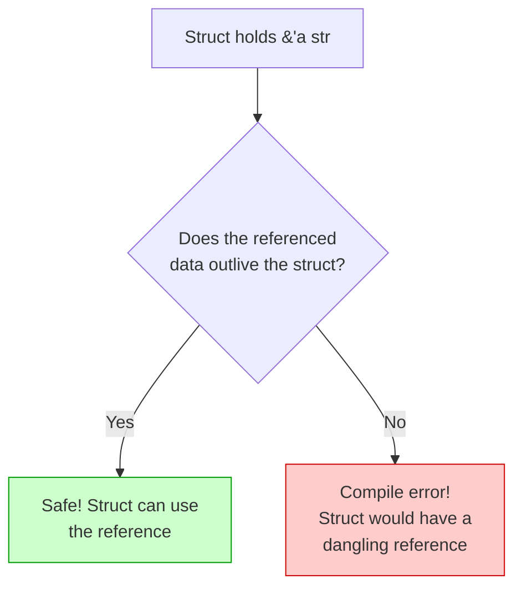
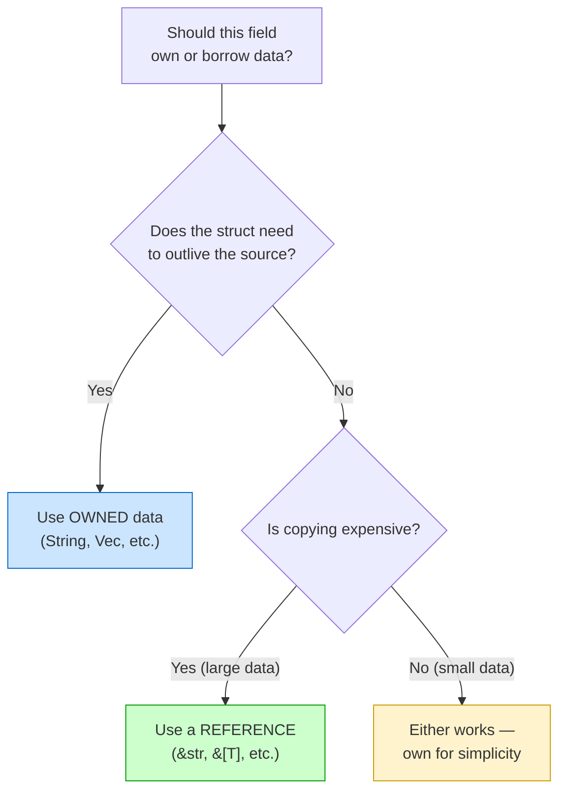

# Lifetimes in Structs 🏗️

> **"When a struct holds a reference, the struct can't outlive the data it borrows from. Lifetime annotations on structs make this relationship explicit."**

---

## Table of Contents

- [Why Structs Need Lifetimes](#why-structs-need-lifetimes)
- [The Syntax](#the-syntax)
- [How It Works](#how-it-works)
- [Methods on Structs with Lifetimes](#methods-on-structs-with-lifetimes)
- [Multiple Lifetime Parameters](#multiple-lifetime-parameters)
- [Structs with Mixed Owned and Borrowed Data](#structs-with-mixed-owned-and-borrowed-data)
- [Real-World Examples](#real-world-examples)
- [When to Use References vs Owned Data](#when-to-use-references-vs-owned-data)
- [Common Mistakes](#common-mistakes)
- [Try It Yourself](#try-it-yourself)
- [Summary](#summary)

---

## Why Structs Need Lifetimes

Structs can hold **owned data** (like `String`) or **borrowed data** (like `&str`). When they hold borrowed data, the compiler needs a guarantee: **the struct won't outlive the data it borrows from**.

```rust
// This struct holds owned data — no lifetime needed
struct OwnedExcerpt {
    text: String,  // owns its data
}

// This struct holds borrowed data — lifetime IS needed
struct BorrowedExcerpt<'a> {
    text: &'a str,  // borrows data from somewhere else
}
```

### What Happens Without a Lifetime?

```rust
// WON'T COMPILE:
// struct Excerpt {
//     text: &str,
// }
// ERROR: expected named lifetime parameter
```

The compiler tells you: "This struct holds a reference, but I need to know how long that reference is valid. Add a lifetime parameter."

### The Analogy: Library Cards

```
┌──────────────────────────────────────────────────────────┐
│  Think of a struct with a lifetime as a LIBRARY CARD:    │
│                                                          │
│  struct LibraryCard<'a> {                                │
│      borrowed_book: &'a Book,                            │
│  }                                                       │
│                                                          │
│  The card REFERENCES a book in the library.              │
│  The card cannot exist after the book is destroyed.      │
│  The lifetime 'a says: "this card is valid as long       │
│  as the book exists."                                    │
└──────────────────────────────────────────────────────────┘
```

---

## The Syntax

A struct with a lifetime parameter declares it in angle brackets, just like generic types:

```rust
struct Excerpt<'a> {
    text: &'a str,
}
```

Reading this in English: **"An `Excerpt` holds a string reference, and the `Excerpt` cannot outlive the string it references."**

### ASCII Art: Memory Layout

```
Stack                              Heap (or static data)
┌──────────────────┐
│ Excerpt<'a>      │              ┌────────────────────────┐
│ ┌──────────────┐ │              │ "Call me Ishmael..."   │
│ │ text: ptr ───┼─┼──────────────│                        │
│ │ text: len    │ │              └────────────────────────┘
│ └──────────────┘ │
└──────────────────┘

The Excerpt BORROWS from the string data.
If the string data is freed, the Excerpt's reference
would be dangling. The lifetime 'a prevents this.
```

### Complete Example

```rust
struct Excerpt<'a> {
    text: &'a str,
}

fn main() {
    let novel = String::from("Call me Ishmael. Some years ago...");

    // Create an excerpt that borrows from novel
    let first_sentence;
    {
        let excerpt_text = &novel[..16]; // "Call me Ishmael."
        first_sentence = Excerpt { text: excerpt_text };
    }
    // This works because novel is still alive!
    println!("Excerpt: {}", first_sentence.text);
}
```

### When the Lifetime is Violated

```rust
struct Excerpt<'a> {
    text: &'a str,
}

fn main() {
    let excerpt;
    {
        let novel = String::from("Call me Ishmael.");
        excerpt = Excerpt { text: &novel };
    } // novel is dropped here!

    // println!("{}", excerpt.text);  // ERROR: novel doesn't live long enough
}
```



---

## How It Works

When you create a struct with a lifetime parameter, the compiler enforces that **every instance of the struct** lives no longer than the data it references:

```rust
#[derive(Debug)]
struct Config<'a> {
    name: &'a str,
    value: &'a str,
}

fn main() {
    let name = String::from("debug");
    let value = String::from("true");

    let config = Config {
        name: &name,
        value: &value,
    };

    println!("{:?}", config); // Config { name: "debug", value: "true" }
    // config, name, and value all live until end of main — safe!
}
```

### Multiple References, Same Lifetime

When a struct has multiple references with the same lifetime `'a`, ALL referenced data must live at least as long as the struct:

```rust
struct Pair<'a> {
    first: &'a str,
    second: &'a str,
}

fn main() {
    let a = String::from("hello");
    let b = String::from("world");

    let pair = Pair {
        first: &a,
        second: &b,
    };
    // Both a and b must outlive pair
    println!("{} {}", pair.first, pair.second);
}
```

---

## Methods on Structs with Lifetimes

When implementing methods on a struct with lifetimes, you must include the lifetime in the `impl` block:

```rust
struct Excerpt<'a> {
    text: &'a str,
}

impl<'a> Excerpt<'a> {
    // Methods that return non-references — no output lifetime needed
    fn word_count(&self) -> usize {
        self.text.split_whitespace().count()
    }

    // Methods that return references — Rule 3 (elision) applies
    fn first_word(&self) -> &str {
        self.text.split_whitespace().next().unwrap_or("")
    }

    // Can also return &'a str explicitly (same thing)
    fn full_text(&self) -> &'a str {
        self.text
    }
}

fn main() {
    let novel = String::from("Call me Ishmael. Some years ago...");
    let excerpt = Excerpt { text: &novel[..16] };

    println!("Words: {}", excerpt.word_count());   // 3
    println!("First: {}", excerpt.first_word());    // "Call"
    println!("Full: {}", excerpt.full_text());      // "Call me Ishmael."
}
```

### The impl Syntax

```
impl<'a> Excerpt<'a> {
     ^^   ^^^^^^^^ ^^
      │       │     │
      │       │     └── use the lifetime in the struct type
      │       └── struct name
      └── declare the lifetime parameter for the impl block
```

---

## Multiple Lifetime Parameters

Structs can have multiple lifetime parameters when different fields have genuinely independent lifetimes:

```rust
struct Comparison<'a, 'b> {
    original: &'a str,
    modified: &'b str,
}

impl<'a, 'b> Comparison<'a, 'b> {
    fn new(original: &'a str, modified: &'b str) -> Self {
        Comparison { original, modified }
    }

    fn has_changes(&self) -> bool {
        self.original != self.modified
    }
}

fn main() {
    let original = String::from("hello world");
    let comparison;
    {
        let modified = String::from("hello rust");
        comparison = Comparison::new(&original, &modified);
        println!("Changed: {}", comparison.has_changes()); // true
    }
    // comparison can't be used here because modified was dropped
}
```

### When to Use Multiple Lifetimes

```
Use ONE lifetime 'a when:
  - All references in the struct come from the same source
  - Or they all need to live equally long
  - Example: struct Pair<'a> { left: &'a str, right: &'a str }

Use MULTIPLE lifetimes when:
  - References come from different, independent sources
  - You want maximum flexibility for the caller
  - Example: struct Join<'a, 'b> { table1: &'a Data, table2: &'b Data }
```

---

## Structs with Mixed Owned and Borrowed Data

A struct can have both owned and borrowed fields:

```rust
#[derive(Debug)]
struct Article<'a> {
    title: String,       // owned — no lifetime needed
    author: String,      // owned — no lifetime needed
    excerpt: &'a str,    // borrowed — needs lifetime
}

fn main() {
    let full_text = String::from(
        "Rust is a systems programming language focused on safety..."
    );

    let article = Article {
        title: String::from("Why Rust?"),
        author: String::from("Alice"),
        excerpt: &full_text[..50],
    };

    println!("{:?}", article);
    // The article owns title and author, but borrows from full_text.
    // article can't outlive full_text, but title and author are independent.
}
```

### Decision Guide: Own or Borrow?



---

## Real-World Examples

### Example 1: A Log Entry Parser

```rust
/// A parsed log entry that borrows from the original log line
#[derive(Debug)]
struct LogEntry<'a> {
    timestamp: &'a str,
    level: &'a str,
    message: &'a str,
}

fn parse_log<'a>(line: &'a str) -> Option<LogEntry<'a>> {
    let parts: Vec<&str> = line.splitn(3, ' ').collect();
    if parts.len() == 3 {
        Some(LogEntry {
            timestamp: parts[0],
            level: parts[1],
            message: parts[2],
        })
    } else {
        None
    }
}

fn main() {
    let log_line = "2026-04-01T10:00:00 INFO Server started on port 8080";
    if let Some(entry) = parse_log(log_line) {
        println!("Time: {}", entry.timestamp);
        println!("Level: {}", entry.level);
        println!("Message: {}", entry.message);
    }
}
```

### Example 2: A Text Highlighter

```rust
struct Highlight<'a> {
    text: &'a str,
    start: usize,
    end: usize,
}

impl<'a> Highlight<'a> {
    fn new(text: &'a str, start: usize, end: usize) -> Self {
        assert!(end <= text.len(), "end index out of bounds");
        assert!(start <= end, "start must be <= end");
        Highlight { text, start, end }
    }

    fn selected(&self) -> &str {
        &self.text[self.start..self.end]
    }

    fn before(&self) -> &str {
        &self.text[..self.start]
    }

    fn after(&self) -> &str {
        &self.text[self.end..]
    }
}

fn main() {
    let text = "The quick brown fox jumps over the lazy dog";
    let highlight = Highlight::new(text, 10, 19);

    println!("Before: '{}'", highlight.before());    // "The quick "
    println!("Selected: '{}'", highlight.selected()); // "brown fox"
    println!("After: '{}'", highlight.after());       // " jumps over the lazy dog"
}
```

### Example 3: An Iterator That Borrows

```rust
struct Words<'a> {
    remaining: &'a str,
}

impl<'a> Words<'a> {
    fn new(text: &'a str) -> Self {
        Words { remaining: text.trim() }
    }
}

impl<'a> Iterator for Words<'a> {
    type Item = &'a str;

    fn next(&mut self) -> Option<&'a str> {
        if self.remaining.is_empty() {
            return None;
        }

        match self.remaining.find(' ') {
            Some(pos) => {
                let word = &self.remaining[..pos];
                self.remaining = self.remaining[pos..].trim_start();
                Some(word)
            }
            None => {
                let word = self.remaining;
                self.remaining = "";
                Some(word)
            }
        }
    }
}

fn main() {
    let text = String::from("hello beautiful world");
    let words = Words::new(&text);

    for word in words {
        println!("{word}");
    }
    // hello
    // beautiful
    // world
}
```

---

## When to Use References vs Owned Data

| Scenario | Use Reference (`&'a T`) | Use Owned (`T`) |
|----------|------------------------|-----------------|
| Struct is short-lived, data is large | Yes | No — copying is expensive |
| Struct needs to be returned from a function | Usually no | Yes — easier lifetime management |
| Struct needs to be stored in a collection | Careful — source must outlive collection | Yes — simpler |
| Parsing: struct views into input text | Yes — zero-copy parsing | No — unnecessary allocation |
| Data needs to be sent to another thread | No — threads need owned data | Yes |
| Small data (integers, bools) | No — just copy it | Yes (Copy types) |

### Rule of Thumb

> If in doubt, **start with owned data** (`String`, `Vec<T>`). Switch to references when you have a specific performance reason — like zero-copy parsing or avoiding allocations in a hot loop.

---

## Common Mistakes

### Mistake 1: Forgetting the lifetime on the impl block

```rust
struct Wrapper<'a> {
    data: &'a str,
}

// WRONG:
// impl Wrapper<'a> { ... }
// ERROR: use of undeclared lifetime name `'a`

// CORRECT:
impl<'a> Wrapper<'a> {
    fn get(&self) -> &str {
        self.data
    }
}

fn main() {
    let s = String::from("hello");
    let w = Wrapper { data: &s };
    println!("{}", w.get());
}
```

### Mistake 2: Storing a reference that doesn't live long enough

```rust
struct Cache<'a> {
    data: &'a str,
}

fn main() {
    let cache;
    {
        let temp = String::from("temporary data");
        // cache = Cache { data: &temp };
        // ERROR: temp doesn't live long enough
    }
    // println!("{}", cache.data);

    // FIX: make temp live long enough
    let temp = String::from("temporary data");
    let cache = Cache { data: &temp };
    println!("{}", cache.data);
}
```

### Mistake 3: Using a reference when you should own

```rust
// PROBLEMATIC — hard to use because of lifetime constraints
// struct Config<'a> {
//     database_url: &'a str,
//     api_key: &'a str,
// }

// BETTER — owns its data, no lifetime gymnastics
struct Config {
    database_url: String,
    api_key: String,
}

fn load_config() -> Config {
    Config {
        database_url: String::from("postgres://localhost/mydb"),
        api_key: String::from("secret-key-123"),
    }
}

fn main() {
    let config = load_config(); // Easy! No lifetimes to worry about.
    println!("DB: {}", config.database_url);
}
```

---

## Try It Yourself

### Exercise 1: Create a Struct with a Lifetime

Create a struct `Sentence` that holds a reference to a string and provides a `word_count` method:

<details>
<summary><strong>Solution</strong></summary>

```rust
struct Sentence<'a> {
    text: &'a str,
}

impl<'a> Sentence<'a> {
    fn new(text: &'a str) -> Self {
        Sentence { text }
    }

    fn word_count(&self) -> usize {
        self.text.split_whitespace().count()
    }
}

fn main() {
    let text = String::from("the quick brown fox");
    let sentence = Sentence::new(&text);
    println!("Words: {}", sentence.word_count()); // 4
}
```

</details>

### Exercise 2: Multiple Lifetimes

Create a `Diff` struct that holds references to two strings (old and new) with independent lifetimes:

<details>
<summary><strong>Solution</strong></summary>

```rust
struct Diff<'a, 'b> {
    old: &'a str,
    new: &'b str,
}

impl<'a, 'b> Diff<'a, 'b> {
    fn changed(&self) -> bool {
        self.old != self.new
    }

    fn summary(&self) -> String {
        if self.changed() {
            format!("'{}' -> '{}'", self.old, self.new)
        } else {
            format!("'{}' (unchanged)", self.old)
        }
    }
}

fn main() {
    let original = String::from("hello");
    let updated = String::from("world");
    let diff = Diff { old: &original, new: &updated };
    println!("{}", diff.summary()); // 'hello' -> 'world'
}
```

</details>

### Exercise 3: Fix the Lifetime Error

This code won't compile. Fix it:

```rust
struct Important {
    content: &str,
}

fn main() {
    let text = String::from("urgent message");
    let msg = Important { content: &text };
    println!("{}", msg.content);
}
```

<details>
<summary><strong>Solution</strong></summary>

Add a lifetime parameter to the struct:

```rust
struct Important<'a> {
    content: &'a str,
}

fn main() {
    let text = String::from("urgent message");
    let msg = Important { content: &text };
    println!("{}", msg.content); // "urgent message"
}
```

</details>

### Exercise 4: Own or Borrow?

For each scenario, decide whether the struct field should own or borrow the data:

1. A `User` struct stored in a database cache
2. A `Token` struct produced by a lexer scanning input text
3. A `HttpResponse` struct returned from a function
4. A `CsvRow` struct used while iterating through a large file

<details>
<summary><strong>Answer</strong></summary>

1. **Own** — cache needs to outlive any particular request
2. **Borrow** — tokens reference the input text (zero-copy lexing)
3. **Own** — returned values need independent lifetimes
4. **Borrow** — each row references the current line (zero-copy parsing)

</details>

---

## Summary

| Concept | Key Idea |
|---------|----------|
| **Struct with `'a`** | `struct S<'a> { field: &'a T }` — struct can't outlive referenced data |
| **impl block** | Must declare lifetime: `impl<'a> S<'a> { ... }` |
| **Multiple lifetimes** | `struct S<'a, 'b>` — when fields have independent sources |
| **Mixed owned/borrowed** | `struct S<'a> { owned: String, borrowed: &'a str }` |
| **Methods** | Elision Rule 3 often handles return lifetimes automatically |
| **When to borrow** | Zero-copy parsing, viewing into large data, short-lived structs |
| **When to own** | Long-lived structs, returned values, cross-thread data |

### Key Takeaway

> A lifetime parameter on a struct is a contract: "this struct borrows data and promises not to outlive it." If you find yourself fighting lifetime annotations on structs, consider whether your struct should own its data instead.

---

<p align="center">
  <strong>Tutorial 5 of 7 — Stage 9: Lifetimes</strong>
</p>

<p align="center">
  <a href="./04-lifetime-elision.md">← Previous: Lifetime Elision Rules</a> | <a href="./06-static-lifetime.md">Next: The 'static Lifetime →</a>
</p>
