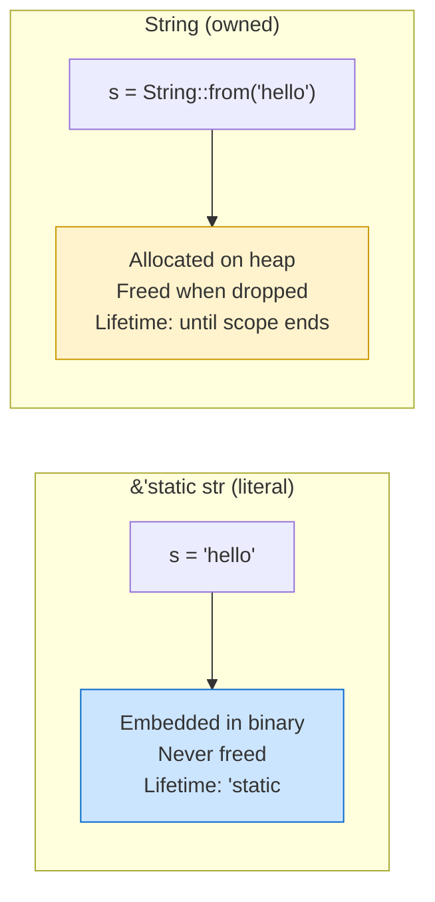

# The 'static Lifetime ♾️

> **"'static is the longest possible lifetime — it means the data lives for the entire duration of the program. But it's not as scary (or as common) as you might think."**

---

## Table of Contents

- [What 'static Means](#what-static-means)
- [String Literals Are 'static](#string-literals-are-static)
- [Other 'static Data](#other-static-data)
- [T: 'static — The Bound That Confuses Everyone](#t-static--the-bound-that-confuses-everyone)
- [When You See 'static in Error Messages](#when-you-see-static-in-error-messages)
- ['static vs Owned Data](#static-vs-owned-data)
- [Real-World Uses of 'static](#real-world-uses-of-static)
- [Common Mistakes](#common-mistakes)
- [Try It Yourself](#try-it-yourself)
- [Summary](#summary)

---

## What 'static Means

The `'static` lifetime means the reference is valid for the **entire duration of the program**. Data with a `'static` lifetime is either:

1. **Baked into the binary** (string literals, constants)
2. **Intentionally leaked** (rare, advanced use)
3. **Global/static variables**

```
┌──────────────────────────────────────────────────────────┐
│                  PROGRAM MEMORY                          │
│                                                          │
│  ┌──────────────────────────────────────────────┐        │
│  │  Binary / Read-Only Data                      │        │
│  │  "hello"  "world"  "error: not found"         │        │
│  │  These string literals live HERE — embedded    │        │
│  │  in the compiled binary. They exist from       │        │
│  │  program start to program end.                 │        │
│  │  Lifetime: 'static                             │        │
│  └──────────────────────────────────────────────┘        │
│                                                          │
│  ┌──────────────────────────────────────────────┐        │
│  │  Heap                                         │        │
│  │  String::from("hello")                        │        │
│  │  Lives until owner is dropped.                │        │
│  │  Lifetime: NOT 'static (usually)              │        │
│  └──────────────────────────────────────────────┘        │
│                                                          │
│  ┌──────────────────────────────────────────────┐        │
│  │  Stack                                        │        │
│  │  let x = 5;                                   │        │
│  │  Lives until function returns.                │        │
│  │  Lifetime: NOT 'static                        │        │
│  └──────────────────────────────────────────────┘        │
└──────────────────────────────────────────────────────────┘
```

---

## String Literals Are 'static

Every string literal in Rust has the type `&'static str`:

```rust
fn main() {
    let s: &'static str = "hello, world!";
    // This string is embedded in the program binary.
    // It exists from the moment the program starts until it exits.
    // The reference is ALWAYS valid — it can never dangle.
    println!("{s}");
}
```

You usually don't write `&'static str` explicitly — the compiler infers it:

```rust
fn main() {
    let s = "hello"; // type: &'static str (inferred)
    println!("{s}");
}
```

### Why String Literals Are 'static

```
Your source code:     let s = "hello";

After compilation:
┌────────────────────────────────────┐
│          COMPILED BINARY            │
│                                    │
│  .rodata section:                  │
│    address 0x4000: "hello\0"       │
│                                    │
│  .text section:                    │
│    let s = pointer to 0x4000       │
│    (s.ptr = 0x4000, s.len = 5)    │
└────────────────────────────────────┘

The bytes "hello" are literally inside the .exe / binary file.
They can never be freed or moved. They exist forever.
That's why the reference is 'static.
```

### String Literal vs String



---

## Other 'static Data

### Constants

```rust
const MAX_RETRIES: u32 = 3;
const APP_NAME: &str = "MyApp"; // &'static str

fn main() {
    println!("{APP_NAME} will retry up to {MAX_RETRIES} times");
}
```

### Static Variables

```rust
static VERSION: &str = "1.0.0";
static COUNTER: std::sync::atomic::AtomicU32 = std::sync::atomic::AtomicU32::new(0);

fn main() {
    println!("Version: {VERSION}");
}
```

### Leaked Data (Advanced)

You can intentionally leak heap data to give it a `'static` lifetime. This is rare but sometimes useful:

```rust
fn make_static(s: String) -> &'static str {
    // Leak the String — it will never be freed
    // The memory stays alive for the rest of the program
    Box::leak(s.into_boxed_str())
}

fn main() {
    let dynamic = String::from("created at runtime");
    let permanent: &'static str = make_static(dynamic);
    println!("{permanent}"); // "created at runtime"
    // Note: the leaked memory is never freed (until program exits)
}
```

Use `Box::leak` very sparingly — it's essentially a controlled memory leak.

---

## T: 'static — The Bound That Confuses Everyone

One of the most confusing lifetime concepts is the `T: 'static` bound. It does **NOT** mean "T must be a reference with lifetime 'static." It means:

> **"T must not contain any non-'static references."**

In other words: **T can be safely kept alive forever** (though it doesn't have to be).

### What Satisfies T: 'static

```rust
// All of these satisfy T: 'static:
// - i32, f64, bool (no references at all)
// - String (owns its data, no borrowed references)
// - Vec<i32> (owns its data)
// - Box<dyn Error> (owns its data)
// - &'static str (reference IS 'static)

// These do NOT satisfy T: 'static:
// - &str (might not be 'static)
// - &String (reference to a local)
// - Excerpt<'a> (contains a non-'static reference)
```

### Practical Example

```rust
use std::fmt::Display;

// T: 'static means T has no short-lived references
fn print_forever<T: Display + 'static>(val: T) {
    println!("{val}");
}

fn main() {
    print_forever(42);                     // i32: 'static (no references)
    print_forever(String::from("hello"));  // String: 'static (owns data)
    print_forever("literal");              // &'static str: 'static

    let local = String::from("local");
    // print_forever(&local);
    // ERROR: &local is not 'static — it only lives until end of main
    // But String itself IS 'static — it owns its data
    print_forever(local); // This works! String is moved in.
}
```

### The Key Insight

```
┌────────────────────────────────────────────────────────────┐
│  T: 'static does NOT mean "T lives forever"                │
│                                                            │
│  It means "T COULD live forever if needed"                 │
│  (because it doesn't borrow from anything short-lived)     │
│                                                            │
│  Types that satisfy T: 'static:                            │
│    - Any type that OWNS all its data                       │
│    - Any type with only 'static references                 │
│                                                            │
│  A String satisfies 'static because it OWNS its data.      │
│  It can be dropped at any time, but it COULD live forever. │
└────────────────────────────────────────────────────────────┘
```

---

## When You See 'static in Error Messages

A common confusing error:

```
error[E0597]: `x` does not live long enough
  |
  = note: ...requires that `x` is borrowed for `'static`
```

This usually means you're trying to use a reference where the API requires owned data or `'static` data. Common scenarios:

### Scenario 1: Thread Spawning

```rust
use std::thread;

fn main() {
    let name = String::from("Alice");

    // thread::spawn requires 'static — the thread might outlive main!
    // let handle = thread::spawn(|| {
    //     println!("{name}"); // ERROR: name might not live long enough
    // });

    // FIX: move ownership into the thread
    let handle = thread::spawn(move || {
        println!("{name}"); // name is MOVED into the closure
    });

    handle.join().unwrap();
}
```

### Scenario 2: Storing in a Long-Lived Collection

```rust
fn main() {
    let mut messages: Vec<&'static str> = Vec::new();

    messages.push("hello");    // OK — string literal is 'static
    messages.push("world");    // OK — string literal is 'static

    let dynamic = String::from("dynamic");
    // messages.push(&dynamic);
    // ERROR: dynamic doesn't live long enough for 'static

    // FIX: use Vec<String> instead
    let mut owned_messages: Vec<String> = Vec::new();
    owned_messages.push(String::from("hello"));
    owned_messages.push(dynamic); // moves the String in
}
```

---

## 'static vs Owned Data

A common question: "Should I use `&'static str` or `String`?"

| Feature | `&'static str` | `String` |
|---------|----------------|----------|
| Memory | In binary (no heap allocation) | Heap-allocated |
| Mutability | Immutable | Mutable |
| Source | Literals, constants, leaked | Created at runtime |
| Copyable | Yes (it's a reference) | No (must clone) |
| Use case | Fixed text, constants | Dynamic text, user input |

### When to Use Each

```rust
fn main() {
    // Use &'static str for known-at-compile-time values:
    let error_msg: &str = "file not found"; // &'static str
    let app_name: &str = "MyApp";           // &'static str

    // Use String for runtime-generated values:
    let user_input = String::from("hello");
    let greeting = format!("Hello, {}!", "world");
    let file_contents = std::fs::read_to_string("data.txt")
        .unwrap_or_default();

    println!("{error_msg} {app_name}");
    println!("{user_input} {greeting}");
}
```

---

## Real-World Uses of 'static

### Error Messages

```rust
#[derive(Debug)]
struct AppError {
    message: &'static str, // error messages are always literals
    code: u32,
}

impl AppError {
    fn new(message: &'static str, code: u32) -> Self {
        AppError { message, code }
    }
}

fn validate_age(age: i32) -> Result<i32, AppError> {
    if age < 0 {
        Err(AppError::new("age cannot be negative", 400))
    } else if age > 150 {
        Err(AppError::new("age is unrealistically high", 400))
    } else {
        Ok(age)
    }
}

fn main() {
    match validate_age(-5) {
        Ok(age) => println!("Valid age: {age}"),
        Err(e) => println!("Error {}: {}", e.code, e.message),
    }
}
```

### Configuration Defaults

```rust
struct Config {
    host: String,
    port: u16,
}

impl Default for Config {
    fn default() -> Self {
        Config {
            host: String::from("localhost"), // could be &'static str if immutable
            port: 8080,
        }
    }
}

const DEFAULT_HOST: &str = "localhost"; // &'static str
const DEFAULT_PORT: u16 = 8080;

fn main() {
    let config = Config::default();
    println!("{}:{}", config.host, config.port);
}
```

### Type-Erased Errors

```rust
use std::error::Error;

// Box<dyn Error + 'static> — the error type must not contain
// short-lived references (so it can be passed around freely)
fn do_something() -> Result<(), Box<dyn Error>> {
    let num: i32 = "42".parse()?;
    println!("{num}");
    Ok(())
}

fn main() {
    if let Err(e) = do_something() {
        println!("Error: {e}");
    }
}
```

---

## Common Mistakes

### Mistake 1: Thinking &'static means "the reference lives forever"

```rust
fn main() {
    let s: &'static str = "hello";
    // s is a reference that COULD live forever,
    // but it can still be shadowed, go out of scope, etc.

    {
        let s: &'static str = "scoped";
        println!("{s}"); // "scoped"
    }
    // s from inner scope is gone (the binding, not the data)

    println!("{s}"); // "hello" — the outer binding is still here
}
```

### Mistake 2: Trying to make everything 'static

```rust
// DON'T DO THIS — unnecessary complexity
// fn process(data: &'static str) { ... }

// DO THIS — accept any lifetime
fn process(data: &str) {
    println!("Processing: {data}");
}

fn main() {
    process("literal");                          // works
    let dynamic = String::from("dynamic");
    process(&dynamic);                           // also works!
}
```

### Mistake 3: Confusing &'static str with String

```rust
fn main() {
    // &'static str — immutable, in binary, no allocation
    let literal: &'static str = "hello";

    // String — mutable, on heap, allocated at runtime
    let mut owned: String = String::from("hello");
    owned.push_str(", world!");

    // You can get a &str from a String, but it won't be 'static
    let slice: &str = &owned; // lifetime tied to `owned`, not 'static

    println!("{literal} | {owned} | {slice}");
}
```

---

## Try It Yourself

### Exercise 1: Identify 'static

Which of these are `'static`?

```rust
let a = "hello";                        // 1
let b = String::from("hello");          // 2
let c = &b;                             // 3
let d = 42_i32;                         // 4
let e = vec![1, 2, 3];                  // 5
```

<details>
<summary><strong>Answer</strong></summary>

1. `"hello"` is `&'static str` — string literal, embedded in binary
2. `String::from("hello")` satisfies `T: 'static` — it owns its data (no short-lived refs)
3. `&b` is NOT 'static — it's a reference to a local variable
4. `42_i32` satisfies `T: 'static` — it's a value type with no references
5. `vec![1,2,3]` satisfies `T: 'static` — Vec owns its data

</details>

### Exercise 2: Fix the Thread Error

This code won't compile. Fix it:

```rust
use std::thread;

fn main() {
    let data = vec![1, 2, 3];
    let handle = thread::spawn(|| {
        println!("{:?}", data);
    });
    handle.join().unwrap();
}
```

<details>
<summary><strong>Solution</strong></summary>

Use `move` to transfer ownership into the thread:

```rust
use std::thread;

fn main() {
    let data = vec![1, 2, 3];
    let handle = thread::spawn(move || {
        println!("{:?}", data);
    });
    handle.join().unwrap();
    // data was moved — can't use it here
}
```

</details>

### Exercise 3: 'static Bound

Why does this work? Explain why `String` satisfies `T: 'static`.

```rust
fn log_message<T: std::fmt::Display + 'static>(msg: T) {
    println!("[LOG] {msg}");
}

fn main() {
    log_message(String::from("server started"));
    log_message(42);
    log_message("hello");
}
```

<details>
<summary><strong>Answer</strong></summary>

`T: 'static` means "T does not contain any non-'static references." All three types qualify:

- `String` owns its data (no references at all) — satisfies `'static`
- `i32` has no references — satisfies `'static`
- `"hello"` is `&'static str` — the reference itself is `'static`

`'static` does NOT mean "lives forever" — it means "could live forever if needed."

</details>

---

## Summary

| Concept | Key Idea |
|---------|----------|
| **`'static` lifetime** | Data is valid for the entire program duration |
| **String literals** | Always `&'static str` — embedded in the binary |
| **Constants** | `const` and `static` values have `'static` lifetime |
| **`T: 'static`** | "T has no short-lived references" — NOT "T lives forever" |
| **Owned types** | `String`, `Vec<T>`, `i32` all satisfy `T: 'static` |
| **Thread spawning** | Requires `'static` because threads may outlive the caller |
| **`Box::leak`** | Converts heap data to `'static` by leaking it (use sparingly) |
| **Common fix** | Use `move` closures or owned types instead of references |

### Key Takeaway

> `'static` means the data *could* live for the entire program. String literals get it for free (they're in the binary). Owned types like `String` satisfy `T: 'static` because they don't borrow from anything. When an API requires `'static`, it usually means: "give me owned data, not borrowed references."

---

<p align="center">
  <strong>Tutorial 6 of 7 — Stage 9: Lifetimes</strong>
</p>

<p align="center">
  <a href="./05-lifetimes-in-structs.md">← Previous: Lifetimes in Structs</a> | <a href="./07-lifetime-patterns.md">Next: Lifetime Patterns & Tips →</a>
</p>
