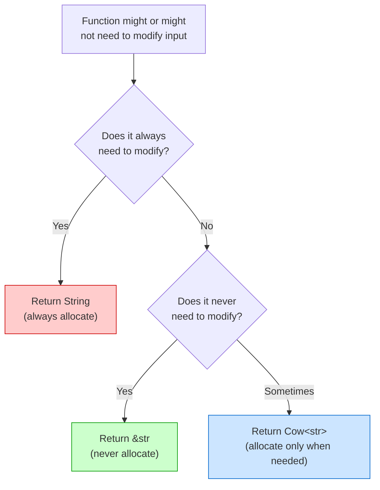
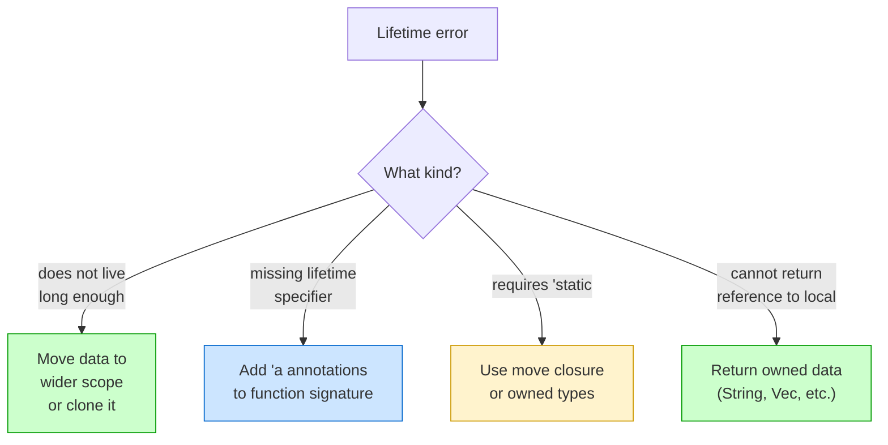

# Lifetime Patterns & Tips 🧩

> **"When you're fighting the borrow checker, it's often a sign that your data structure needs rethinking, not more lifetime annotations."**

---

## Table of Contents

- [The Golden Rule of Lifetime Annotations](#the-golden-rule-of-lifetime-annotations)
- [Pattern 1: Input-Output Borrowing](#pattern-1-input-output-borrowing)
- [Pattern 2: Structs as Views](#pattern-2-structs-as-views)
- [Pattern 3: The Builder Pattern with Lifetimes](#pattern-3-the-builder-pattern-with-lifetimes)
- [Pattern 4: Cow — Clone on Write](#pattern-4-cow--clone-on-write)
- [When to Restructure Instead of Annotate](#when-to-restructure-instead-of-annotate)
- [Lifetime Troubleshooting Guide](#lifetime-troubleshooting-guide)
- [Advanced: Higher-Ranked Trait Bounds](#advanced-higher-ranked-trait-bounds)
- [Common Mistakes](#common-mistakes)
- [Try It Yourself](#try-it-yourself)
- [Summary](#summary)

---

## The Golden Rule of Lifetime Annotations

Before diving into patterns, remember this:

```
┌────────────────────────────────────────────────────────────┐
│          WHEN IN DOUBT, OWN YOUR DATA                      │
│                                                            │
│  If lifetimes are making your code complex:                │
│    1. First try using owned types (String, Vec, etc.)      │
│    2. Only use references when you have a clear reason:    │
│       - Performance (avoiding copies of large data)        │
│       - Zero-copy parsing                                  │
│       - The API requires it                                │
│    3. If you're adding > 2 lifetime parameters, STOP       │
│       and reconsider your design.                          │
└────────────────────────────────────────────────────────────┘
```

---

## Pattern 1: Input-Output Borrowing

The most common pattern: a function takes references in and returns a reference derived from one of them.

### Same-Source Borrowing

```rust
/// Returns the longer of two string slices
fn longer<'a>(a: &'a str, b: &'a str) -> &'a str {
    if a.len() >= b.len() { a } else { b }
}

/// Trims whitespace and returns a slice of the input
fn clean(input: &str) -> &str {
    input.trim()
}

/// Finds the first word in a sentence
fn first_word(s: &str) -> &str {
    s.split_whitespace().next().unwrap_or("")
}

fn main() {
    let text = String::from("  hello world  ");
    let cleaned = clean(&text);
    let word = first_word(cleaned);
    println!("'{word}'"); // 'hello'
}
```

### Different-Source Borrowing

```rust
/// Search for a pattern in text — result borrows from text, not pattern
fn find_match<'a>(text: &'a str, pattern: &str) -> Option<&'a str> {
    text.find(pattern).map(|i| &text[i..i + pattern.len()])
}

fn main() {
    let document = String::from("Rust is awesome and Rust is fast");
    let result;
    {
        let search = String::from("awesome");
        result = find_match(&document, &search);
    }
    // search dropped — but result borrows from document, so it's fine
    println!("{:?}", result); // Some("awesome")
}
```

---

## Pattern 2: Structs as Views

Use structs with lifetimes to create "views" into data without copying it:

```rust
/// A zero-copy CSV row parser
struct CsvRow<'a> {
    fields: Vec<&'a str>,
}

impl<'a> CsvRow<'a> {
    fn parse(line: &'a str) -> Self {
        CsvRow {
            fields: line.split(',').map(|f| f.trim()).collect(),
        }
    }

    fn get(&self, index: usize) -> Option<&'a str> {
        self.fields.get(index).copied()
    }

    fn field_count(&self) -> usize {
        self.fields.len()
    }
}

fn main() {
    let data = String::from("Alice, 30, Engineer, alice@example.com");
    let row = CsvRow::parse(&data);

    println!("Name: {}", row.get(0).unwrap_or("?"));   // Alice
    println!("Age: {}", row.get(1).unwrap_or("?"));     // 30
    println!("Fields: {}", row.field_count());           // 4
    // No heap allocations for the fields — they're all slices of `data`
}
```

### When Views Shine

```
┌───────────────────────────────────────────────────┐
│  WITHOUT views (allocating):                       │
│    "Alice,30,Engineer" → ["Alice", "30", "Engineer"]
│    Each element is a new String allocation.         │
│    Total: 3 heap allocations + 3 copies.           │
│                                                    │
│  WITH views (zero-copy):                           │
│    "Alice,30,Engineer" → [&"Alice", &"30", &"Engineer"]
│    Each element is a pointer into the original.     │
│    Total: 0 heap allocations, 0 copies.            │
└───────────────────────────────────────────────────┘
```

---

## Pattern 3: The Builder Pattern with Lifetimes

Builders can borrow configuration data:

```rust
struct QueryBuilder<'a> {
    table: &'a str,
    conditions: Vec<String>,
    limit: Option<usize>,
}

impl<'a> QueryBuilder<'a> {
    fn new(table: &'a str) -> Self {
        QueryBuilder {
            table,
            conditions: Vec::new(),
            limit: None,
        }
    }

    fn where_clause(mut self, condition: &str) -> Self {
        self.conditions.push(condition.to_string());
        self
    }

    fn limit(mut self, n: usize) -> Self {
        self.limit = Some(n);
        self
    }

    fn build(&self) -> String {
        let mut query = format!("SELECT * FROM {}", self.table);
        if !self.conditions.is_empty() {
            query.push_str(" WHERE ");
            query.push_str(&self.conditions.join(" AND "));
        }
        if let Some(limit) = self.limit {
            query.push_str(&format!(" LIMIT {limit}"));
        }
        query
    }
}

fn main() {
    let table_name = String::from("users");
    let query = QueryBuilder::new(&table_name)
        .where_clause("age > 18")
        .where_clause("active = true")
        .limit(10)
        .build();

    println!("{query}");
    // SELECT * FROM users WHERE age > 18 AND active = true LIMIT 10
}
```

---

## Pattern 4: Cow — Clone on Write

`Cow<'a, T>` (Clone on Write) is a smart pointer that can hold either borrowed or owned data. It lets you avoid allocations when possible but clone when necessary:

```rust
use std::borrow::Cow;

/// Normalize a name: trim whitespace and capitalize first letter
/// Returns borrowed data if no changes needed, owned if modified
fn normalize_name(name: &str) -> Cow<'_, str> {
    let trimmed = name.trim();
    if trimmed.is_empty() {
        return Cow::Borrowed("Anonymous");
    }

    // Check if already properly capitalized
    let first_char = trimmed.chars().next().unwrap();
    if first_char.is_uppercase() && trimmed == name {
        Cow::Borrowed(name) // no allocation needed!
    } else {
        // Need to create a new String
        let mut result = String::with_capacity(trimmed.len());
        for (i, c) in trimmed.chars().enumerate() {
            if i == 0 {
                result.extend(c.to_uppercase());
            } else {
                result.push(c);
            }
        }
        Cow::Owned(result)
    }
}

fn main() {
    let names = vec!["Alice", "  bob  ", "CHARLIE", "", "  dave"];

    for name in names {
        let normalized = normalize_name(name);
        println!("'{}' -> '{}'", name, normalized);
    }
    // 'Alice' -> 'Alice'       (borrowed — no allocation)
    // '  bob  ' -> 'Bob'       (owned — had to modify)
    // 'CHARLIE' -> 'CHARLIE'   (borrowed — already correct)
    // '' -> 'Anonymous'        (borrowed — static literal)
    // '  dave' -> 'Dave'       (owned — had to modify)
}
```

### When to Use Cow



---

## When to Restructure Instead of Annotate

Sometimes the best fix for lifetime complexity is to change your data structure:

### Before: Fighting Lifetimes

```rust
// Complex, hard to use — lifetime constraints everywhere
// struct App<'a> {
//     config: &'a Config,
//     database: &'a Database,
//     cache: &'a Cache,
// }
// Every user of App must ensure Config, Database, and Cache
// all outlive the App. This is a maintenance nightmare.
```

### After: Own Your Data

```rust
// Simple, easy to use — no lifetimes needed
struct App {
    config: Config,
    database: Database,
    cache: Cache,
}

struct Config {
    host: String,
    port: u16,
}

struct Database {
    connection_string: String,
}

struct Cache {
    max_size: usize,
}

impl App {
    fn new() -> Self {
        App {
            config: Config { host: String::from("localhost"), port: 8080 },
            database: Database { connection_string: String::from("sqlite://app.db") },
            cache: Cache { max_size: 1000 },
        }
    }
}

fn main() {
    let app = App::new();
    println!("Server on {}:{}", app.config.host, app.config.port);
}
```

### Decision Guide

```
┌────────────────────────────────────────────────────────┐
│  Signs you should OWN data (use String/Vec):           │
│  - Struct is long-lived or stored in a collection      │
│  - Struct is returned from functions                   │
│  - You're adding 3+ lifetime parameters                │
│  - The borrowed data is small (cheap to clone)         │
│                                                        │
│  Signs you should BORROW data (use &str/&[T]):         │
│  - Struct is short-lived (e.g., within a single loop)  │
│  - Performance matters (processing large data)         │
│  - Zero-copy parsing                                   │
│  - The API/trait requires references                   │
└────────────────────────────────────────────────────────┘
```

---

## Lifetime Troubleshooting Guide

### Problem: "does not live long enough"

```
error[E0597]: `x` does not live long enough
```

**Cause:** A reference outlives the data it points to.

**Fixes:**
1. Move the data to a wider scope
2. Clone the data instead of borrowing
3. Use an owned type instead of a reference

### Problem: "missing lifetime specifier"

```
error[E0106]: missing lifetime specifier
```

**Cause:** The compiler can't infer lifetimes via elision rules.

**Fix:** Add explicit lifetime annotations. Check which input the output borrows from.

### Problem: "cannot infer an appropriate lifetime"

```
error: cannot infer an appropriate lifetime
```

**Cause:** Lifetime constraints are contradictory or too complex.

**Fixes:**
1. Simplify your function signature
2. Use owned types instead of references
3. Split complex functions into simpler ones

### Problem: "requires that `x` is borrowed for `'static`"

**Cause:** Usually thread spawning or trait objects requiring `'static`.

**Fix:** Use `move` closures or owned types.

### Troubleshooting Flowchart



---

## Advanced: Higher-Ranked Trait Bounds

For advanced users: sometimes you need a function that works with references of ANY lifetime. This uses the `for<'a>` syntax:

```rust
fn apply_to_ref<F>(f: F, data: &str)
where
    F: for<'a> Fn(&'a str) -> &'a str,
{
    let result = f(data);
    println!("{result}");
}

fn first_word(s: &str) -> &str {
    s.split_whitespace().next().unwrap_or("")
}

fn main() {
    apply_to_ref(first_word, "hello world");
    // Output: hello
}
```

You'll rarely need this in everyday Rust code, but it appears in some library APIs. The `for<'a>` syntax reads as: "for any lifetime `'a`."

---

## Common Mistakes

### Mistake 1: Over-annotating

```rust
// TOO MANY LIFETIMES — this is a code smell
// struct Processor<'a, 'b, 'c, 'd> {
//     input: &'a str,
//     output: &'b str,
//     config: &'c Config,
//     cache: &'d Cache,
// }

// BETTER: own most data, borrow only what's necessary
struct Processor<'a> {
    input: &'a str,    // borrow: zero-copy processing
    config: Config,    // own: used throughout processor lifetime
    cache: Cache,      // own: modified by processor
}

struct Config { level: u32 }
struct Cache { entries: Vec<String> }
```

### Mistake 2: Using references in return types when not needed

```rust
// UNNECESSARY — creates lifetime complexity
// fn create_greeting<'a>(name: &'a str) -> (&'a str, String) {
//     (name, format!("Hello, {name}!"))
// }

// SIMPLER — just return owned data
fn create_greeting(name: &str) -> String {
    format!("Hello, {name}!")
}

fn main() {
    println!("{}", create_greeting("Alice"));
}
```

### Mistake 3: Not knowing about Cow

```rust
use std::borrow::Cow;

// INEFFICIENT — always allocates even when not needed
fn ensure_prefix_alloc(s: &str) -> String {
    if s.starts_with("https://") {
        s.to_string()  // unnecessary allocation!
    } else {
        format!("https://{s}")
    }
}

// EFFICIENT — only allocates when modification is needed
fn ensure_prefix(s: &str) -> Cow<'_, str> {
    if s.starts_with("https://") {
        Cow::Borrowed(s)
    } else {
        Cow::Owned(format!("https://{s}"))
    }
}

fn main() {
    let urls = vec!["https://example.com", "example.org", "https://rust-lang.org"];
    for url in urls {
        println!("{}", ensure_prefix(url));
    }
}
```

---

## Try It Yourself

### Exercise 1: Choose the Right Pattern

For each scenario, choose: owned data, borrowed data, or `Cow`:

1. A function that adds "Dr." prefix if not already present
2. A struct that stores database query results permanently
3. A struct that tokenizes input text for a parser
4. A function that may or may not modify a filename

<details>
<summary><strong>Answer</strong></summary>

1. **Cow** — sometimes borrowed (already has prefix), sometimes owned (needs modification)
2. **Owned** — long-lived data needs to outlive the query source
3. **Borrowed** — tokens reference the input text (zero-copy)
4. **Cow** — same reasoning as #1

</details>

### Exercise 2: Simplify the Lifetimes

This struct has too many lifetime parameters. Simplify it:

```rust
struct Report<'a, 'b, 'c> {
    title: &'a str,
    author: &'b str,
    content: &'c str,
}
```

<details>
<summary><strong>Solution</strong></summary>

Option A: Use a single lifetime (if all data comes from the same source):

```rust
struct Report<'a> {
    title: &'a str,
    author: &'a str,
    content: &'a str,
}
```

Option B: Own the data (if the struct is long-lived):

```rust
struct Report {
    title: String,
    author: String,
    content: String,
}
```

Option B is usually better unless you have a specific zero-copy requirement.

</details>

### Exercise 3: Implement Cow

Write a function `clean_input` that trims whitespace and lowercases a string. Use `Cow` to avoid allocating when the input is already clean:

<details>
<summary><strong>Solution</strong></summary>

```rust
use std::borrow::Cow;

fn clean_input(input: &str) -> Cow<'_, str> {
    let trimmed = input.trim();
    if trimmed == input && trimmed.chars().all(|c| c.is_lowercase() || !c.is_alphabetic()) {
        Cow::Borrowed(input) // already clean
    } else {
        Cow::Owned(trimmed.to_lowercase())
    }
}

fn main() {
    println!("{}", clean_input("hello"));       // Borrowed (no alloc)
    println!("{}", clean_input("  HELLO  "));   // Owned (had to modify)
    println!("{}", clean_input("test123"));      // Borrowed (no alloc)
}
```

</details>

### Exercise 4: Troubleshoot the Error

This code has a lifetime error. Identify the problem and fix it:

```rust
struct Cache {
    entries: Vec<String>,
}

impl Cache {
    fn get_or_insert(&mut self, key: &str) -> &str {
        if let Some(entry) = self.entries.iter().find(|e| e.starts_with(key)) {
            return entry;
        }
        self.entries.push(format!("{key}=default"));
        self.entries.last().unwrap()
    }
}
```

<details>
<summary><strong>Solution</strong></summary>

The issue is that `entry` borrows `self.entries` immutably, but `self.entries.push()` borrows mutably. The fix is to restructure to avoid holding an immutable borrow across a mutable operation:

```rust
struct Cache {
    entries: Vec<String>,
}

impl Cache {
    fn get_or_insert(&mut self, key: &str) -> &str {
        // Check if it exists first (borrow ends at the if)
        let found = self.entries.iter().position(|e| e.starts_with(key));

        match found {
            Some(idx) => &self.entries[idx],
            None => {
                self.entries.push(format!("{key}=default"));
                self.entries.last().unwrap()
            }
        }
    }
}

fn main() {
    let mut cache = Cache { entries: Vec::new() };
    println!("{}", cache.get_or_insert("color")); // "color=default"
    println!("{}", cache.get_or_insert("color")); // "color=default" (found)
}
```

</details>

---

## Summary

| Pattern | When to Use | Example |
|---------|-------------|---------|
| **Input-output borrowing** | Function derives output from input | `fn trim(s: &str) -> &str` |
| **Structs as views** | Zero-copy parsing, windowed access | `struct CsvRow<'a> { fields: Vec<&'a str> }` |
| **Builder with lifetimes** | Builder borrows config, produces owned output | `QueryBuilder<'a>` |
| **Cow (Clone on Write)** | Might or might not need to modify | `fn normalize(s: &str) -> Cow<str>` |
| **Own instead of borrow** | Long-lived data, return values, simplicity | `struct Config { host: String }` |

### Key Takeaways

1. **Start with owned data** — switch to references only when you have a reason
2. **Use Cow** when a function sometimes modifies and sometimes doesn't
3. **3+ lifetime parameters** is a code smell — restructure your types
4. **Lifetime errors** often signal a design problem, not a missing annotation
5. **The borrow checker is your friend** — it catches real bugs at compile time

### Final Thought

> The best Rust code often has very few explicit lifetime annotations. If you find yourself drowning in `'a`, `'b`, `'c`, step back and ask: "Should I just own this data?" The answer is usually yes.

---

## Lifetime Patterns — Quiz & Cheat Sheet

### Quick Quiz: Does This Compile?

Test your understanding. For each snippet, decide: **compiles** or **error**? Answer is in the fold below each.

**Q1:**
```rust
fn first(s: &str) -> &str { &s[..1] }
```
<details><summary>Answer</summary>✅ Compiles — elision rule 2: one input ref, output gets same lifetime.</details>

**Q2:**
```rust
fn pick(a: &str, b: &str) -> &str { a }
```
<details><summary>Answer</summary>❌ Error — two input refs, ambiguous which lifetime to assign to the output. Fix: `fn pick<'a>(a: &'a str, b: &str) -> &'a str`</details>

**Q3:**
```rust
fn main() {
    let s = String::from("hello");
    let r = &s;
    drop(s);
    println!("{}", r);
}
```
<details><summary>Answer</summary>❌ Error — `s` is moved (dropped) while `r` still borrows it. The borrow checker catches this.</details>

**Q4:**
```rust
struct Wrap<'a>(&'a str);
impl<'a> Wrap<'a> {
    fn get(&self) -> &str { self.0 }
}
```
<details><summary>Answer</summary>✅ Compiles — elision rule 3 on `get`: output borrows from `&self`, and since `self` contains `&'a str`, the borrow is valid.</details>

**Q5:**
```rust
fn make() -> &str {
    let s = String::from("hi");
    &s
}
```
<details><summary>Answer</summary>❌ Error — returning a reference to a local variable. `s` is dropped at end of function, leaving a dangling reference.</details>

**Q6:**
```rust
fn identity<'a>(s: &'a str) -> &'a str { s }
```
<details><summary>Answer</summary>✅ Compiles — explicit annotation saying "output borrows from input." Equivalent to what elision would infer anyway.</details>

**Q7:**
```rust
static MSG: &str = "hello";
fn get() -> &'static str { MSG }
```
<details><summary>Answer</summary>✅ Compiles — `'static` data lives for the whole program, perfectly valid to return.</details>

**Q8:**
```rust
fn longer<'a>(x: &'a str, y: &'a str) -> &'a str {
    if x.len() > y.len() { x } else { y }
}
fn main() {
    let s1 = String::from("long string");
    let result;
    {
        let s2 = String::from("xyz");
        result = longer(s1.as_str(), s2.as_str());
        println!("{}", result); // use inside block
    }
}
```
<details><summary>Answer</summary>✅ Compiles — `result` is only used inside the block where both `s1` and `s2` are alive. (Would fail if you moved `println!` outside the block.)</details>

---

### Decision Tree: Should I Add Lifetime Annotations?

```
Is the function/struct using references?
               │
              YES
               │
    Does the compiler complain?
         │           │
        NO           YES — add what the compiler suggests
         │
    Leave it alone — elision handles it
         │
    Does the output reference borrow from multiple inputs?
         │               │
        NO               YES
         │                │
    Elision covers it    Annotate to say which input
                         the output borrows from
         │
    Does the struct hold a reference?
         │               │
        NO               YES — must annotate with 'a
         │
    Does a function return 'static?
         │               │
        NO               YES — annotate 'static
         │
   You probably don't need annotations
```

---

### Lifetime Cheat Sheet

| Situation | Pattern | Example |
|-----------|---------|---------|
| One input ref, one output ref | Elision handles it | `fn first(s: &str) -> &str` |
| Multiple input refs, one output | Annotate the source | `fn f<'a>(a: &'a str, b: &str) -> &'a str` |
| Output from either input | Same `'a` on both | `fn longest<'a>(a: &'a str, b: &'a str) -> &'a str` |
| Struct holds a reference | Lifetime on struct | `struct S<'a> { x: &'a str }` |
| Method output from `self` | Elision Rule 3 | `fn get(&self) -> &str` |
| Method output NOT from `self` | Explicit annotation | `fn get<'a>(&self, s: &'a str) -> &'a str` |
| String literal / constant | `'static` | `fn name() -> &'static str { "Rust" }` |
| Trait object that must be sendable | `'static` bound | `Box<dyn Trait + 'static>` |
| Two independent reference fields | Two lifetimes | `struct S<'a, 'b> { a: &'a str, b: &'b str }` |
| Fighting lifetimes on a struct | Own the data instead | `struct S { x: String }` |

---

<p align="center">
  <strong>Tutorial 7 of 7 — Stage 9: Lifetimes</strong>
</p>

<p align="center">
  <a href="./06-static-lifetime.md">← Previous: The 'static Lifetime</a> | <a href="../10-modules-and-crates/">Next: Stage 10 — Modules & Crates →</a>
</p>
