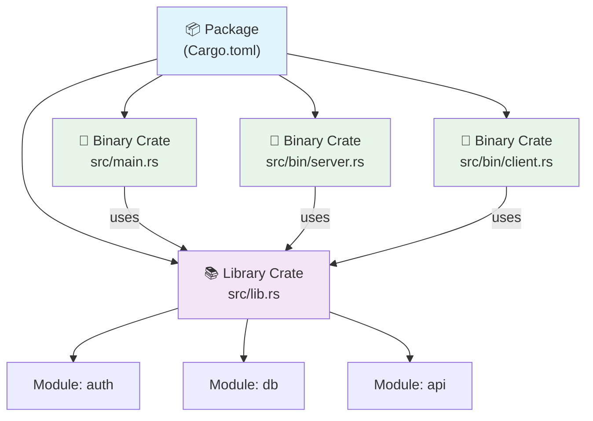

# Packages & Crates — Rust's Building Blocks 📦

> **"A crate is the smallest amount of code that the Rust compiler considers at a time."**
> — *The Rust Programming Language*

---

## Table of Contents

- [What Is a Crate?](#what-is-a-crate)
- [Binary Crates vs Library Crates](#binary-crates-vs-library-crates)
- [What Is a Package?](#what-is-a-package)
- [The Crate Root](#the-crate-root)
- [Anatomy of Cargo.toml](#anatomy-of-cargotoml)
- [Multiple Binary Crates](#multiple-binary-crates)
- [The Shipping Container Analogy](#the-shipping-container-analogy)
- [Comparing to Other Languages](#comparing-to-other-languages)
- [Common Mistakes](#common-mistakes)
- [Try It Yourself](#try-it-yourself)
- [Summary](#summary)

---

## What Is a Crate?

A **crate** is the fundamental compilation unit in Rust. When you run `rustc` or `cargo build`, the compiler processes one crate at a time.

Think of a crate like a **shipping container** — it's a self-contained unit of code that can be transported (shared), stacked (combined with other crates), and opened (used by other code).

```
 ┌─────────────────────────────────────────────┐
 │                  CRATE                       │
 │                                              │
 │  ┌──────────┐  ┌──────────┐  ┌──────────┐  │
 │  │ module A  │  │ module B  │  │ module C  │  │
 │  │          │  │          │  │          │  │
 │  │ fn foo() │  │ fn bar() │  │ struct X  │  │
 │  └──────────┘  └──────────┘  └──────────┘  │
 │                                              │
 │  All compiled together as one unit           │
 └─────────────────────────────────────────────┘
```

Every Rust project you've written so far has been a crate. When you run `cargo new my_project`, you create a new crate.

---

## Binary Crates vs Library Crates

There are exactly **two kinds** of crates in Rust:

### Binary Crates

A **binary crate** compiles to an executable you can run. It **must** have a `main` function.

```rust
// src/main.rs — This is a binary crate
fn main() {
    println!("I am an executable program!");
}
```

```bash
$ cargo new my_app        # creates a binary crate by default
$ cargo run               # compiles AND runs it
```

### Library Crates

A **library crate** compiles to code that other crates can use. It does **not** have a `main` function — it provides functions, types, and traits for others to consume.

```rust
// src/lib.rs — This is a library crate
/// Adds two numbers together.
pub fn add(a: i32, b: i32) -> i32 {
    a + b
}

/// Multiplies two numbers.
pub fn multiply(a: i32, b: i32) -> i32 {
    a * b
}
```

```bash
$ cargo new my_lib --lib  # creates a library crate
```

### Side-by-Side Comparison

```
 Binary Crate                     Library Crate
 ┌──────────────────┐            ┌──────────────────┐
 │  src/main.rs     │            │  src/lib.rs       │
 │                  │            │                   │
 │  fn main() {    │            │  pub fn add() {}  │
 │    // entry     │            │  pub fn mul() {}  │
 │    // point     │            │                   │
 │  }              │            │  // no main()     │
 │                  │            │                   │
 │  Compiles to:   │            │  Compiles to:     │
 │  my_app.exe     │            │  libmy_lib.rlib   │
 └──────────────────┘            └──────────────────┘
       ▼                               ▼
   You RUN it                   Others USE it
```

---

## What Is a Package?

A **package** is one or more crates bundled together with a `Cargo.toml` file. It's the unit that Cargo works with.

**Rules for packages:**
1. A package **must** contain at least one crate
2. A package can contain **at most one** library crate
3. A package can contain **any number** of binary crates

```
 ┌──────────────────────────────────────────┐
 │              PACKAGE                      │
 │         (has Cargo.toml)                  │
 │                                           │
 │  ┌─────────────┐   ┌─────────────┐       │
 │  │ Binary Crate│   │Library Crate│       │
 │  │ src/main.rs │   │ src/lib.rs  │       │
 │  └─────────────┘   └─────────────┘       │
 │                                           │
 │  ┌─────────────┐   ┌─────────────┐       │
 │  │ Binary Crate│   │ Binary Crate│       │
 │  │ src/bin/a.rs│   │ src/bin/b.rs│       │
 │  └─────────────┘   └─────────────┘       │
 │                                           │
 │  0 or 1 library + any number of binaries  │
 └──────────────────────────────────────────┘
```

Here's what `cargo new` gives you:

```bash
$ cargo new hello_world
$ tree hello_world/
hello_world/
├── Cargo.toml        # Package manifest
└── src/
    └── main.rs       # Crate root (binary crate)
```

```bash
$ cargo new my_lib --lib
$ tree my_lib/
my_lib/
├── Cargo.toml        # Package manifest
└── src/
    └── lib.rs        # Crate root (library crate)
```

---

## The Crate Root

The **crate root** is the source file that the Rust compiler starts from when building a crate. It forms the root of the crate's module tree.

| Crate Type | Crate Root | Created By |
|-----------|-----------|-----------|
| Binary | `src/main.rs` | `cargo new name` |
| Library | `src/lib.rs` | `cargo new name --lib` |
| Extra binary | `src/bin/name.rs` | You create it manually |

The compiler doesn't search all your `.rs` files — it starts at the crate root and follows `mod` declarations to find the rest of your code.

```
 Compiler's View:

 src/main.rs  ← START HERE (crate root)
     │
     ├── mod config;    → loads src/config.rs
     │       │
     │       └── mod defaults;  → loads src/config/defaults.rs
     │
     ├── mod db;        → loads src/db.rs
     │
     └── mod routes;    → loads src/routes.rs
```

---

## Anatomy of Cargo.toml

The `Cargo.toml` file is the **heart of every package**. Let's look at a complete example:

```toml
[package]
name = "my_awesome_app"          # Crate name (must be unique on crates.io)
version = "0.1.0"                # Semantic versioning
edition = "2021"                 # Rust edition (2015, 2018, 2021, 2024)
authors = ["Alice <alice@example.com>"]
description = "A short description of what this crate does"
license = "MIT OR Apache-2.0"   # SPDX license expression
repository = "https://github.com/user/repo"
readme = "README.md"
keywords = ["cli", "tool"]      # Up to 5 keywords
categories = ["command-line-utilities"]

[dependencies]
serde = "1.0"                    # From crates.io
serde_json = { version = "1.0", features = ["raw_value"] }
my_local_lib = { path = "../my_lib" }   # Local path dependency
my_git_lib = { git = "https://github.com/user/lib.git" }  # Git dependency

[dev-dependencies]
tempfile = "3.0"                 # Only for tests and examples

[build-dependencies]
cc = "1.0"                       # Only for build scripts

[[bin]]
name = "my_tool"                 # Additional binary
path = "src/bin/my_tool.rs"
```

### Key Sections Explained

```
 Cargo.toml Structure
 ┌──────────────────────────────────┐
 │  [package]                       │  ← Identity & metadata
 │    name, version, edition...     │
 ├──────────────────────────────────┤
 │  [dependencies]                  │  ← What you need at runtime
 │    serde = "1.0"                 │
 ├──────────────────────────────────┤
 │  [dev-dependencies]              │  ← Only for tests/examples
 │    tempfile = "3.0"              │
 ├──────────────────────────────────┤
 │  [build-dependencies]            │  ← Only for build.rs
 │    cc = "1.0"                    │
 ├──────────────────────────────────┤
 │  [[bin]]                         │  ← Extra binary targets
 │    name = "tool"                 │
 └──────────────────────────────────┘
```

---

## Multiple Binary Crates

A single package can contain many binary crates. There are two ways:

### Method 1: The `src/bin/` Directory

Any `.rs` file in `src/bin/` automatically becomes its own binary crate:

```
my_package/
├── Cargo.toml
└── src/
    ├── main.rs          # default binary: "my_package"
    ├── lib.rs           # library crate (optional)
    └── bin/
        ├── server.rs    # binary: "server"
        ├── client.rs    # binary: "client"
        └── migrate.rs   # binary: "migrate"
```

```bash
$ cargo run --bin server    # Run the server binary
$ cargo run --bin client    # Run the client binary
$ cargo run --bin migrate   # Run the migrate binary
$ cargo run                 # Run the default (src/main.rs)
```

### Method 2: Multi-file Binaries

For binaries that need multiple files, use subdirectories:

```
my_package/
└── src/
    └── bin/
        └── server/
            ├── main.rs      # entry point for "server" binary
            ├── config.rs
            └── handlers.rs
```

### Example: A CLI Tool with Multiple Commands

```rust
// src/bin/encode.rs
use my_package::codec;  // use the library crate

fn main() {
    let input = std::env::args().nth(1).expect("provide input");
    let encoded = codec::encode(&input);
    println!("Encoded: {encoded}");
}
```

```rust
// src/bin/decode.rs
use my_package::codec;  // same library, different binary

fn main() {
    let input = std::env::args().nth(1).expect("provide input");
    let decoded = codec::decode(&input);
    println!("Decoded: {decoded}");
}
```

```rust
// src/lib.rs — shared library code
pub mod codec {
    pub fn encode(input: &str) -> String {
        // encoding logic: convert each char to hex
        input.chars().map(|c| format!("{:02x}", c as u8)).collect()
    }

    pub fn decode(input: &str) -> String {
        // decoding logic: convert hex pairs back to chars
        input.as_bytes()
            .chunks(2)
            .filter_map(|chunk| {
                let hex = std::str::from_utf8(chunk).ok()?;
                u8::from_str_radix(hex, 16).ok().map(|b| b as char)
            })
            .collect()
    }
}
```

---

## The Shipping Container Analogy



Think of it this way:

| Real World | Rust Equivalent |
|-----------|----------------|
| Shipping container | Crate |
| Items inside | Modules, functions, types |
| Shipment (group of containers) | Package |
| Shipping manifest | Cargo.toml |
| Shipping company | Cargo (the build tool) |
| Port / warehouse | crates.io |

A **crate** is a single container full of related code. A **package** is the entire shipment — one or more containers plus the paperwork (Cargo.toml) that describes what's inside.

---

## Comparing to Other Languages

| Concept | Rust | JavaScript/npm | Python | Java |
|---------|------|---------------|--------|------|
| Compilation unit | Crate | Module (file) | Module (file) | Class |
| Distribution unit | Package | Package | Package | JAR |
| Manifest | Cargo.toml | package.json | pyproject.toml | pom.xml |
| Registry | crates.io | npmjs.com | PyPI | Maven Central |
| Build tool | Cargo | npm/yarn | pip/poetry | Maven/Gradle |

### package.json vs Cargo.toml

```json
// JavaScript: package.json
{
  "name": "my-app",
  "version": "1.0.0",
  "main": "index.js",
  "dependencies": {
    "express": "^4.18.0"
  }
}
```

```toml
# Rust: Cargo.toml
[package]
name = "my_app"
version = "1.0.0"
edition = "2021"

[dependencies]
actix-web = "4.0"
```

The key difference: Rust's Cargo.toml doesn't need a `"main"` field because Rust uses **convention over configuration** — `src/main.rs` is always the binary crate root and `src/lib.rs` is always the library crate root.

---

## Common Mistakes

### Mistake 1: Confusing Packages and Crates

```
 ❌ Wrong mental model:
 "My project is a crate"

 ✅ Correct mental model:
 "My project is a PACKAGE that contains one or more CRATES"
```

A package is the directory with `Cargo.toml`. The crate(s) are the compiled units inside.

### Mistake 2: Trying to Have Two Library Crates

```
 ❌ This doesn't work:
 my_package/
 ├── Cargo.toml
 └── src/
     ├── lib.rs          # Library crate 1
     └── lib2.rs         # ← Not a second library crate!
```

A package can have **at most one** library crate. If you need multiple libraries, use a **workspace** (covered in tutorial 6).

### Mistake 3: Forgetting `pub` in Library Crates

```rust
// src/lib.rs
// ❌ This function is private — no one outside can use it!
fn helper() -> String {
    "hello".to_string()
}

// ✅ Mark it `pub` so other crates can use it
pub fn helper() -> String {
    "hello".to_string()
}
```

### Mistake 4: Wrong Dependency Version Syntax

```toml
[dependencies]
# ❌ This means exactly 1.0.0 — probably not what you want
serde = "=1.0.0"

# ✅ This means "compatible with 1.0" (any 1.x.y)
serde = "1.0"

# ✅ Be more specific if needed
serde = "1.0.193"    # means >=1.0.193, <2.0.0
```

### Mistake 5: Importing Your Own Library Crate Wrong

```rust
// src/main.rs
// ❌ Can't use `crate::` to access the library from the binary
use crate::my_module::MyType;

// ✅ Use the package name to access the library crate
use my_package::my_module::MyType;
```

The binary crate and library crate are **separate crates** that happen to live in the same package. They communicate through the public API.

---

## Try It Yourself

### Exercise 1: Create a Binary Crate

Create a new binary crate and add a greeting function:

```bash
cargo new greeter
cd greeter
```

Edit `src/main.rs`:

```rust
fn greet(name: &str) -> String {
    format!("Hello, {}! Welcome to Rust.", name)
}

fn main() {
    let message = greet("World");
    println!("{message}");
}
```

Run it with `cargo run`. You should see: `Hello, World! Welcome to Rust.`

### Exercise 2: Create a Library Crate

Create a library crate with math utilities:

```bash
cargo new mathtools --lib
```

Edit `src/lib.rs`:

```rust
/// Returns the factorial of n.
pub fn factorial(n: u64) -> u64 {
    (1..=n).product()
}

/// Returns true if n is prime.
pub fn is_prime(n: u64) -> bool {
    if n < 2 { return false; }
    if n == 2 { return true; }
    if n % 2 == 0 { return false; }
    let mut i = 3;
    while i * i <= n {
        if n % i == 0 { return false; }
        i += 2;
    }
    true
}

#[cfg(test)]
mod tests {
    use super::*;

    #[test]
    fn test_factorial() {
        assert_eq!(factorial(0), 1);
        assert_eq!(factorial(5), 120);
        assert_eq!(factorial(10), 3628800);
    }

    #[test]
    fn test_is_prime() {
        assert!(!is_prime(0));
        assert!(!is_prime(1));
        assert!(is_prime(2));
        assert!(is_prime(17));
        assert!(!is_prime(18));
    }
}
```

Run `cargo test` to verify your tests pass.

### Exercise 3: Add a Dependency

Add the `rand` crate to your `greeter` project:

```toml
# In Cargo.toml, add:
[dependencies]
rand = "0.8"
```

```rust
// src/main.rs
use rand::Rng;

fn main() {
    let mut rng = rand::thread_rng();
    let number: u32 = rng.gen_range(1..=100);
    println!("Random number: {number}");
}
```

Run `cargo run` — Cargo automatically downloads and compiles `rand` for you.

### Exercise 4: Both Binary and Library in One Package

Create a package with both:

```bash
cargo new calculator
cd calculator
```

Create `src/lib.rs`:

```rust
pub fn add(a: f64, b: f64) -> f64 { a + b }
pub fn subtract(a: f64, b: f64) -> f64 { a - b }
pub fn multiply(a: f64, b: f64) -> f64 { a * b }
pub fn divide(a: f64, b: f64) -> Option<f64> {
    if b == 0.0 { None } else { Some(a / b) }
}
```

Edit `src/main.rs`:

```rust
use calculator::{add, subtract, multiply, divide};

fn main() {
    println!("10 + 3 = {}", add(10.0, 3.0));
    println!("10 - 3 = {}", subtract(10.0, 3.0));
    println!("10 * 3 = {}", multiply(10.0, 3.0));
    match divide(10.0, 3.0) {
        Some(result) => println!("10 / 3 = {result:.2}"),
        None => println!("Cannot divide by zero!"),
    }
}
```

### Exercise 5: Multiple Binaries

Add `src/bin/square.rs` and `src/bin/cube.rs` to the calculator package:

```rust
// src/bin/square.rs
use calculator::multiply;

fn main() {
    let n: f64 = std::env::args()
        .nth(1)
        .and_then(|s| s.parse().ok())
        .unwrap_or(5.0);
    println!("{n}^2 = {}", multiply(n, n));
}
```

Run with `cargo run --bin square` and `cargo run --bin cube`.

---

## Summary

| Concept | Definition |
|---------|-----------|
| **Crate** | The smallest compilation unit in Rust — one crate = one call to the compiler |
| **Binary crate** | A crate with `main()` that compiles to an executable |
| **Library crate** | A crate without `main()` that provides code for others to use |
| **Package** | A bundle of one or more crates with a `Cargo.toml` manifest |
| **Crate root** | The entry file: `src/main.rs` (binary) or `src/lib.rs` (library) |
| **Cargo.toml** | The manifest describing the package: metadata, dependencies, targets |
| **src/bin/** | Directory for additional binary crates within a package |
| **Convention** | Rust uses convention over configuration for file layout |

### Key Takeaway

> A **crate** is the unit of compilation. A **package** is the unit of distribution. Cargo.toml ties them together. Understanding this distinction is the foundation for organizing Rust projects of any size.

---

<p align="center">
  <strong>Tutorial 1 of 7 — Stage 10: Modules & Crates</strong>
</p>

<p align="center">
  <a href="../09-lifetimes/">← Previous: Stage 9 — Lifetimes</a> | <a href="./02-defining-modules.md">Next: Defining Modules →</a>
</p>
