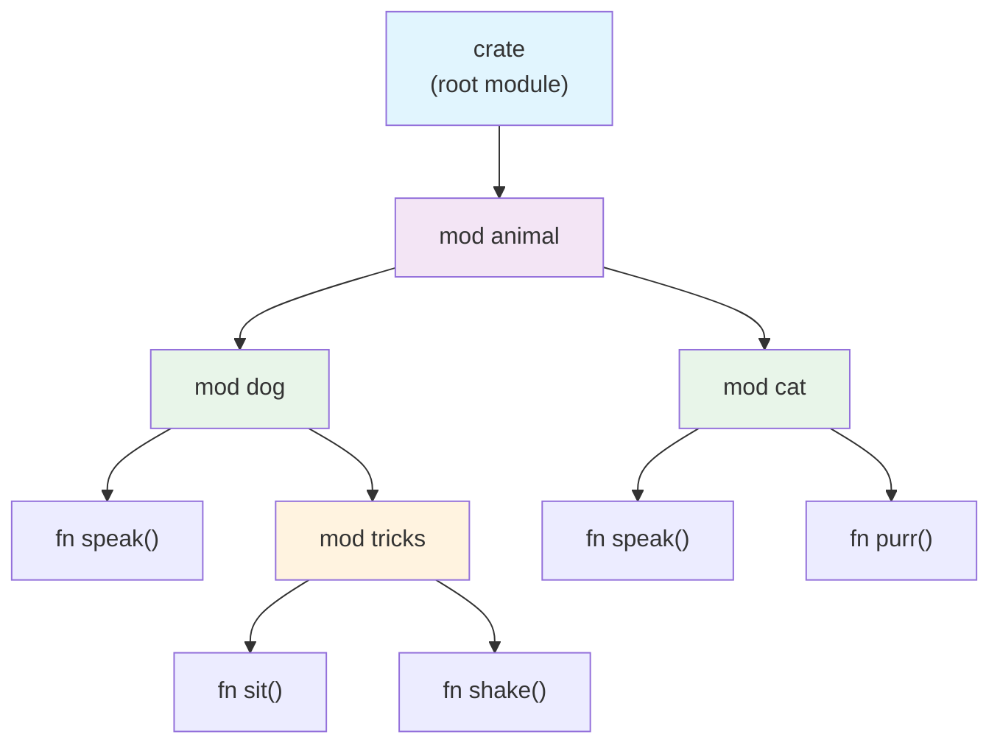
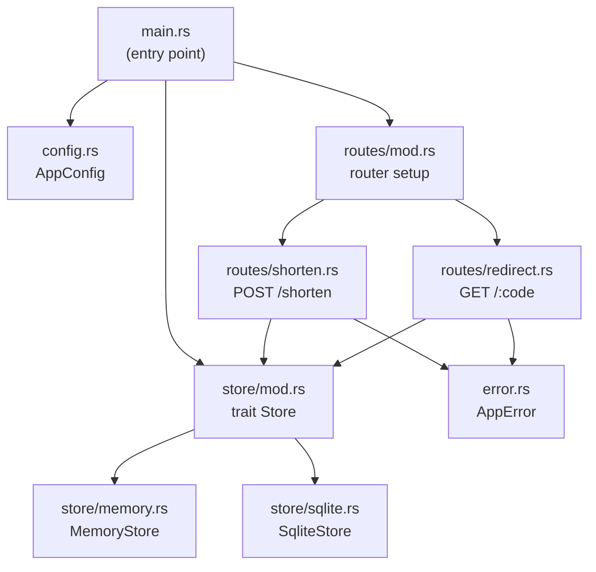

# Defining Modules — Organizing Your Code 🗂️

> **"Modules let you organize code within a crate into groups for readability and easy reuse. Modules also control the privacy of items."**
> — *The Rust Programming Language*

---

## Table of Contents

- [Why Modules?](#why-modules)
- [The mod Keyword](#the-mod-keyword)
- [Inline Modules](#inline-modules)
- [Nested Modules](#nested-modules)
- [The Module Tree](#the-module-tree)
- [Privacy by Default](#privacy-by-default)
- [The Restaurant Example](#the-restaurant-example)
- [The Filing Cabinet Analogy](#the-filing-cabinet-analogy)
- [Comparing to Other Languages](#comparing-to-other-languages)
- [Common Mistakes](#common-mistakes)
- [Try It Yourself](#try-it-yourself)
- [Summary](#summary)

---

## Why Modules?

As your Rust project grows, you can't put everything in one file. Modules let you:

1. **Group related code** — keep all database logic together, all HTTP handlers together, etc.
2. **Control visibility** — decide what's public API vs internal implementation details
3. **Avoid name collisions** — two modules can each have a function called `process()`
4. **Navigate large codebases** — find code by following the module hierarchy

```
 Without modules:               With modules:
 ┌────────────────────┐        ┌────────────────────────┐
 │  main.rs           │        │  main.rs               │
 │                    │        │  ├── mod auth           │
 │  fn connect_db()   │        │  │   ├── fn login()    │
 │  fn login()        │        │  │   └── fn logout()   │
 │  fn logout()       │        │  ├── mod db             │
 │  fn query()        │        │  │   ├── fn connect()  │
 │  fn handle_get()   │        │  │   └── fn query()    │
 │  fn handle_post()  │        │  └── mod routes         │
 │  fn parse_json()   │        │      ├── fn get()      │
 │  fn validate()     │        │      └── fn post()     │
 │  ... 2000 lines    │        └────────────────────────┘
 └────────────────────┘         Clear structure!
   Total chaos!
```

---

## The mod Keyword

You define a module with the `mod` keyword:

```rust
// The simplest possible module
mod greetings {
    pub fn hello() {
        println!("Hello!");
    }

    pub fn goodbye() {
        println!("Goodbye!");
    }
}

fn main() {
    greetings::hello();    // access with :: path separator
    greetings::goodbye();
}
```

The `mod` keyword does two things:
1. **Declares** a module (says "this module exists")
2. **Defines** its contents (either inline or by loading a file)

---

## Inline Modules

Inline modules put the code right inside the `mod` block:

```rust
mod math {
    pub fn add(a: i32, b: i32) -> i32 {
        a + b
    }

    pub fn subtract(a: i32, b: i32) -> i32 {
        a - b
    }

    // This function is PRIVATE — only code inside `math` can call it
    fn internal_helper() -> f64 {
        std::f64::consts::PI
    }
}

mod strings {
    pub fn capitalize(s: &str) -> String {
        let mut chars = s.chars();
        match chars.next() {
            None => String::new(),
            Some(first) => {
                let upper: String = first.to_uppercase().collect();
                upper + chars.as_str()
            }
        }
    }

    pub fn reverse(s: &str) -> String {
        s.chars().rev().collect()
    }
}

fn main() {
    println!("2 + 3 = {}", math::add(2, 3));
    println!("Capitalized: {}", strings::capitalize("hello"));
    println!("Reversed: {}", strings::reverse("hello"));
}
```

Inline modules are great for small, closely-related groups of code. For larger modules, you'll want to move them to separate files (covered in tutorial 5).

---

## Nested Modules

Modules can contain other modules, forming a **tree** structure:

```rust
mod animal {
    pub mod dog {
        pub fn speak() {
            println!("Woof!");
        }

        pub mod tricks {
            pub fn sit() {
                println!("*sits down*");
            }

            pub fn shake() {
                println!("*extends paw*");
            }
        }
    }

    pub mod cat {
        pub fn speak() {
            println!("Meow!");
        }

        pub fn purr() {
            println!("Purrrr...");
        }
    }
}

fn main() {
    animal::dog::speak();           // Woof!
    animal::dog::tricks::sit();     // *sits down*
    animal::cat::speak();           // Meow!
    animal::cat::purr();            // Purrrr...
}
```

Notice how `dog::speak()` and `cat::speak()` can both be called `speak` without conflict — the module path makes them unique.

---

## The Module Tree

Every crate has a **module tree** rooted at the crate root file (`src/main.rs` or `src/lib.rs`). The crate itself is the implicit root module, named `crate`.

```
 Module Tree for the animal example:
 
 crate (root)
 └── animal
     ├── dog
     │   ├── speak()
     │   └── tricks
     │       ├── sit()
     │       └── shake()
     └── cat
         ├── speak()
         └── purr()
```

You can refer to any item using its **full path** from the crate root:

```rust
// These are absolute paths from the crate root
crate::animal::dog::speak();
crate::animal::dog::tricks::sit();
crate::animal::cat::speak();
```

### Visualizing the Module Tree



The module tree is like a file system — just as files live in directories, items (functions, structs, enums) live in modules.

---

## Privacy by Default

In Rust, **everything is private by default**. This is a deliberate design choice that promotes encapsulation.

```rust
mod bank {
    // Private struct — only code in `bank` can create or access it
    struct Account {
        holder: String,
        balance: f64,  // private field
    }

    // Private function — internal implementation detail
    fn validate_amount(amount: f64) -> bool {
        amount > 0.0 && amount < 1_000_000.0
    }

    // Public function — this is the module's API
    pub fn create_account(holder: &str) -> String {
        let account = Account {
            holder: holder.to_string(),
            balance: 0.0,
        };
        format!("Account created for {}", account.holder)
    }

    // Public function
    pub fn deposit(holder: &str, amount: f64) -> String {
        if validate_amount(amount) {     // can call private fn within module
            format!("Deposited ${amount:.2} for {holder}")
        } else {
            format!("Invalid amount: {amount}")
        }
    }
}

fn main() {
    // ✅ These work — they're pub
    println!("{}", bank::create_account("Alice"));
    println!("{}", bank::deposit("Alice", 100.0));

    // ❌ These would NOT compile — they're private
    // let acc = bank::Account { holder: "Bob".into(), balance: 0.0 };
    // let valid = bank::validate_amount(50.0);
}
```

### Privacy Rules at a Glance

```
 ┌─────────────────────────────────────────────────┐
 │  PRIVACY RULES                                   │
 │                                                   │
 │  • Everything is PRIVATE by default               │
 │  • Private items: visible within the same module  │
 │    and its descendants (child modules)             │
 │  • pub items: visible to parent and siblings      │
 │  • Child modules CAN see private parent items     │
 │  • Parent modules CANNOT see private child items  │
 └─────────────────────────────────────────────────┘
```

Think of it like a one-way mirror:

```
 Parent Module
 ┌──────────────────────────────────┐
 │  fn public_fn()  ← visible      │
 │  fn private_fn() ← visible      │
 │                                  │
 │  ┌─────────────────────────┐    │
 │  │  Child Module           │    │
 │  │                         │    │
 │  │  pub fn child_pub()     │←── │── Parent CAN see this
 │  │  fn child_priv()        │    │── Parent CANNOT see this
 │  │                         │    │
 │  │  (can see parent's      │    │
 │  │   private_fn too!)      │    │
 │  └─────────────────────────┘    │
 └──────────────────────────────────┘
```

---

## The Restaurant Example

Let's build a realistic module structure for a restaurant system. This is one of the classic Rust examples:

```rust
mod restaurant {
    pub mod front_of_house {
        pub mod hosting {
            pub fn add_to_waitlist() {
                println!("Added to waitlist");
            }

            pub fn seat_at_table(table: u32) {
                println!("Seated at table {table}");
            }
        }

        pub mod serving {
            pub fn take_order() {
                println!("Order taken");
            }

            pub fn serve_order() {
                println!("Order served");
            }

            pub fn take_payment() {
                println!("Payment received");
            }
        }
    }

    mod back_of_house {
        pub struct Breakfast {
            pub toast: String,       // customer can choose toast
            seasonal_fruit: String,  // chef picks the fruit (private)
        }

        impl Breakfast {
            // We need a constructor because seasonal_fruit is private
            pub fn summer(toast: &str) -> Breakfast {
                Breakfast {
                    toast: toast.to_string(),
                    seasonal_fruit: String::from("peaches"),
                }
            }

            pub fn describe(&self) -> String {
                format!("{} toast with {}", self.toast, self.seasonal_fruit)
            }
        }

        pub enum Appetizer {
            Soup,      // enum variants are pub if the enum is pub
            Salad,
            Bread,
        }

        fn fix_incorrect_order() {
            // Can call sibling function
            cook_order();
        }

        fn cook_order() {
            println!("Cooking...");
        }
    }

    // This function is in the `restaurant` module
    pub fn eat_at_restaurant() {
        // Absolute path
        crate::restaurant::front_of_house::hosting::add_to_waitlist();

        // Relative path (from within restaurant module)
        front_of_house::hosting::seat_at_table(5);
        front_of_house::serving::take_order();
        front_of_house::serving::serve_order();

        // Order a breakfast
        let mut meal = back_of_house::Breakfast::summer("Rye");
        meal.toast = String::from("Wheat");  // ✅ can change pub field
        // meal.seasonal_fruit = String::from("kiwi"); // ❌ private!
        println!("Meal: {}", meal.describe());

        // Order an appetizer
        let _app = back_of_house::Appetizer::Soup;
    }
}

fn main() {
    restaurant::eat_at_restaurant();
}
```

### The Restaurant Module Tree

```
 crate
 └── restaurant
     ├── front_of_house (pub)
     │   ├── hosting (pub)
     │   │   ├── add_to_waitlist() (pub)
     │   │   └── seat_at_table()   (pub)
     │   └── serving (pub)
     │       ├── take_order()      (pub)
     │       ├── serve_order()     (pub)
     │       └── take_payment()    (pub)
     ├── back_of_house (private!)
     │   ├── Breakfast (pub)
     │   │   ├── toast (pub)
     │   │   └── seasonal_fruit (PRIVATE)
     │   ├── Appetizer (pub)
     │   ├── fix_incorrect_order() (private)
     │   └── cook_order() (private)
     └── eat_at_restaurant() (pub)
```

Notice how `back_of_house` is private, so only code within `restaurant` can access it. But `eat_at_restaurant()` is pub and lives in `restaurant`, so it **can** access `back_of_house`.

---

## The Filing Cabinet Analogy

Think of modules as a **filing cabinet system**:

```
 ┌───────────────────────────────────────────────┐
 │  📁 FILING CABINET (crate)                    │
 │                                                │
 │  ┌─────────────────────────────────────┐      │
 │  │ 📂 Drawer: front_of_house           │      │
 │  │   ┌────────────────────┐            │      │
 │  │   │ 📁 Folder: hosting │            │      │
 │  │   │   📄 add_to_waitlist            │      │
 │  │   │   📄 seat_at_table              │      │
 │  │   └────────────────────┘            │      │
 │  │   ┌────────────────────┐            │      │
 │  │   │ 📁 Folder: serving │            │      │
 │  │   │   📄 take_order                 │      │
 │  │   │   📄 serve_order                │      │
 │  │   └────────────────────┘            │      │
 │  └─────────────────────────────────────┘      │
 │                                                │
 │  ┌─────────────────────────────────────┐      │
 │  │ 🔒 Drawer: back_of_house (locked!) │      │
 │  │   📄 Breakfast struct               │      │
 │  │   📄 Appetizer enum                 │      │
 │  │   📄 cook_order (confidential)      │      │
 │  └─────────────────────────────────────┘      │
 └───────────────────────────────────────────────┘
```

- The **filing cabinet** is your crate
- **Drawers** are top-level modules
- **Folders** within drawers are nested modules
- **Documents** are functions, structs, enums, etc.
- **Locked drawers** are private modules
- The **`pub`** keyword is like making a copy and putting it in the shared area

---

## Comparing to Other Languages

### Python Packages

```python
# Python: packages are directories with __init__.py
# my_package/
#   __init__.py
#   module_a.py
#   subpackage/
#     __init__.py
#     module_b.py

from my_package.module_a import something
from my_package.subpackage.module_b import other_thing
```

```rust
// Rust: modules declared with `mod`, paths use ::
mod module_a;
mod subpackage {
    pub mod module_b;
}

use crate::module_a::something;
use crate::subpackage::module_b::other_thing;
```

### Java Packages

```java
// Java: packages map to directory structure
// com/example/myapp/Database.java
package com.example.myapp;
public class Database { ... }

// Access: import com.example.myapp.Database;
```

```rust
// Rust equivalent
mod myapp {
    pub mod database {
        pub struct Database { /* ... */ }
    }
}

use crate::myapp::database::Database;
```

### C++ Namespaces

```cpp
// C++: namespaces group names but don't control privacy
namespace mylib {
    namespace math {
        int add(int a, int b) { return a + b; }
    }
}

// Access: mylib::math::add(1, 2);
```

```rust
// Rust: modules ARE namespaces + privacy control
mod mylib {
    pub mod math {
        pub fn add(a: i32, b: i32) -> i32 { a + b }
    }
}

// Access: mylib::math::add(1, 2);
```

**Key difference**: Rust modules **combine** namespacing (like C++) with access control (like Java's `public`/`private`), while other languages often treat these as separate features.

---

## Common Mistakes

### Mistake 1: Forgetting `pub` on Nested Modules

```rust
mod outer {
    mod inner {  // ❌ inner is private!
        pub fn hello() {
            println!("Hello!");
        }
    }
}

fn main() {
    // ❌ Error: module `inner` is private
    outer::inner::hello();
}
```

Fix: add `pub` to the inner module too:

```rust
mod outer {
    pub mod inner {  // ✅ now accessible
        pub fn hello() {
            println!("Hello!");
        }
    }
}
```

### Mistake 2: Thinking `pub` on a Struct Makes All Fields Public

```rust
mod shapes {
    pub struct Rectangle {
        width: f64,   // ❌ still private!
        height: f64,  // ❌ still private!
    }
}

fn main() {
    // ❌ Error: fields are private
    let r = shapes::Rectangle { width: 10.0, height: 5.0 };
}
```

Each field needs its own `pub`:

```rust
mod shapes {
    pub struct Rectangle {
        pub width: f64,   // ✅ now public
        pub height: f64,  // ✅ now public
    }
}
```

### Mistake 3: Trying to Access Sibling Module's Private Items

```rust
mod module_a {
    fn secret() -> i32 { 42 }  // private to module_a
}

mod module_b {
    fn try_access() {
        // ❌ Error: `secret` is private
        let x = super::module_a::secret();
    }
}
```

Sibling modules cannot see each other's private items. Make it `pub` if you want to share.

### Mistake 4: Circular Module Dependencies

```rust
// ❌ This pattern doesn't work well
mod a {
    use super::b::helper_b;
    pub fn work_a() { helper_b(); }
}

mod b {
    use super::a::work_a;
    pub fn helper_b() { work_a(); }  // infinite recursion at runtime!
}
```

If two modules depend on each other, consider extracting shared code into a third module.

---

## Try It Yourself

### Exercise 1: Create a Simple Module

Create a `colors` module with functions that return color codes:

```rust
mod colors {
    pub fn red() -> &'static str { "\x1b[31m" }
    pub fn green() -> &'static str { "\x1b[32m" }
    pub fn blue() -> &'static str { "\x1b[34m" }
    pub fn reset() -> &'static str { "\x1b[0m" }
}

fn main() {
    println!("{}Red text{}", colors::red(), colors::reset());
    println!("{}Green text{}", colors::green(), colors::reset());
    println!("{}Blue text{}", colors::blue(), colors::reset());
}
```

### Exercise 2: Nested Modules with Privacy

Build a `game` module with public and private parts:

```rust
mod game {
    pub mod player {
        pub struct Player {
            pub name: String,
            health: i32,  // private — managed through methods
        }

        impl Player {
            pub fn new(name: &str) -> Player {
                Player {
                    name: name.to_string(),
                    health: 100,
                }
            }

            pub fn take_damage(&mut self, amount: i32) {
                self.health = (self.health - amount).max(0);
            }

            pub fn is_alive(&self) -> bool {
                self.health > 0
            }

            pub fn status(&self) -> String {
                format!("{}: {} HP", self.name, self.health)
            }
        }
    }

    pub mod combat {
        use super::player::Player;

        pub fn attack(attacker: &Player, defender: &mut Player) {
            println!("{} attacks {}!", attacker.name, defender.name);
            defender.take_damage(25);
            println!("  {}", defender.status());
        }
    }
}

fn main() {
    let hero = game::player::Player::new("Hero");
    let mut villain = game::player::Player::new("Villain");

    game::combat::attack(&hero, &mut villain);
    game::combat::attack(&hero, &mut villain);
    println!("Villain alive? {}", villain.is_alive());
}
```

### Exercise 3: The Library Module Challenge

Create a `library` module system with books, patrons, and checkout logic. Make the internal tracking private but expose public functions for checking out and returning books.

```rust
mod library {
    pub mod catalog {
        pub struct Book {
            pub title: String,
            pub author: String,
            pub available: bool,
        }

        impl Book {
            pub fn new(title: &str, author: &str) -> Book {
                Book {
                    title: title.to_string(),
                    author: author.to_string(),
                    available: true,
                }
            }
        }
    }

    pub mod checkout {
        use super::catalog::Book;

        pub fn borrow_book(book: &mut Book, patron: &str) -> String {
            if book.available {
                book.available = false;
                format!("{} borrowed '{}' by {}", patron, book.title, book.author)
            } else {
                format!("'{}' is not available", book.title)
            }
        }

        pub fn return_book(book: &mut Book) -> String {
            book.available = true;
            format!("'{}' has been returned", book.title)
        }
    }
}

fn main() {
    let mut book = library::catalog::Book::new("The Rust Book", "Steve Klabnik");
    println!("{}", library::checkout::borrow_book(&mut book, "Alice"));
    println!("{}", library::checkout::borrow_book(&mut book, "Bob"));
    println!("{}", library::checkout::return_book(&mut book));
    println!("{}", library::checkout::borrow_book(&mut book, "Bob"));
}
```

---

## Summary

| Concept | Description |
|---------|-------------|
| **`mod` keyword** | Declares and defines a module |
| **Inline module** | Module contents written directly in the `mod {}` block |
| **Nested modules** | Modules inside modules, forming a tree |
| **Module tree** | The hierarchy of all modules, rooted at `crate` |
| **Privacy default** | Everything is private unless marked `pub` |
| **Child can see parent** | Child modules can access parent's private items |
| **Parent can't see child** | Parent cannot access child's private items without `pub` |
| **Struct fields** | Each field needs its own `pub` — `pub struct` alone isn't enough |
| **`::` separator** | Used to navigate the module path: `module::item` |

### Key Takeaway

> Modules are Rust's way of organizing code into a tree of namespaces with built-in privacy control. Everything is private by default, which forces you to think carefully about your public API — leading to better-designed, more maintainable code.

---

## Real-World Module Organization Patterns

### Pattern 1 — Organize by Feature, Not by Type

A common beginner mistake is organizing modules like this:

```
src/
  models/      ← all structs here
  handlers/    ← all functions here
  errors/      ← all error types here
```

This forces you to jump between three files every time you touch one feature. The **feature-based pattern** keeps related code together:

```
src/
  users/       ← everything about users: struct, handler, errors
  posts/       ← everything about posts: struct, handler, errors
  auth/        ← everything about auth
  main.rs
```

In Rust:
```rust
// src/main.rs
mod users;
mod posts;
mod auth;

fn main() {
    // ...
}
```

```rust
// src/users/mod.rs
pub struct User { pub id: u64, pub name: String }

pub fn create_user(name: &str) -> User {
    User { id: 1, name: name.to_string() }
}

#[derive(Debug)]
pub enum UserError { NotFound(u64), NameTooLong }
```

Everything a reader needs to understand "users" is in one place.

### Pattern 2 — The Prelude Pattern

Popular libraries like `tokio` and `serde` provide a `prelude` module that re-exports the most commonly used items. Users import the whole prelude with one line.

```rust
// src/prelude.rs — your library's "starter pack"
pub use crate::config::Config;
pub use crate::error::{Error, Result};
pub use crate::client::Client;
pub use crate::users::User;
```

```rust
// Users of your library write just:
use my_library::prelude::*;

// Instead of:
use my_library::config::Config;
use my_library::error::{Error, Result};
use my_library::client::Client;
```

This is safe use of glob imports because the prelude is explicitly curated — you control exactly what goes in it.

### Pattern 3 — The Internal Module Pattern

Hide implementation details with a private `internal` or `detail` module:

```rust
// src/lib.rs
mod internal;          // private — users can't access this

pub mod api;           // public — the interface users see

// src/internal.rs
pub(crate) fn hash_password(pw: &str) -> String {
    // implementation detail
    format!("{:x}", pw.len()) // simplified
}

// src/api.rs
use crate::internal;

pub fn register(username: &str, password: &str) -> bool {
    let _hash = internal::hash_password(password);
    // ... store user
    true
}
```

`pub(crate)` means "public within this crate, private to the outside world." The internal module is an implementation detail — callers only see `api`.

### Mini-Project Example — URL Shortener

Here's a realistic module structure for a URL shortener service:

```
url-shortener/
└── src/
    ├── main.rs
    ├── config.rs       ← app config (port, db URL)
    ├── store/
    │   ├── mod.rs      ← trait Store + pub use
    │   ├── memory.rs   ← in-memory implementation
    │   └── sqlite.rs   ← SQLite implementation
    ├── routes/
    │   ├── mod.rs      ← registers all routes
    │   ├── shorten.rs  ← POST /shorten
    │   └── redirect.rs ← GET /:code
    └── error.rs        ← AppError enum
```



```rust
// src/store/mod.rs
mod memory;
mod sqlite;

pub use memory::MemoryStore;
pub use sqlite::SqliteStore;

pub trait Store: Send + Sync {
    fn save(&self, code: &str, url: &str);
    fn lookup(&self, code: &str) -> Option<String>;
}

// src/store/memory.rs
use std::collections::HashMap;
use std::sync::Mutex;
use super::Store;

pub struct MemoryStore(Mutex<HashMap<String, String>>);

impl MemoryStore {
    pub fn new() -> Self {
        MemoryStore(Mutex::new(HashMap::new()))
    }
}

impl Store for MemoryStore {
    fn save(&self, code: &str, url: &str) {
        self.0.lock().unwrap().insert(code.to_string(), url.to_string());
    }
    fn lookup(&self, code: &str) -> Option<String> {
        self.0.lock().unwrap().get(code).cloned()
    }
}
```

The `pub use` in `store/mod.rs` means callers write `use url_shortener::store::MemoryStore` rather than reaching into the internal `memory` submodule.

---

<p align="center">
  <strong>Tutorial 2 of 7 — Stage 10: Modules & Crates</strong>
</p>

<p align="center">
  <a href="./01-packages-and-crates.md">← Previous: Packages & Crates</a> | <a href="./03-paths-and-visibility.md">Next: Paths & Visibility →</a>
</p>
