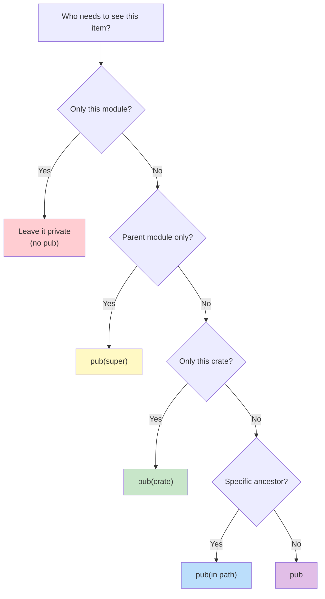

# Paths & Visibility — Finding Your Way Around 🗺️

> **"You can think of the module tree as being like a filesystem's directory tree — and paths work the same way."**
> — *The Rust Programming Language*

---

## Table of Contents

- [Two Kinds of Paths](#two-kinds-of-paths)
- [Absolute Paths](#absolute-paths)
- [Relative Paths](#relative-paths)
- [The self Keyword](#the-self-keyword)
- [The super Keyword](#the-super-keyword)
- [The pub Keyword in Depth](#the-pub-keyword-in-depth)
- [Fine-Grained Visibility](#fine-grained-visibility)
- [Why Rust Defaults to Private](#why-rust-defaults-to-private)
- [Path Resolution Visualized](#path-resolution-visualized)
- [Comparing to Other Languages](#comparing-to-other-languages)
- [Common Mistakes](#common-mistakes)
- [Try It Yourself](#try-it-yourself)
- [Summary](#summary)

---

## Two Kinds of Paths

Just like a filesystem has absolute and relative paths, Rust modules have two ways to refer to items:

```
 Filesystem analogy:
 
 Absolute path:  /home/alice/documents/report.txt
 Relative path:  ../documents/report.txt
 
 Rust module paths:
 
 Absolute path:  crate::module_a::module_b::function
 Relative path:  module_b::function (from within module_a)
```

Both point to the same item — it's just about where you start:
- **Absolute** paths start from the crate root (`crate::`)
- **Relative** paths start from the current module

---

## Absolute Paths

An absolute path starts with `crate::` and traces a path from the root of the crate:

```rust
mod network {
    pub mod server {
        pub fn start() {
            println!("Server starting...");
        }

        pub fn stop() {
            println!("Server stopping...");
        }
    }

    pub mod client {
        pub fn connect() {
            // Absolute path — starts from crate root
            crate::network::server::start();
            println!("Client connected!");
        }
    }
}

fn main() {
    // Absolute path from main (which is at the crate root)
    crate::network::server::start();
    crate::network::client::connect();
}
```

**When to use absolute paths:**
- When calling something far away in the module tree
- When you want to be explicit about where something lives
- In macros and generated code (where the calling context varies)

---

## Relative Paths

A relative path starts from the current module, without the `crate::` prefix:

```rust
mod network {
    pub mod server {
        pub fn start() {
            println!("Server starting...");
        }
    }

    pub mod client {
        pub fn connect() {
            // Relative path — starts from `network` module
            // But wait — this doesn't work from `client`!
            // We need super:: to go up to `network` first
            super::server::start();
            println!("Client connected!");
        }
    }

    pub fn status() {
        // Relative path — `server` is a sibling module
        server::start();
        client::connect();
    }
}

fn main() {
    // Relative path — `network` is at the same level as main
    network::status();
}
```

**When to use relative paths:**
- When calling something in a child module
- When calling siblings via `super::`
- When the code might move as a unit (relative paths are more refactor-friendly)

---

## The self Keyword

`self::` refers to the current module. It's rarely needed, but useful for disambiguation:

```rust
mod utils {
    pub fn process(data: &str) -> String {
        format!("processed: {data}")
    }

    pub mod advanced {
        pub fn process(data: &str) -> String {
            // Call the parent's process function using super
            let base = super::process(data);
            format!("advanced({base})")
        }
    }

    pub fn run_all(data: &str) {
        // self:: makes it explicit we mean THIS module's function
        let basic = self::process(data);
        let advanced = self::advanced::process(data);
        println!("{basic}");
        println!("{advanced}");
    }
}

fn main() {
    utils::run_all("hello");
    // Output:
    // processed: hello
    // advanced(processed: hello)
}
```

`self::` is also required when using `use` inside a module to import from itself:

```rust
mod shapes {
    pub struct Circle { pub radius: f64 }
    pub struct Square { pub side: f64 }

    pub mod areas {
        use self::super::{Circle, Square};
        // or equivalently: use super::{Circle, Square};

        pub fn circle_area(c: &Circle) -> f64 {
            std::f64::consts::PI * c.radius * c.radius
        }

        pub fn square_area(s: &Square) -> f64 {
            s.side * s.side
        }
    }
}

fn main() {
    let c = shapes::Circle { radius: 5.0 };
    println!("Area: {:.2}", shapes::areas::circle_area(&c));
}
```

---

## The super Keyword

`super::` means "go up one level" in the module tree — like `..` in a filesystem:

```rust
mod app {
    // Shared configuration at the app level
    fn get_version() -> &'static str {
        "1.0.0"
    }

    pub mod api {
        pub fn version_endpoint() -> String {
            // super:: goes up from `api` to `app`
            let version = super::get_version();
            format!("API version: {version}")
        }

        pub mod v2 {
            pub fn enhanced_version() -> String {
                // super:: goes up from `v2` to `api`
                // super::super:: goes up from `api` to `app`
                let version = super::super::get_version();
                format!("Enhanced API v2 (core: {version})")
            }
        }
    }
}

fn main() {
    println!("{}", app::api::version_endpoint());
    println!("{}", app::api::v2::enhanced_version());
}
```

### Visualizing super::

```
 Module tree:
 
 crate
 └── app
     ├── get_version()
     └── api
         ├── version_endpoint()
         │   └── super::get_version()
         │       ──────►  goes UP to `app`
         └── v2
             └── enhanced_version()
                 └── super::super::get_version()
                     ──────►──────► goes UP to `api`, then UP to `app`
```

---

## The pub Keyword in Depth

`pub` makes an item visible outside its module. But there are subtleties:

### pub on Functions

```rust
mod tools {
    pub fn public_tool() {
        println!("Anyone can use me!");
        private_helper();  // ✅ same module
    }

    fn private_helper() {
        println!("I'm an implementation detail");
    }
}

fn main() {
    tools::public_tool();   // ✅ works
    // tools::private_helper(); // ❌ private
}
```

### pub on Structs vs Enums

This is a critical distinction:

```rust
mod data {
    // Struct: `pub` on the struct doesn't make fields public!
    pub struct Config {
        pub name: String,       // ✅ public field
        secret_key: String,     // ❌ private field
    }

    impl Config {
        pub fn new(name: &str) -> Config {
            Config {
                name: name.to_string(),
                secret_key: "default-key".to_string(),
            }
        }
    }

    // Enum: `pub` on the enum DOES make ALL variants public!
    pub enum Color {
        Red,      // ✅ automatically public
        Green,    // ✅ automatically public
        Blue,     // ✅ automatically public
    }
}

fn main() {
    // Must use constructor because secret_key is private
    let config = data::Config::new("MyApp");
    println!("Name: {}", config.name);  // ✅ public field
    // println!("{}", config.secret_key); // ❌ private field

    // Can use any variant — they're all public
    let color = data::Color::Red;       // ✅
    let color2 = data::Color::Green;    // ✅
}
```

```
 ┌─────────────────────────────────────────────────────────────┐
 │  KEY DIFFERENCE                                              │
 │                                                              │
 │  pub struct → struct is public, fields still individually    │
 │               controlled (private by default)                │
 │                                                              │
 │  pub enum   → enum AND all its variants are public           │
 │               (you can't have a public enum with private     │
 │                variants — that would break pattern matching)  │
 └─────────────────────────────────────────────────────────────┘
```

---

## Fine-Grained Visibility

Rust offers more than just `pub` or private. You can specify exactly who can see an item:

### pub(crate) — Visible Within the Crate Only

```rust
mod internal {
    // Visible anywhere in THIS crate, but not to external users
    pub(crate) fn crate_only_helper() -> String {
        "This is an internal API".to_string()
    }

    // Fully public — external crates can use this
    pub fn public_api() -> String {
        let helper = crate_only_helper();  // ✅
        format!("Public: {helper}")
    }
}

fn main() {
    // Both work within the same crate
    println!("{}", internal::crate_only_helper());  // ✅
    println!("{}", internal::public_api());          // ✅
}
// But if someone depends on this crate, they can only use public_api()
```

### pub(super) — Visible to Parent Module Only

```rust
mod outer {
    mod inner {
        // Only visible to `outer`, not to the rest of the crate
        pub(super) fn parent_only() -> &'static str {
            "Only outer can see me"
        }

        pub fn everyone() -> &'static str {
            "Anyone can see me"
        }
    }

    pub fn demo() {
        println!("{}", inner::parent_only());  // ✅ we're the parent
        println!("{}", inner::everyone());      // ✅ it's pub
    }
}

fn main() {
    outer::demo();                          // ✅
    // outer::inner::parent_only();          // ❌ we're not the parent
}
```

### pub(in path) — Visible to a Specific Ancestor

```rust
mod top {
    pub mod middle {
        pub mod bottom {
            // Only visible to `top` and its descendants
            pub(in crate::top) fn restricted() -> &'static str {
                "Only visible within top"
            }
        }
    }

    pub fn access() {
        // ✅ We're inside `top`
        println!("{}", middle::bottom::restricted());
    }
}

fn main() {
    top::access();  // ✅
    // top::middle::bottom::restricted(); // ❌ main is outside `top`
}
```

### Visibility Levels Comparison

```
 ┌──────────────────┬──────────────────────────────────────────┐
 │  Visibility       │  Who can see it?                        │
 ├──────────────────┼──────────────────────────────────────────┤
 │  (default)        │  Same module + its children only        │
 │  pub(self)        │  Same as default (rarely used)          │
 │  pub(super)       │  Parent module                          │
 │  pub(in path)     │  Specific ancestor module               │
 │  pub(crate)       │  Anywhere in the same crate             │
 │  pub              │  Anywhere (including other crates)       │
 └──────────────────┴──────────────────────────────────────────┘

 Least visible ──────────────────────────► Most visible
  private    pub(super)   pub(crate)    pub
```

### Visibility Decision Flowchart



---

## Why Rust Defaults to Private

Rust's "private by default" is intentional. Here's why:

### 1. Encapsulation

```rust
mod database {
    // Internal representation — we might change this later
    struct ConnectionPool {
        connections: Vec<String>,
        max_size: usize,
    }

    // Public API — this is the contract with users
    pub fn connect(url: &str) -> String {
        // Users don't need to know about ConnectionPool
        format!("Connected to {url}")
    }
}
```

If `ConnectionPool` were public by default, changing its fields would break everyone who uses it. Private by default means you're **free to refactor internals** without breaking your API.

### 2. Smaller API Surface

```
 ❌ Everything public (easy to write, hard to maintain):
 ┌─────────────────────────────────┐
 │  pub fn connect()               │
 │  pub fn disconnect()            │
 │  pub fn validate_url()          │  ← Should this be public?
 │  pub fn parse_connection_str()  │  ← Or this?
 │  pub fn retry_with_backoff()    │  ← Users shouldn't call this directly
 │  pub fn internal_cleanup()      │  ← Definitely not this
 └─────────────────────────────────┘
 
 ✅ Private by default (explicit public API):
 ┌─────────────────────────────────┐
 │  pub fn connect()               │  ← Clear, intentional public API
 │  pub fn disconnect()            │
 │  fn validate_url()              │  ← Implementation detail
 │  fn parse_connection_str()      │  ← Implementation detail
 │  fn retry_with_backoff()        │  ← Implementation detail
 │  fn internal_cleanup()          │  ← Implementation detail
 └─────────────────────────────────┘
```

### 3. Compiler Catches Dead Code

If a function is private and unused, the compiler warns you. Public functions can't be warned about because someone *might* be using them from another crate.

---

## Path Resolution Visualized

Here's how the compiler resolves different path styles:

```
 Module tree:
 
 crate
 ├── main()              ← we're here for examples 1 & 2
 ├── config
 │   └── load()
 └── network
     ├── server
     │   └── start()     ← we're here for examples 3 & 4
     └── client
         └── connect()

 Example paths (from main):

 1. crate::network::server::start()     absolute: crate → network → server → start
 2. network::server::start()            relative: (current) → network → server → start

 Example paths (from inside server::start):

 3. super::client::connect()            relative: UP to network → client → connect
 4. crate::config::load()               absolute: crate → config → load
```

```
 PATH RESOLUTION STEP-BY-STEP

 Resolving: crate::network::server::start()

 Step 1: "crate" → go to crate root
         ┌──────────┐
         │  crate   │ ◄── HERE
         │  ├ config │
         │  └ network│
         └──────────┘

 Step 2: "network" → enter network module
         ┌──────────┐
         │  network │ ◄── HERE
         │  ├ server │
         │  └ client │
         └──────────┘

 Step 3: "server" → enter server module
         ┌──────────┐
         │  server  │ ◄── HERE
         │  └ start()│
         └──────────┘

 Step 4: "start" → found the function!
         start() ◄── RESOLVED ✅
```

---

## Comparing to Other Languages

| Feature | Rust | Java | C++ | Python |
|---------|------|------|-----|--------|
| Default visibility | Private | Package-private | Public | Public |
| Public keyword | `pub` | `public` | `public:` | (everything) |
| Private keyword | (default) | `private` | `private:` | `_prefix` convention |
| Protected | `pub(super)` | `protected` | `protected:` | `__prefix` convention |
| Internal | `pub(crate)` | — | — | — |
| Custom scope | `pub(in path)` | — | — | — |

Rust's system is the **most fine-grained** of any mainstream language. You can specify exactly which module has access.

---

## Common Mistakes

### Mistake 1: Path Starts Wrong

```rust
mod app {
    pub mod db {
        pub fn connect() {}
    }

    pub mod api {
        pub fn handler() {
            // ❌ Error: `db` is not in `api`
            db::connect();

            // ✅ Use super:: to go up to `app` first
            super::db::connect();

            // ✅ Or use the absolute path
            crate::app::db::connect();
        }
    }
}
```

### Mistake 2: Forgetting pub on Intermediate Modules

```rust
mod outer {
    mod middle {          // ❌ private!
        pub mod inner {
            pub fn hello() {}
        }
    }
}

fn main() {
    // ❌ Error: module `middle` is private
    outer::middle::inner::hello();
}
```

**Every module in the path** must be visible. Making `inner` and `hello` public doesn't help if `middle` is private.

### Mistake 3: Confusing pub(crate) with pub

```rust
// In a library crate (src/lib.rs):
pub(crate) fn internal_helper() {}  // ← only visible within this crate
pub fn public_api() {}               // ← visible to everyone

// A user of your library:
// use your_lib::internal_helper;    // ❌ Not accessible!
// use your_lib::public_api;         // ✅ Works fine
```

Use `pub(crate)` for functions that other modules in your crate need, but external users should not call.

### Mistake 4: Expecting super to Skip Levels

```rust
mod a {
    mod b {
        mod c {
            fn deep() {
                // ❌ super:: only goes up ONE level (to b)
                // super::some_fn_in_a();

                // ✅ Chain super:: to go up multiple levels
                super::super::some_fn_in_a();
            }
        }
    }

    fn some_fn_in_a() {}
}
```

Each `super::` goes up exactly one level. Chain them to go higher.

---

## Try It Yourself

### Exercise 1: Fix the Visibility Errors

This code has visibility problems. Fix it so it compiles:

```rust
mod school {
    mod classroom {  // Hint: needs pub
        struct Student {  // Hint: needs pub
            name: String,  // Hint: needs pub
        }

        fn create_student(name: &str) -> Student {  // Hint: needs pub
            Student { name: name.to_string() }
        }
    }

    pub fn enroll(name: &str) -> String {
        let student = classroom::create_student(name);
        format!("Enrolled: {}", student.name)
    }
}

fn main() {
    println!("{}", school::enroll("Alice"));
}
```

### Exercise 2: Use super:: Correctly

Complete this code using `super::` paths:

```rust
mod config {
    pub fn app_name() -> &'static str {
        "MyApp"
    }

    pub mod logging {
        pub fn log(message: &str) {
            // TODO: Use super:: to call app_name()
            let name = super::app_name();
            println!("[{name}] {message}");
        }

        pub mod formatters {
            pub fn format_error(msg: &str) -> String {
                // TODO: Use super::super:: to get app_name
                let name = super::super::app_name();
                format!("[{name}] ERROR: {msg}")
            }
        }
    }
}

fn main() {
    config::logging::log("Starting up");
    let err = config::logging::formatters::format_error("disk full");
    println!("{err}");
}
```

### Exercise 3: Use pub(crate) and pub(super)

Refactor this code to use fine-grained visibility:

```rust
mod engine {
    // Should be visible only within the crate
    pub(crate) fn internal_init() {
        println!("Engine initialized internally");
    }

    pub mod renderer {
        // Should be visible only to `engine`
        pub(super) fn gpu_details() -> &'static str {
            "GPU: Integrated"
        }

        pub fn render() {
            let gpu = gpu_details();
            println!("Rendering with {gpu}");
        }
    }

    pub fn start() {
        internal_init();
        let gpu = renderer::gpu_details();  // ✅ parent can see pub(super)
        println!("Engine started: {gpu}");
        renderer::render();
    }
}

fn main() {
    engine::start();
    engine::internal_init();            // ✅ pub(crate) visible here
    engine::renderer::render();         // ✅ pub is always visible
    // engine::renderer::gpu_details(); // ❌ pub(super) — not our parent
}
```

### Exercise 4: Build a Module Hierarchy

Create a `webshop` module with this structure and correct visibility:

```
webshop
├── products (pub)
│   ├── Product struct (pub, pub fields)
│   └── list_products() (pub)
├── cart (pub)
│   ├── Cart struct (pub, private items field)
│   ├── new() (pub)
│   ├── add_item() (pub)
│   └── total() (pub)
└── internal (private)
    └── calculate_tax() — used by cart::total()
```

```rust
mod webshop {
    pub mod products {
        pub struct Product {
            pub name: String,
            pub price: f64,
        }

        pub fn list_products() -> Vec<Product> {
            vec![
                Product { name: "Rust Book".into(), price: 39.99 },
                Product { name: "Cargo Stickers".into(), price: 4.99 },
            ]
        }
    }

    pub mod cart {
        use super::products::Product;

        pub struct Cart {
            items: Vec<(Product, u32)>,  // private!
        }

        impl Cart {
            pub fn new() -> Cart {
                Cart { items: Vec::new() }
            }

            pub fn add_item(&mut self, product: Product, quantity: u32) {
                self.items.push((product, quantity));
            }

            pub fn total(&self) -> f64 {
                let subtotal: f64 = self.items.iter()
                    .map(|(p, q)| p.price * *q as f64)
                    .sum();
                subtotal + super::internal::calculate_tax(subtotal)
            }
        }
    }

    mod internal {
        pub(super) fn calculate_tax(subtotal: f64) -> f64 {
            subtotal * 0.08  // 8% tax
        }
    }
}

fn main() {
    let products = webshop::products::list_products();
    let mut cart = webshop::cart::Cart::new();
    for p in products {
        cart.add_item(p, 1);
    }
    println!("Total: ${:.2}", cart.total());
}
```

---

## Summary

| Concept | Description |
|---------|-------------|
| **Absolute path** | Starts with `crate::` — from the root of the module tree |
| **Relative path** | Starts from the current module |
| **`self::`** | Refers to the current module explicitly |
| **`super::`** | Goes up one level in the module tree (like `..` in filesystems) |
| **`pub`** | Makes an item visible to everyone, including external crates |
| **`pub(crate)`** | Visible anywhere within the current crate only |
| **`pub(super)`** | Visible to the parent module only |
| **`pub(in path)`** | Visible to a specific ancestor module |
| **Private default** | Promotes encapsulation and smaller API surfaces |
| **Every path segment** | Must be visible — a public item behind a private module is inaccessible |

### Key Takeaway

> Paths are how you navigate the module tree, and visibility controls who can walk those paths. Rust gives you fine-grained control: from fully private to `pub(super)` to `pub(crate)` to fully `pub`. Start private, and only widen visibility when you have a clear reason to.

---

<p align="center">
  <strong>Tutorial 3 of 7 — Stage 10: Modules & Crates</strong>
</p>

<p align="center">
  <a href="./02-defining-modules.md">← Previous: Defining Modules</a> | <a href="./04-use-keyword.md">Next: The use Keyword →</a>
</p>
