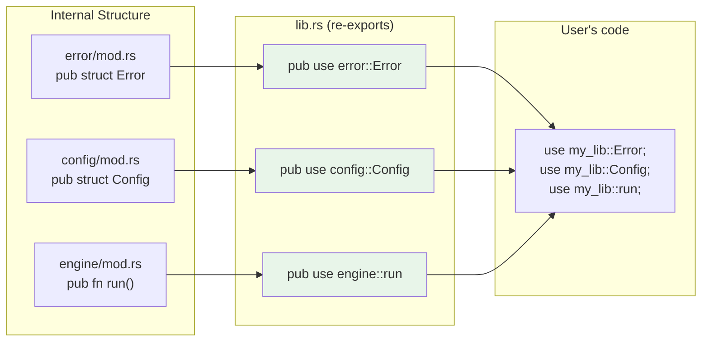

# The use Keyword — Bringing Names Into Scope 🎯

> **"Creating idiomatic use paths is an art — there are conventions that make your code readable at a glance."**
> — *The Rust Programming Language*

---

## Table of Contents

- [Why use?](#why-use)
- [Basic use Syntax](#basic-use-syntax)
- [Idiomatic Conventions](#idiomatic-conventions)
- [Nested Paths](#nested-paths)
- [Glob Imports](#glob-imports)
- [Aliasing with as](#aliasing-with-as)
- [Re-exporting with pub use](#re-exporting-with-pub-use)
- [The Prelude Pattern](#the-prelude-pattern)
- [How use Resolution Works](#how-use-resolution-works)
- [Common Mistakes](#common-mistakes)
- [Try It Yourself](#try-it-yourself)
- [Summary](#summary)

---

## Why use?

Without `use`, every reference to an item requires its full path:

```rust
fn main() {
    // Without use — verbose and repetitive
    let mut map = std::collections::HashMap::new();
    let set = std::collections::HashSet::new();
    let buf = std::io::BufReader::new(std::io::stdin());

    // Imagine writing std::collections::HashMap everywhere!
}
```

The `use` keyword brings names into scope so you can use short names:

```rust
use std::collections::HashMap;
use std::collections::HashSet;
use std::io::{BufReader, stdin};

fn main() {
    // With use — clean and readable
    let mut map = HashMap::new();
    let set = HashSet::new();
    let buf = BufReader::new(stdin());
}
```

```
 WITHOUT use:                        WITH use:
 ┌───────────────────────────┐      ┌───────────────────────────┐
 │ std::collections::HashMap │      │ use std::collections::    │
 │ std::collections::HashMap │      │     HashMap;              │
 │ std::collections::HashMap │      │                           │
 │ std::collections::HashMap │      │ HashMap                   │
 │ std::collections::HashMap │      │ HashMap                   │
 │                           │      │ HashMap                   │
 │ So much typing!           │      │ HashMap                   │
 │ So much reading!          │      │ Clean!                    │
 └───────────────────────────┘      └───────────────────────────┘
```

---

## Basic use Syntax

The basic form is `use path::to::Item;`:

```rust
// Bring a single item into scope
use std::collections::HashMap;

// Bring items from your own crate
mod database {
    pub struct Connection {
        pub url: String,
    }

    impl Connection {
        pub fn new(url: &str) -> Connection {
            Connection { url: url.to_string() }
        }
    }

    pub fn connect(url: &str) -> Connection {
        Connection::new(url)
    }
}

use database::Connection;
use database::connect;

fn main() {
    let conn = connect("postgres://localhost/mydb");
    println!("Connected to: {}", conn.url);

    let conn2 = Connection::new("sqlite://data.db");
    println!("Connected to: {}", conn2.url);
}
```

### Where to Put use Statements

By convention, `use` statements go at the **top of the file** (or at the top of a module), grouped in this order:

```rust
// 1. Standard library imports
use std::collections::HashMap;
use std::io::{self, Read, Write};

// 2. External crate imports
// use serde::{Serialize, Deserialize};
// use tokio::fs;

// 3. Local crate imports
use crate::config::Settings;
use crate::database::Connection;
```

---

## Idiomatic Conventions

Rust has strong conventions about **how much** of a path to bring in with `use`:

### For Functions: Import the Parent Module

```rust
// ❌ Non-idiomatic: imports the function directly
use std::io::stdin;
fn main() {
    let input = stdin();  // Where does stdin come from? Unclear!
}

// ✅ Idiomatic: import the parent module
use std::io;
fn main() {
    let input = io::stdin();  // Clear! stdin comes from io
}
```

Why? When you see `io::stdin()`, you immediately know it's from the `io` module. Just `stdin()` could be from anywhere.

### For Types (Structs, Enums): Import the Full Path

```rust
// ✅ Idiomatic: import the type directly
use std::collections::HashMap;

fn main() {
    let map = HashMap::new();  // HashMap is a well-known type
}
```

```rust
// ❌ Non-idiomatic: too verbose
use std::collections;

fn main() {
    let map = collections::HashMap::new();  // Unnecessarily long
}
```

### Why the Difference?

```
 FUNCTIONS — use the parent:     TYPES — use the full path:

 use std::io;                    use std::collections::HashMap;
 use std::fs;                    use std::collections::HashSet;

 io::stdin()  ← clear origin     HashMap::new()  ← type is the context
 fs::read()   ← clear origin     HashSet::new()  ← type is the context
```

The exception: when two types have the same name:

```rust
use std::fmt;
use std::io;

// When types conflict, use the parent module
fn function1() -> fmt::Result { Ok(()) }
fn function2() -> io::Result<()> { Ok(()) }
```

---

## Nested Paths

When you import multiple items from the same module, use **nested paths** to reduce verbosity:

```rust
// ❌ Repetitive
use std::io::Read;
use std::io::Write;
use std::io::BufReader;
use std::io::BufWriter;

// ✅ Nested path — all from std::io
use std::io::{Read, Write, BufReader, BufWriter};
```

You can nest at any level:

```rust
// Multiple items from different sub-paths
use std::collections::{HashMap, HashSet, BTreeMap};

// You can even include the module itself with `self`
use std::io::{self, Read, Write};
// This imports: io (the module), Read (the trait), Write (the trait)
```

### The self Trick

`self` in a nested path imports the module itself alongside its children:

```rust
use std::io::{self, Read, Write};

fn do_io() -> io::Result<()> {   // use `io` module for io::Result
    let mut buf = String::new();
    io::stdin().read_to_string(&mut buf)?;  // io module
    io::stdout().write_all(b"Done\n")?;     // io module
    Ok(())
}
```

Without `self`, you'd need a separate `use std::io;` line.

---

## Glob Imports

The glob operator `*` imports **everything** that's public from a module:

```rust
// Import all public items from collections
use std::collections::*;

fn main() {
    let mut map = HashMap::new();    // ✅
    let mut set = HashSet::new();    // ✅
    let mut btree = BTreeMap::new(); // ✅
    // ... and many more types are now in scope
}
```

### When to Use Globs

```
 ✅ Good uses of glob imports:

 1. In tests — to bring the tested module into scope
    #[cfg(test)]
    mod tests {
        use super::*;  // ← bring everything from parent
    }

 2. In a prelude module (see below)
    use my_crate::prelude::*;

 ❌ Bad uses of glob imports:

 1. At the top of production code
    use std::collections::*;  // What's in scope? Hard to tell!

 2. Multiple globs from different modules
    use module_a::*;
    use module_b::*;  // Name collision risk!
```

**General rule**: Avoid globs in production code. They make it hard to tell where names come from and can cause surprise name collisions.

---

## Aliasing with as

The `as` keyword renames an import to avoid conflicts or improve clarity:

```rust
use std::fmt::Result as FmtResult;
use std::io::Result as IoResult;

fn format_thing() -> FmtResult {
    Ok(())  // std::fmt::Result
}

fn read_thing() -> IoResult<String> {
    Ok("data".to_string())  // std::io::Result
}

fn main() {
    let _ = format_thing();
    let _ = read_thing();
}
```

### Common Aliasing Patterns

```rust
// Shorten long names
use std::collections::HashMap as Map;
use std::collections::BTreeMap as OrderedMap;

// Disambiguate
use my_crate::error::Error as MyError;
// (so it doesn't conflict with std::error::Error)

// Platform-specific
use std::os::unix::fs::PermissionsExt as UnixPerms;
```

---

## Re-exporting with pub use

`pub use` re-exports an item — it makes it available as if it were defined in the current module:

```rust
mod internal {
    pub mod deep {
        pub mod nested {
            pub struct ImportantType {
                pub value: i32,
            }

            impl ImportantType {
                pub fn new(value: i32) -> Self {
                    ImportantType { value }
                }
            }
        }
    }
}

// Re-export so users don't need to navigate the deep path
pub use internal::deep::nested::ImportantType;

fn main() {
    // Users can now write this:
    let x = ImportantType::new(42);
    println!("Value: {}", x.value);

    // Instead of this:
    // let x = internal::deep::nested::ImportantType::new(42);
}
```

### Real-World Re-export Pattern

```
 Internal structure (complex):       Public API (simple):
 
 src/lib.rs                          Users see:
 ├── mod error                       use my_lib::Error;
 │   └── pub struct Error            use my_lib::Config;
 ├── mod config                      use my_lib::run;
 │   └── pub struct Config
 └── mod engine
     └── pub fn run()

 In lib.rs:
 pub use error::Error;         // re-export from error module
 pub use config::Config;       // re-export from config module  
 pub use engine::run;          // re-export from engine module
```

This is how most Rust libraries work. Internally, the code is organized into many modules. But the public API is flat and simple thanks to `pub use`.

### Re-export Flow



---

## The Prelude Pattern

Some crates define a `prelude` module containing the items most users need:

```rust
// In a library crate (src/lib.rs)
pub mod shapes {
    pub struct Circle { pub radius: f64 }
    pub struct Rectangle { pub width: f64, pub height: f64 }
    pub struct Triangle { pub base: f64, pub height: f64 }
}

pub mod traits {
    pub trait Area {
        fn area(&self) -> f64;
    }

    pub trait Perimeter {
        fn perimeter(&self) -> f64;
    }
}

// The prelude: one-stop import for common items
pub mod prelude {
    pub use super::shapes::{Circle, Rectangle, Triangle};
    pub use super::traits::{Area, Perimeter};
}
```

Users can then import everything they need with one line:

```rust
use my_geometry::prelude::*;

fn main() {
    let c = Circle { radius: 5.0 };
    // Area and Perimeter traits are in scope too
}
```

### Rust's Own Prelude

Rust has a built-in prelude (`std::prelude::v1`) that's automatically imported into every program. That's why you can use these without `use`:

```rust
fn main() {
    let s = String::from("hello");    // String is in the prelude
    let v = Vec::new();               // Vec is in the prelude
    let o: Option<i32> = Some(42);    // Option, Some are in the prelude
    let r: Result<i32, String> = Ok(1); // Result, Ok are in the prelude
    println!("{s}");                   // println! is a macro, always available

    // These are NOT in the prelude — you'd need `use`
    // HashMap, BTreeMap, Rc, Arc, etc.
}
```

---

## How use Resolution Works

When you write `use`, the compiler resolves the path at compile time:

```
 use std::collections::HashMap;

 Step 1: "std" → the standard library crate (external)
 Step 2: "collections" → the collections module within std
 Step 3: "HashMap" → the HashMap struct within collections

 Result: HashMap is now a local alias for std::collections::HashMap
```

```
 use crate::database::Connection;

 Step 1: "crate" → this crate's root
 Step 2: "database" → the database module
 Step 3: "Connection" → the Connection struct

 Result: Connection is now a local alias for crate::database::Connection
```

### use is Scoped

`use` only brings a name into the scope where it appears:

```rust
mod api {
    // This use is only visible inside `api`
    use std::collections::HashMap;

    pub fn handler() {
        let map = HashMap::new();  // ✅ works here
        let _ = map;
    }
}

fn main() {
    // ❌ HashMap is not in scope here!
    // let map = HashMap::new();

    // ✅ Need our own use or full path
    let map = std::collections::HashMap::<String, String>::new();
    let _ = map;
}
```

---

## Common Mistakes

### Mistake 1: Using use for Unused Imports

```rust
// ❌ Compiler warning: unused import
use std::collections::HashMap;
use std::io::Read;  // warning: unused import

fn main() {
    let map = HashMap::new();
    let _ = map;
    // Read is never used!
}
```

The compiler warns about unused imports. Remove them or prefix with `_`:

```rust
use std::collections::HashMap;
// Remove the unused Read import, or if temporarily needed:
// use std::io::Read as _Read;
```

### Mistake 2: Conflicting Imports Without Aliasing

```rust
// ❌ Error: two items named `Error` in scope
use std::fmt::Error;
use std::io::Error;  // conflict!

// ✅ Fix with aliasing
use std::fmt::Error as FmtError;
use std::io::Error as IoError;

// ✅ Or import the parent modules
use std::fmt;
use std::io;
// Then use: fmt::Error, io::Error
```

### Mistake 3: Glob Import Name Collisions

```rust
mod module_a {
    pub fn process() { println!("A"); }
}

mod module_b {
    pub fn process() { println!("B"); }
}

use module_a::*;
use module_b::*;

fn main() {
    // ❌ Error: `process` is ambiguous
    // process();

    // ✅ Be explicit
    module_a::process();
    module_b::process();
}
```

### Mistake 4: Forgetting that use is Module-Scoped

```rust
fn main() {
    {
        use std::collections::HashMap;
        let map = HashMap::new();
        let _ = map;
    }

    // ❌ HashMap is not in scope here — the use was in the inner block
    // let map2 = HashMap::new();
}
```

### Mistake 5: Trying to use Private Items

```rust
mod secret {
    struct Hidden;      // private!
    pub struct Visible;
}

// ❌ Error: `Hidden` is private
// use secret::Hidden;

// ✅ Works — Visible is public
use secret::Visible;
fn main() {
    let _ = Visible;
}
```

---

## Try It Yourself

### Exercise 1: Clean Up Long Paths

Refactor this code to use `use` statements:

```rust
fn main() {
    let mut scores: std::collections::HashMap<String, Vec<i32>> =
        std::collections::HashMap::new();

    scores.insert("Alice".to_string(), vec![95, 87, 92]);
    scores.insert("Bob".to_string(), vec![78, 85, 90]);

    for (name, grades) in &scores {
        let sum: i32 = grades.iter().sum();
        let avg = sum as f64 / grades.len() as f64;
        println!("{name}: {avg:.1}");
    }
}
```

**Solution:**

```rust
use std::collections::HashMap;

fn main() {
    let mut scores: HashMap<String, Vec<i32>> = HashMap::new();

    scores.insert("Alice".to_string(), vec![95, 87, 92]);
    scores.insert("Bob".to_string(), vec![78, 85, 90]);

    for (name, grades) in &scores {
        let sum: i32 = grades.iter().sum();
        let avg = sum as f64 / grades.len() as f64;
        println!("{name}: {avg:.1}");
    }
}
```

### Exercise 2: Nested Paths

Rewrite these imports using nested path syntax:

```rust
// Before:
use std::io::Read;
use std::io::Write;
use std::io::BufReader;
use std::io::BufWriter;
use std::io::Error;
use std::io::ErrorKind;

// After:
use std::io::{Read, Write, BufReader, BufWriter, Error, ErrorKind};
```

### Exercise 3: Create a Re-export

Build a library module with a clean public API:

```rust
mod math {
    pub mod linear {
        pub fn dot_product(a: &[f64], b: &[f64]) -> f64 {
            a.iter().zip(b.iter()).map(|(x, y)| x * y).sum()
        }

        pub fn magnitude(v: &[f64]) -> f64 {
            v.iter().map(|x| x * x).sum::<f64>().sqrt()
        }
    }

    pub mod stats {
        pub fn mean(data: &[f64]) -> f64 {
            if data.is_empty() { return 0.0; }
            data.iter().sum::<f64>() / data.len() as f64
        }

        pub fn median(data: &mut [f64]) -> f64 {
            data.sort_by(|a, b| a.partial_cmp(b).unwrap());
            let mid = data.len() / 2;
            if data.len() % 2 == 0 {
                (data[mid - 1] + data[mid]) / 2.0
            } else {
                data[mid]
            }
        }
    }
}

// Re-export for a flat API
use math::linear::{dot_product, magnitude};
use math::stats::{mean, median};

fn main() {
    let a = vec![1.0, 2.0, 3.0];
    let b = vec![4.0, 5.0, 6.0];

    println!("Dot product: {}", dot_product(&a, &b));
    println!("Magnitude of a: {:.2}", magnitude(&a));
    println!("Mean of a: {:.2}", mean(&a));

    let mut data = vec![3.0, 1.0, 4.0, 1.0, 5.0];
    println!("Median: {}", median(&mut data));
}
```

### Exercise 4: Resolve Name Conflicts

Fix this code that has naming conflicts:

```rust
mod graphics {
    pub struct Color {
        pub r: u8, pub g: u8, pub b: u8,
    }

    impl Color {
        pub fn new(r: u8, g: u8, b: u8) -> Self {
            Color { r, g, b }
        }
    }
}

mod terminal {
    pub struct Color {
        pub code: u8,
    }

    impl Color {
        pub fn new(code: u8) -> Self {
            Color { code }
        }
    }
}

// Use aliasing to resolve the conflict
use graphics::Color as RgbColor;
use terminal::Color as TermColor;

fn main() {
    let pixel = RgbColor::new(255, 128, 0);
    let term = TermColor::new(196);
    println!("RGB: ({}, {}, {})", pixel.r, pixel.g, pixel.b);
    println!("Terminal color code: {}", term.code);
}
```

---

## Summary

| Concept | Description |
|---------|-------------|
| **`use path::Item`** | Brings an item into the current scope |
| **Idiomatic: functions** | Import the parent module: `use std::io;` then `io::stdin()` |
| **Idiomatic: types** | Import the type directly: `use std::collections::HashMap;` |
| **Nested paths** | `use std::io::{Read, Write};` — multiple items from one path |
| **`self` in paths** | `use std::io::{self, Read};` — import the module AND its items |
| **Glob `*`** | `use module::*;` — import everything (use sparingly) |
| **`as` aliasing** | `use std::io::Result as IoResult;` — rename to avoid conflicts |
| **`pub use`** | Re-export an item — makes it part of your public API |
| **Prelude pattern** | A `prelude` module with `pub use` for common items |
| **Scope** | `use` only affects the module/block where it appears |

### Key Takeaway

> The `use` keyword is about ergonomics — it saves you from typing full paths everywhere. Follow the conventions (parent module for functions, full path for types), use `pub use` to create a clean public API, and avoid glob imports in production code. Well-organized `use` statements make your code immediately understandable.

---

## Idiomatic Import Patterns in Real Rust Projects

### The Standard Import Grouping Convention

Well-written Rust files group `use` statements in this order, separated by blank lines:

```rust
// 1. Standard library
use std::collections::HashMap;
use std::fmt;
use std::io::{self, Read, Write};

// 2. External crates (from Cargo.toml)
use serde::{Deserialize, Serialize};
use tokio::runtime::Runtime;

// 3. Local crate (your own modules)
use crate::config::Config;
use crate::error::{AppError, Result};
use super::utils::hash;
```

This ordering is enforced by `rustfmt` and Clippy. It makes it immediately clear what comes from the standard library, what are third-party dependencies, and what is local code.

### When Glob Imports Are Acceptable

Clippy warns about `use module::*` by default — with good reason. But there are three places where globs are idiomatic:

```rust
// 1. Test modules — glob the parent for convenience
#[cfg(test)]
mod tests {
    use super::*;  // ✅ idiomatic in test modules

    #[test]
    fn test_something() { /* ... */ }
}

// 2. Your own carefully-curated prelude module
pub mod prelude {
    pub use crate::client::Client;
    pub use crate::error::Result;
}
// Users: use mylib::prelude::*; — the glob is safe because YOU own the prelude

// 3. Enum variants in a local scope
use Color::*;  // ✅ OK when you're doing a lot with Color variants
let c = Red;   // instead of Color::Red every time
```

Everywhere else, prefer explicit imports. Glob imports in library code make it hard for readers (and IDEs) to know where names come from.

### Building a Clean Public API with `pub use`

The most powerful use of `pub use` is **facade design** — internal modules can be organized however you like, but users see a clean, flat API:

```rust
// Internal structure (messy but organized for maintainability):
// src/
//   lib.rs
//   net/tcp.rs      ← TcpClient
//   net/udp.rs      ← UdpClient
//   codec/json.rs   ← JsonCodec
//   codec/binary.rs ← BinaryCodec

// src/lib.rs — the public facade
mod net;
mod codec;

// Re-export the items users actually need
pub use net::tcp::TcpClient;
pub use net::udp::UdpClient;
pub use codec::json::JsonCodec;
pub use codec::binary::BinaryCodec;

// Users write:
//   use mylib::TcpClient;   ← flat, clean
// Instead of:
//   use mylib::net::tcp::TcpClient;  ← exposing internals
```

This lets you reorganize internals without breaking callers.

### Real Pattern: How `serde` Does It

The `serde` crate is a great example. It re-exports everything users need from a clean top-level:

```rust
// How serde exposes its API (simplified):
pub use serde_derive::{Deserialize, Serialize};  // re-export derive macros
pub use de::Deserialize;
pub use ser::Serialize;

// Users just write:
use serde::{Deserialize, Serialize};
// They don't need to know serde has internal `de` and `ser` submodules
```

And the derive macros live in a separate `serde_derive` crate entirely — but `serde` re-exports them so users only need one dependency in their `Cargo.toml`.

### How `tokio` Uses Its Prelude

```rust
// tokio's prelude (simplified):
pub mod prelude {
    pub use crate::io::{AsyncRead, AsyncReadExt};
    pub use crate::io::{AsyncWrite, AsyncWriteExt};
    pub use crate::stream::StreamExt;
}

// Users of tokio write:
use tokio::prelude::*;
// And get all the async traits they need in one line
```

### `use` in `impl` Blocks and Functions

You can use `use` inside any block — it's scoped to that block:

```rust
fn process() {
    use std::collections::HashSet;  // only in scope for this function
    let mut seen = HashSet::new();
    seen.insert(1);
}

impl MyStruct {
    fn render(&self) {
        use std::fmt::Write;  // only needed in this method
        let mut buf = String::new();
        write!(buf, "{}", self.value).unwrap();
        println!("{}", buf);
    }
}
```

This is useful for imports that are only relevant in one place — keeps the top-level import list clean.

---

<p align="center">
  <strong>Tutorial 4 of 7 — Stage 10: Modules & Crates</strong>
</p>

<p align="center">
  <a href="./03-paths-and-visibility.md">← Previous: Paths & Visibility</a> | <a href="./05-splitting-into-files.md">Next: Splitting Into Files →</a>
</p>
