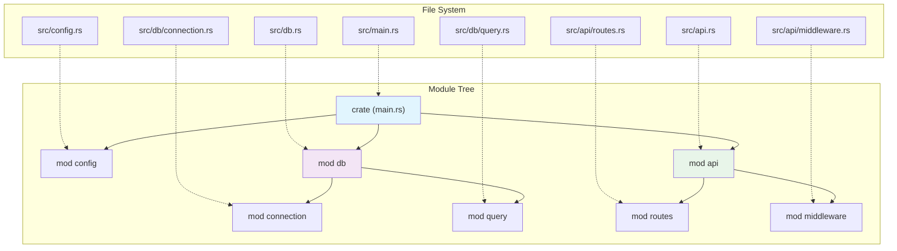

# Splitting Into Files — Real Project Structure 📁

> **"As modules get large, you'll want to move their definitions to a separate file to make the code easier to navigate."**
> — *The Rust Programming Language*

---

## Table of Contents

- [Why Split Into Files?](#why-split-into-files)
- [How mod Loads Files](#how-mod-loads-files)
- [File Naming Conventions](#file-naming-conventions)
- [Step-by-Step Refactor](#step-by-step-refactor)
- [The Two Directory Styles](#the-two-directory-styles)
- [File System to Module Tree Mapping](#file-system-to-module-tree-mapping)
- [A Real Project Structure](#a-real-project-structure)
- [Best Practices](#best-practices)
- [Comparing to Python](#comparing-to-python)
- [Common Mistakes](#common-mistakes)
- [Try It Yourself](#try-it-yourself)
- [Summary](#summary)

---

## Why Split Into Files?

As your project grows, a single file becomes unmanageable:

```
 ❌ Single file (src/main.rs — 3000 lines):
 ┌──────────────────────────────┐
 │ line 1-200:    database code │
 │ line 201-500:  auth code     │
 │ line 501-900:  API routes    │
 │ line 901-1200: models        │
 │ line 1201-1800: business     │
 │ line 1801-2400: templates    │
 │ line 2401-3000: utilities    │
 │                              │
 │ Scrolling forever...         │
 │ Can't find anything!         │
 └──────────────────────────────┘

 ✅ Split into files:
 src/
 ├── main.rs         (50 lines — entry point)
 ├── database.rs     (200 lines)
 ├── auth.rs         (300 lines)
 ├── routes.rs       (400 lines)
 ├── models.rs       (300 lines)
 ├── business.rs     (600 lines)
 ├── templates.rs    (600 lines)
 └── utils.rs        (200 lines)

 Each file is focused and manageable!
```

Splitting into files gives you:
- **Easier navigation** — find code by filename
- **Better version control** — smaller diffs, fewer merge conflicts
- **Parallel work** — team members edit different files
- **Mental clarity** — each file has one responsibility

---

## How mod Loads Files

When you write `mod foo;` (with a semicolon, no curly braces), Rust looks for the module's content in a file:

```rust
// src/main.rs
mod database;   // ← looks for src/database.rs (or src/database/mod.rs)
mod auth;       // ← looks for src/auth.rs (or src/auth/mod.rs)

fn main() {
    database::connect();
    auth::login("alice", "password123");
}
```

The semicolon is the key difference:

```rust
// INLINE module — content is right here
mod math {
    pub fn add(a: i32, b: i32) -> i32 { a + b }
}

// FILE module — content is in a separate file
mod math;   // ← loads from src/math.rs
```

Think of `mod foo;` as saying: "There's a module called `foo` — go find its file and load it."

---

## File Naming Conventions

For a module `foo` declared in `src/main.rs`, Rust looks in **two places** (in order):

```
 mod foo;  declared in src/main.rs

 Option 1: src/foo.rs          ← Modern style (preferred)
 Option 2: src/foo/mod.rs      ← Older style (still works)
```

For a **nested** module `bar` declared inside `foo`:

```
 mod bar;  declared in src/foo.rs (or src/foo/mod.rs)

 Option 1: src/foo/bar.rs          ← Modern style
 Option 2: src/foo/bar/mod.rs      ← Older style
```

### The Rule

```
 ┌────────────────────────────────────────────────────────────┐
 │  Where the compiler looks for module content:              │
 │                                                            │
 │  If `mod foo;` appears in src/main.rs:                     │
 │    → src/foo.rs                                            │
 │    → src/foo/mod.rs                                        │
 │                                                            │
 │  If `mod bar;` appears in src/foo.rs:                      │
 │    → src/foo/bar.rs                                        │
 │    → src/foo/bar/mod.rs                                    │
 │                                                            │
 │  If `mod baz;` appears in src/foo/bar.rs:                  │
 │    → src/foo/bar/baz.rs                                    │
 │    → src/foo/bar/baz/mod.rs                                │
 │                                                            │
 │  Pattern: the file path mirrors the module path!           │
 └────────────────────────────────────────────────────────────┘
```

---

## Step-by-Step Refactor

Let's take a single-file program and split it into modules.

### Before: Everything in main.rs

```rust
// src/main.rs — everything in one file (BAD for large projects)

struct User {
    name: String,
    email: String,
}

impl User {
    fn new(name: &str, email: &str) -> User {
        User {
            name: name.to_string(),
            email: email.to_string(),
        }
    }

    fn display(&self) -> String {
        format!("{} <{}>", self.name, self.email)
    }
}

fn validate_email(email: &str) -> bool {
    email.contains('@') && email.contains('.')
}

fn greet(user: &User) -> String {
    format!("Welcome, {}!", user.name)
}

fn main() {
    let email = "alice@example.com";
    if validate_email(email) {
        let user = User::new("Alice", email);
        println!("{}", greet(&user));
        println!("Profile: {}", user.display());
    }
}
```

### After: Split Into Files

**Step 1:** Create the module files.

```rust
// src/user.rs — the User struct and its methods
pub struct User {
    pub name: String,
    pub email: String,
}

impl User {
    pub fn new(name: &str, email: &str) -> User {
        User {
            name: name.to_string(),
            email: email.to_string(),
        }
    }

    pub fn display(&self) -> String {
        format!("{} <{}>", self.name, self.email)
    }
}
```

```rust
// src/validation.rs — validation functions
pub fn validate_email(email: &str) -> bool {
    email.contains('@') && email.contains('.')
}
```

```rust
// src/greeting.rs — greeting functions
use crate::user::User;

pub fn greet(user: &User) -> String {
    format!("Welcome, {}!", user.name)
}
```

**Step 2:** Update main.rs to declare and use the modules.

```rust
// src/main.rs — clean entry point
mod user;
mod validation;
mod greeting;

use user::User;
use validation::validate_email;
use greeting::greet;

fn main() {
    let email = "alice@example.com";
    if validate_email(email) {
        let user = User::new("Alice", email);
        println!("{}", greet(&user));
        println!("Profile: {}", user.display());
    }
}
```

**Step 3:** Verify the file layout:

```
src/
├── main.rs          # declares mod user, mod validation, mod greeting
├── user.rs          # User struct and methods
├── validation.rs    # validate_email function
└── greeting.rs      # greet function
```

### Key Changes When Splitting

```
 ┌──────────────────────────────────────────────────────────┐
 │  CHECKLIST when moving code to a new file:               │
 │                                                          │
 │  1. Add `pub` to anything the outside needs to see       │
 │  2. Add `mod filename;` in the parent module             │
 │  3. Add `use crate::path::Item;` where items are used    │
 │  4. Remove the inline mod {} block from the old file     │
 └──────────────────────────────────────────────────────────┘
```

---

## The Two Directory Styles

When a module has submodules, you have two layout options:

### Modern Style (Recommended): Named File + Directory

```
src/
├── main.rs
├── network.rs          ← module content goes here
└── network/
    ├── server.rs       ← submodule
    └── client.rs       ← submodule
```

```rust
// src/main.rs
mod network;

fn main() {
    network::server::start();
    network::client::connect();
}
```

```rust
// src/network.rs
pub mod server;    // loads src/network/server.rs
pub mod client;    // loads src/network/client.rs
```

```rust
// src/network/server.rs
pub fn start() {
    println!("Server started!");
}
```

```rust
// src/network/client.rs
pub fn connect() {
    println!("Client connected!");
}
```

### Older Style: mod.rs Inside Directory

```
src/
├── main.rs
└── network/
    ├── mod.rs          ← module content goes here (instead of network.rs)
    ├── server.rs
    └── client.rs
```

```rust
// src/network/mod.rs (same content as network.rs above)
pub mod server;
pub mod client;
```

### Which Should You Use?

```
 Modern style (✅ preferred):      Older mod.rs style:
 
 src/                              src/
 ├── network.rs   ← clear name    └── network/
 └── network/                          ├── mod.rs   ← many mod.rs files
     ├── server.rs                     ├── server.rs     get confusing!
     └── client.rs                     └── client.rs

 Advantage: each file has a         Disadvantage: many files named
 unique name, easy to find          mod.rs in your editor tabs
 in editor tabs
```

**Use the modern style** (`network.rs` + `network/` directory). The `mod.rs` style is still supported but results in many files with the same name in your editor.

---

## File System to Module Tree Mapping



The file system **mirrors** the module tree:

```
 File path:               Module path:
 
 src/main.rs         →    crate
 src/config.rs       →    crate::config
 src/db.rs           →    crate::db
 src/db/connection.rs →   crate::db::connection
 src/db/query.rs     →    crate::db::query
 src/api.rs          →    crate::api
 src/api/routes.rs   →    crate::api::routes
 src/api/middleware.rs →   crate::api::middleware
```

---

## A Real Project Structure

Here's what a medium-sized Rust web application might look like:

```
my_web_app/
├── Cargo.toml
├── src/
│   ├── main.rs              # Entry point, starts the server
│   ├── lib.rs               # Library root (optional but useful)
│   ├── config.rs            # Configuration loading
│   ├── error.rs             # Custom error types
│   ├── db.rs                # Database module root
│   ├── db/
│   │   ├── connection.rs    # Connection pool
│   │   ├── models.rs        # Data models
│   │   └── queries.rs       # SQL queries
│   ├── api.rs               # API module root
│   ├── api/
│   │   ├── routes.rs        # Route definitions
│   │   ├── handlers.rs      # Request handlers
│   │   └── middleware.rs     # Auth, logging, etc.
│   └── utils.rs             # Shared utilities
├── tests/
│   └── integration_test.rs  # Integration tests
└── examples/
    └── demo.rs              # Example usage
```

The module declarations form a chain:

```rust
// src/main.rs
mod config;
mod error;
mod db;
mod api;
mod utils;

fn main() {
    let cfg = config::load();
    let pool = db::connection::create_pool(&cfg);
    api::routes::setup(pool);
}
```

```rust
// src/db.rs
pub mod connection;
pub mod models;
pub mod queries;
```

```rust
// src/api.rs
pub mod routes;
pub mod handlers;
pub mod middleware;
```

Each file only declares its **direct children** — it doesn't need to know about grandchildren.

---

## Best Practices

### 1. Keep main.rs Thin

```rust
// ✅ Good main.rs — just wiring things together
mod app;
mod config;

fn main() {
    let config = config::load();
    app::run(config);
}
```

```rust
// ❌ Bad main.rs — doing everything
fn main() {
    // 500 lines of setup, logic, error handling...
}
```

### 2. One Concept Per File

```
 ✅ Good:
 src/user.rs        → User struct + methods
 src/auth.rs        → authentication logic
 src/email.rs       → email sending

 ❌ Bad:
 src/stuff.rs       → User + auth + email + database + ...
```

### 3. Group Related Modules in Directories

```
 ✅ Good — related modules grouped:
 src/db/
 ├── connection.rs
 ├── models.rs
 └── queries.rs

 ❌ Bad — flat structure at scale:
 src/
 ├── db_connection.rs
 ├── db_models.rs
 ├── db_queries.rs
 ├── api_routes.rs
 ├── api_handlers.rs
 └── api_middleware.rs
```

### 4. Use pub use for Clean APIs

```rust
// src/db.rs — re-export commonly used items
pub mod connection;
pub mod models;
pub mod queries;

// Users can write `use crate::db::Connection` instead of
// `use crate::db::connection::Connection`
pub use connection::Connection;
pub use models::{User, Post};
```

### 5. Tests Stay Close to Code

```rust
// src/math.rs
pub fn factorial(n: u64) -> u64 {
    (1..=n).product()
}

// Tests in the same file — this is idiomatic Rust!
#[cfg(test)]
mod tests {
    use super::*;

    #[test]
    fn test_factorial() {
        assert_eq!(factorial(0), 1);
        assert_eq!(factorial(5), 120);
    }
}
```

---

## Comparing to Python

```
 Python:                           Rust:

 my_package/                       src/
 ├── __init__.py    (package)      ├── main.rs or lib.rs (crate root)
 ├── module_a.py                   ├── module_a.rs
 └── subpackage/                   ├── subpackage.rs
     ├── __init__.py               └── subpackage/
     └── module_b.py                   └── module_b.rs
```

| Feature | Python | Rust |
|---------|--------|------|
| Package init | `__init__.py` | `mod.rs` or parent file |
| Submodule declaration | Automatic (file exists = module exists) | Explicit (`mod foo;` required) |
| Import syntax | `from package import module` | `use crate::module` |
| Re-export | `from .module import *` in `__init__` | `pub use module::Item` in parent |

**Key difference**: In Python, any `.py` file is automatically a module. In Rust, you must **explicitly declare** modules with `mod`. This is intentional — Rust wants you to be explicit about your module tree.

---

## Common Mistakes

### Mistake 1: Forgetting the mod Declaration

```
 src/
 ├── main.rs
 └── helpers.rs    ← file exists but...
```

```rust
// src/main.rs
// ❌ Forgot to declare the module!
// helpers::format_name("alice");  // Error: can't find `helpers`

// ✅ Must declare it first
mod helpers;  // NOW Rust knows to look for src/helpers.rs
helpers::format_name("alice");
```

Just creating a `.rs` file is not enough — you **must** declare it with `mod`.

### Mistake 2: Declaring mod in the Wrong Place

```
 src/
 ├── main.rs
 ├── api.rs
 └── api/
     └── routes.rs
```

```rust
// ❌ WRONG: declaring api's child in main.rs
// src/main.rs
mod api;
mod routes;  // Error! Rust looks for src/routes.rs, not src/api/routes.rs

// ✅ CORRECT: declare children in the parent module
// src/main.rs
mod api;

// src/api.rs
pub mod routes;  // Rust looks for src/api/routes.rs ✅
```

### Mistake 3: Having Both network.rs and network/mod.rs

```
 ❌ Ambiguous — compiler error!
 src/
 ├── network.rs        ← which one is the module?
 └── network/
     └── mod.rs        ← conflict!
```

You can have **either** `network.rs` **or** `network/mod.rs`, not both.

### Mistake 4: Forgetting to Add pub When Splitting

```rust
// Before splitting (inline module):
mod math {
    fn add(a: i32, b: i32) -> i32 { a + b }  // worked without pub
}

// math::add was accessible because it was in the same file
```

```rust
// After splitting into src/math.rs:
// ❌ Everything is still private!
fn add(a: i32, b: i32) -> i32 { a + b }

// ✅ Need pub for things used outside the module
pub fn add(a: i32, b: i32) -> i32 { a + b }
```

### Mistake 5: Wrong use Path After Splitting

```rust
// src/api/handlers.rs
// ❌ Wrong: trying to use relative file path
use super::super::db::models::User;

// ✅ Correct: use absolute crate path
use crate::db::models::User;
```

When in doubt, use `crate::` absolute paths — they always work regardless of where you are in the module tree.

---

## Try It Yourself

### Exercise 1: Split a Single File

Start with this single-file program and split it into modules:

```rust
// Original src/main.rs — split this into 3 files

struct Todo {
    id: u32,
    title: String,
    completed: bool,
}

impl Todo {
    fn new(id: u32, title: &str) -> Todo {
        Todo { id, title: title.to_string(), completed: false }
    }

    fn complete(&mut self) {
        self.completed = true;
    }

    fn display(&self) -> String {
        let status = if self.completed { "✓" } else { "○" };
        format!("[{status}] #{}: {}", self.id, self.title)
    }
}

fn format_todo_list(todos: &[Todo]) -> String {
    todos.iter()
        .map(|t| t.display())
        .collect::<Vec<_>>()
        .join("\n")
}

fn main() {
    let mut todos = vec![
        Todo::new(1, "Learn Rust modules"),
        Todo::new(2, "Split code into files"),
        Todo::new(3, "Build something cool"),
    ];

    todos[0].complete();
    println!("{}", format_todo_list(&todos));
}
```

**Target structure:**

```
src/
├── main.rs          # mod declarations + main()
├── todo.rs          # Todo struct and methods
└── formatter.rs     # format_todo_list function
```

### Exercise 2: Add Nested Modules

Extend Exercise 1 by adding a `storage` module with submodules:

```
src/
├── main.rs
├── todo.rs
├── formatter.rs
├── storage.rs           # declares submodules
└── storage/
    ├── memory.rs        # in-memory storage
    └── file_store.rs    # file-based storage (future)
```

### Exercise 3: Create a Library + Binary Structure

Build a project with both `src/lib.rs` and `src/main.rs`:

```
src/
├── lib.rs               # pub mod todo; pub mod formatter;
├── main.rs              # use my_crate::todo::Todo; etc.
├── todo.rs
└── formatter.rs
```

The binary crate (`main.rs`) uses the library crate (`lib.rs`) by the package name.

---

## Summary

| Concept | Description |
|---------|-------------|
| **`mod foo;`** | Declares a module and loads it from `foo.rs` or `foo/mod.rs` |
| **`mod foo { ... }`** | Declares an inline module with contents in curly braces |
| **Modern style** | `foo.rs` + `foo/` directory for submodules (preferred) |
| **Older style** | `foo/mod.rs` for the module content (still works) |
| **Crate root** | `src/main.rs` or `src/lib.rs` — the starting point |
| **File = Module** | Each `.rs` file is a module, but must be declared with `mod` |
| **Path mirrors tree** | File paths map directly to module paths |
| **`pub` required** | Items must be `pub` to be used outside their module file |
| **`use crate::`** | Absolute paths work from anywhere in the crate |

### Key Takeaway

> Splitting code into files is how real Rust projects are organized. The rule is simple: `mod foo;` loads `foo.rs` (or `foo/mod.rs`). The file system mirrors the module tree. Start with everything in one file, and split when a file gets too large or a module deserves its own home. Always prefer the modern `foo.rs` + `foo/` style over `foo/mod.rs`.

---

## Try It Yourself — File Splitting Exercises

**Exercise 1 — Basic split**

Start with this single-file program. Split it into two files: `main.rs` and `math.rs`.

```rust
// main.rs (before)
fn add(a: i32, b: i32) -> i32 { a + b }
fn multiply(a: i32, b: i32) -> i32 { a * b }

fn main() {
    println!("{}", add(2, 3));
    println!("{}", multiply(4, 5));
}
```

<details><summary>Solution</summary>

```rust
// src/math.rs
pub fn add(a: i32, b: i32) -> i32 { a + b }
pub fn multiply(a: i32, b: i32) -> i32 { a * b }

// src/main.rs
mod math;
use math::{add, multiply};

fn main() {
    println!("{}", add(2, 3));
    println!("{}", multiply(4, 5));
}
```
</details>

**Exercise 2 — Nested modules**

Restructure the code below into files: `main.rs`, `shapes/mod.rs`, `shapes/circle.rs`, `shapes/rectangle.rs`.

```rust
// All in main.rs (before)
mod shapes {
    pub struct Circle { pub radius: f64 }
    pub struct Rectangle { pub width: f64, pub height: f64 }
    impl Circle { pub fn area(&self) -> f64 { std::f64::consts::PI * self.radius * self.radius } }
    impl Rectangle { pub fn area(&self) -> f64 { self.width * self.height } }
}
fn main() {
    let c = shapes::Circle { radius: 3.0 };
    let r = shapes::Rectangle { width: 4.0, height: 5.0 };
    println!("Circle area: {:.2}", c.area());
    println!("Rectangle area: {:.2}", r.area());
}
```

<details><summary>Solution</summary>

```rust
// src/shapes/circle.rs
pub struct Circle { pub radius: f64 }
impl Circle {
    pub fn area(&self) -> f64 { std::f64::consts::PI * self.radius * self.radius }
}

// src/shapes/rectangle.rs
pub struct Rectangle { pub width: f64, pub height: f64 }
impl Rectangle {
    pub fn area(&self) -> f64 { self.width * self.height }
}

// src/shapes/mod.rs  (or src/shapes.rs with src/shapes/ dir)
pub mod circle;
pub mod rectangle;
pub use circle::Circle;
pub use rectangle::Rectangle;

// src/main.rs
mod shapes;
fn main() {
    let c = shapes::Circle { radius: 3.0 };
    let r = shapes::Rectangle { width: 4.0, height: 5.0 };
    println!("Circle area: {:.2}", c.area());
    println!("Rectangle area: {:.2}", r.area());
}
```
</details>

---

<p align="center">
  <strong>Tutorial 5 of 7 — Stage 10: Modules & Crates</strong>
</p>

<p align="center">
  <a href="./04-use-keyword.md">← Previous: The use Keyword</a> | <a href="./06-workspaces.md">Next: Cargo Workspaces →</a>
</p>
