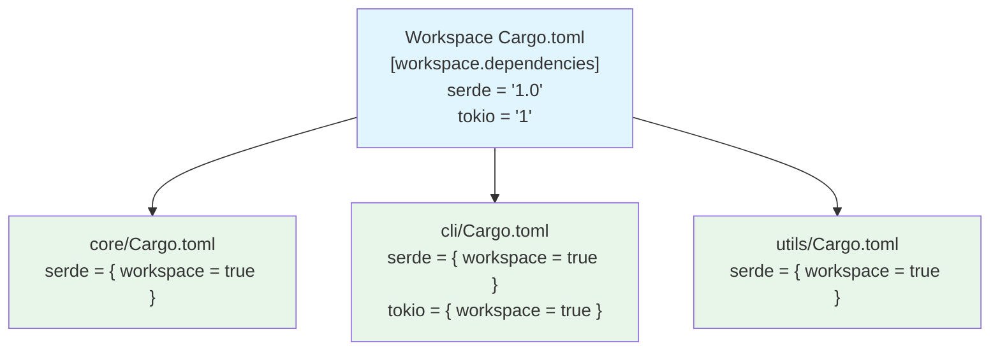

# Cargo Workspaces — Managing Multiple Crates 🏗️

> **"A workspace is a set of packages that share the same Cargo.lock and output directory."**
> — *The Cargo Book*

---

## Table of Contents

- [What Is a Workspace?](#what-is-a-workspace)
- [When to Use Workspaces](#when-to-use-workspaces)
- [Creating a Workspace](#creating-a-workspace)
- [Workspace Cargo.toml](#workspace-cargotoml)
- [Adding Members](#adding-members)
- [Sharing Dependencies](#sharing-dependencies)
- [Running Commands Across Members](#running-commands-across-members)
- [Inter-Crate Dependencies](#inter-crate-dependencies)
- [Workspace Layout](#workspace-layout)
- [Common Mistakes](#common-mistakes)
- [Try It Yourself](#try-it-yourself)
- [Summary](#summary)

---

## What Is a Workspace?

A **workspace** is a way to manage multiple related Rust packages (crates) in a single repository. All crates in a workspace share:

- A single `Cargo.lock` file (consistent dependency versions)
- A common `target/` directory (shared compilation cache)
- A root `Cargo.toml` that ties everything together

```
 Without workspace:                With workspace:
 
 repo/                             repo/
 ├── app/                          ├── Cargo.toml    ← workspace root
 │   ├── Cargo.toml                ├── Cargo.lock    ← shared!
 │   ├── Cargo.lock  ← separate   ├── target/       ← shared!
 │   ├── target/     ← separate   │
 │   └── src/                      ├── app/
 ├── core-lib/                     │   ├── Cargo.toml
 │   ├── Cargo.toml                │   └── src/
 │   ├── Cargo.lock  ← separate   ├── core-lib/
 │   ├── target/     ← separate   │   ├── Cargo.toml
 │   └── src/                      │   └── src/
 └── cli/                          └── cli/
     ├── Cargo.toml                    ├── Cargo.toml
     ├── Cargo.lock  ← separate        └── src/
     ├── target/     ← separate
     └── src/
                                    3 lock files → 1
 Duplicated builds!                 3 target dirs → 1
 Version mismatches possible!       Consistent versions!
```

---

## When to Use Workspaces

Workspaces are ideal when you have:

### 1. A Library + Binary Combo

```
 ┌─────────────────────────────────────┐
 │  my-tool (workspace)                │
 │                                     │
 │  ┌──────────┐   ┌──────────────┐   │
 │  │ my-lib   │   │ my-tool-cli  │   │
 │  │ (library)│──→│ (binary)     │   │
 │  └──────────┘   └──────────────┘   │
 │                                     │
 │  Library has the logic              │
 │  CLI wraps it for users             │
 └─────────────────────────────────────┘
```

### 2. Microservice Architecture

```
 ┌─────────────────────────────────────────────┐
 │  my-services (workspace)                     │
 │                                              │
 │  ┌────────┐  ┌────────┐  ┌────────────┐    │
 │  │  api   │  │ worker │  │  shared    │    │
 │  │ server │  │ service│  │  types &   │    │
 │  └───┬────┘  └───┬────┘  │  utilities │    │
 │      │           │        └─────┬──────┘    │
 │      └───────────┴──────────────┘           │
 │                                              │
 │  Multiple services sharing common code       │
 └─────────────────────────────────────────────┘
```

### 3. Plugin Systems

Multiple crates that share a common interface but have separate implementations.

---

## Creating a Workspace

**Step 1:** Create the workspace root directory and its `Cargo.toml`:

```bash
mkdir my_workspace
cd my_workspace
```

Create `Cargo.toml` with workspace configuration:

```toml
# my_workspace/Cargo.toml
[workspace]
members = [
    "core",
    "cli",
]
resolver = "2"  # recommended for all new workspaces
```

**Step 2:** Create the member crates:

```bash
cargo new core --lib
cargo new cli
```

**Step 3:** Verify the structure:

```
my_workspace/
├── Cargo.toml          # workspace root — no [package] section!
├── Cargo.lock          # shared lock file
├── target/             # shared build directory
├── core/
│   ├── Cargo.toml      # [package] for the core library
│   └── src/
│       └── lib.rs
└── cli/
    ├── Cargo.toml      # [package] for the CLI binary
    └── src/
        └── main.rs
```

---

## Workspace Cargo.toml

The workspace root `Cargo.toml` is special — it has a `[workspace]` section but typically **no** `[package]` section:

```toml
# Root Cargo.toml — this is the WORKSPACE manifest
[workspace]
members = [
    "core",           # path to first member
    "cli",            # path to second member
    "utils",          # path to third member
]
resolver = "2"

# Optional: shared dependencies for all members
[workspace.dependencies]
serde = { version = "1.0", features = ["derive"] }
tokio = { version = "1", features = ["full"] }
```

### Members Can Use Globs

```toml
[workspace]
members = [
    "crates/*",       # all directories under crates/
    "tools/*",        # all directories under tools/
]
```

### Excluding Members

```toml
[workspace]
members = ["crates/*"]
exclude = ["crates/experimental"]  # skip this one
```

---

## Adding Members

Each member has its own `Cargo.toml` with a `[package]` section:

```toml
# core/Cargo.toml
[package]
name = "my-core"
version = "0.1.0"
edition = "2021"

[dependencies]
# Can reference workspace-level dependencies
serde = { workspace = true }
```

```toml
# cli/Cargo.toml
[package]
name = "my-cli"
version = "0.1.0"
edition = "2021"

[dependencies]
# Depend on the sibling crate
my-core = { path = "../core" }
# Also use workspace dependency
serde = { workspace = true }
```

### Workspace Dependency Inheritance



**Why inherit?** Every member gets the same version of `serde`. No risk of one crate using 1.0 and another using 1.1.

---

## Sharing Dependencies

### Declaring Shared Dependencies

In the workspace root:

```toml
# Root Cargo.toml
[workspace]
members = ["app", "core", "utils"]

[workspace.dependencies]
# Declare versions once at the workspace level
serde = { version = "1.0", features = ["derive"] }
serde_json = "1.0"
log = "0.4"
thiserror = "1.0"
```

### Using Shared Dependencies in Members

```toml
# app/Cargo.toml
[package]
name = "app"
version = "0.1.0"
edition = "2021"

[dependencies]
serde = { workspace = true }         # inherits version and features
serde_json = { workspace = true }
log = { workspace = true }
core = { path = "../core" }

# Can still add member-specific dependencies
clap = "4.0"   # only used by app
```

```toml
# core/Cargo.toml
[package]
name = "core"
version = "0.1.0"
edition = "2021"

[dependencies]
serde = { workspace = true }
thiserror = { workspace = true }
# Doesn't need clap or serde_json
```

### Adding Features on Top of Workspace Dependencies

```toml
# Member Cargo.toml — add extra features
[dependencies]
serde = { workspace = true, features = ["rc"] }  # adds "rc" feature
```

---

## Running Commands Across Members

From the workspace root, Cargo commands affect all members:

```bash
# Build everything in the workspace
cargo build

# Test everything
cargo test

# Check everything (faster than build)
cargo check

# Run a specific binary
cargo run -p my-cli

# Test a specific crate
cargo test -p my-core

# Build a specific crate
cargo build -p my-core
```

### The -p Flag

```
 ┌──────────────────────────────────────────────────────┐
 │  -p (or --package) selects a specific member:        │
 │                                                       │
 │  cargo build              → builds ALL members        │
 │  cargo build -p core      → builds only core          │
 │  cargo test -p cli        → tests only cli            │
 │  cargo run -p cli         → runs cli's binary         │
 │  cargo doc -p core        → generates core's docs     │
 └──────────────────────────────────────────────────────┘
```

### Running Tests

```bash
# All tests in all crates
cargo test

# Only tests in the core crate
cargo test -p my-core

# A specific test in a specific crate
cargo test -p my-core test_name

# Only doc tests
cargo test -p my-core --doc
```

---

## Inter-Crate Dependencies

The most powerful workspace feature: crates can depend on each other using **path dependencies**:

```toml
# cli/Cargo.toml
[dependencies]
my-core = { path = "../core" }    # use the local version
my-utils = { path = "../utils" }
```

### Example: A Complete Workspace

```rust
// core/src/lib.rs
pub struct Task {
    pub id: u32,
    pub title: String,
    pub done: bool,
}

impl Task {
    pub fn new(id: u32, title: &str) -> Self {
        Task {
            id,
            title: title.to_string(),
            done: false,
        }
    }

    pub fn complete(&mut self) {
        self.done = true;
    }
}

pub fn create_task(id: u32, title: &str) -> Task {
    Task::new(id, title)
}
```

```rust
// utils/src/lib.rs
use my_core::Task;

pub fn format_task(task: &Task) -> String {
    let status = if task.done { "[x]" } else { "[ ]" };
    format!("{} #{}: {}", status, task.id, task.title)
}

pub fn format_task_list(tasks: &[Task]) -> String {
    tasks.iter()
        .map(|t| format_task(t))
        .collect::<Vec<_>>()
        .join("\n")
}
```

```rust
// cli/src/main.rs
use my_core::{Task, create_task};
use my_utils::{format_task, format_task_list};

fn main() {
    let mut tasks = vec![
        create_task(1, "Set up workspace"),
        create_task(2, "Add core library"),
        create_task(3, "Build CLI"),
    ];

    tasks[0].complete();
    tasks[1].complete();

    println!("Task List:");
    println!("{}", format_task_list(&tasks));
    println!();
    println!("Individual: {}", format_task(&tasks[2]));
}
```

### Dependency Graph

```
 ┌─────────┐
 │   cli   │──────depends on──────┐
 │ (binary)│                      │
 └────┬────┘                      │
      │                           │
      │ depends on                │
      ▼                           ▼
 ┌─────────┐              ┌─────────┐
 │  utils  │──depends on──│  core   │
 │  (lib)  │              │  (lib)  │
 └─────────┘              └─────────┘
```

---

## Workspace Layout

Here's the complete layout for a real-world workspace:

```
 my_project/
 ├── Cargo.toml              ← workspace manifest
 ├── Cargo.lock              ← shared (committed to git)
 ├── target/                 ← shared build artifacts
 ├── README.md
 │
 ├── core/                   ← shared library
 │   ├── Cargo.toml
 │   └── src/
 │       ├── lib.rs
 │       ├── models.rs
 │       └── traits.rs
 │
 ├── server/                 ← web server binary
 │   ├── Cargo.toml
 │   └── src/
 │       ├── main.rs
 │       ├── routes.rs
 │       └── handlers.rs
 │
 ├── cli/                    ← command-line tool
 │   ├── Cargo.toml
 │   └── src/
 │       └── main.rs
 │
 └── tests/                  ← integration tests (optional workspace member)
     ├── Cargo.toml
     └── src/
         └── lib.rs
```

### The Shared target/ Directory

All workspace members compile into the same `target/` directory:

```
 target/
 ├── debug/
 │   ├── my-cli              ← cli binary
 │   ├── my-server           ← server binary
 │   ├── libmy_core.rlib     ← core library
 │   └── deps/               ← all dependencies (shared!)
 └── release/
     ├── my-cli
     ├── my-server
     └── ...
```

This means if `core` and `cli` both depend on `serde`, it's compiled **once** and shared. This saves significant build time.

---

## Common Mistakes

### Mistake 1: Putting [package] in the Workspace Root

```toml
# ❌ Root Cargo.toml should NOT have [package] (usually)
[package]
name = "my-workspace"
version = "0.1.0"

[workspace]
members = ["core", "cli"]
```

The workspace root `Cargo.toml` is typically **only** a workspace manifest. If you want the root to also be a package, it's allowed but unusual.

```toml
# ✅ Clean workspace root
[workspace]
members = ["core", "cli"]
resolver = "2"
```

### Mistake 2: Forgetting Path Dependencies

```toml
# cli/Cargo.toml
[dependencies]
# ❌ This tries to download "my-core" from crates.io!
my-core = "0.1.0"

# ✅ Use path to reference the local workspace member
my-core = { path = "../core" }
```

### Mistake 3: Version Mismatches Without workspace.dependencies

```toml
# ❌ Without workspace.dependencies, versions can drift:
# core/Cargo.toml
serde = "1.0.180"

# cli/Cargo.toml
serde = "1.0.193"   # different version!
```

```toml
# ✅ With workspace.dependencies, versions are centralized:
# Root Cargo.toml
[workspace.dependencies]
serde = "1.0.193"

# Both members:
serde = { workspace = true }  # same version guaranteed
```

### Mistake 4: Running cargo Commands in the Wrong Directory

```bash
# ❌ Inside a member directory — may not find workspace context
cd cli/
cargo build  # builds only cli, might miss workspace config

# ✅ From workspace root — full workspace context
cd my_workspace/
cargo build -p my-cli  # explicit and reliable
```

### Mistake 5: Circular Dependencies Between Members

```
 ❌ This won't work:
 
 core depends on utils
 utils depends on core    ← circular!
```

Cargo will give an error. Extract shared types into a third crate if needed.

---

## Try It Yourself

### Exercise 1: Create a Basic Workspace

Set up a workspace with a library crate and a binary crate:

```bash
mkdir todo_workspace && cd todo_workspace
```

Create the workspace `Cargo.toml`:

```toml
[workspace]
members = ["todo-core", "todo-cli"]
resolver = "2"
```

```bash
cargo new todo-core --lib
cargo new todo-cli
```

Add to `todo-cli/Cargo.toml`:

```toml
[dependencies]
todo-core = { path = "../todo-core" }
```

Implement a `Task` struct in `todo-core` and use it in `todo-cli`.

### Exercise 2: Add Shared Dependencies

Add `serde` as a workspace-level dependency:

```toml
# Root Cargo.toml
[workspace.dependencies]
serde = { version = "1.0", features = ["derive"] }
serde_json = "1.0"
```

Use `serde = { workspace = true }` in both members. Serialize tasks to JSON in the CLI.

### Exercise 3: Add a Third Member

Add a `todo-web` binary crate to the workspace that serves tasks over HTTP (or just prints them formatted differently). All three crates should depend on `todo-core`.

```
todo_workspace/
├── Cargo.toml
├── todo-core/    ← shared library
├── todo-cli/     ← command-line interface
└── todo-web/     ← web interface (new!)
```

---

## Summary

| Concept | Description |
|---------|-------------|
| **Workspace** | A collection of packages that share Cargo.lock and target/ |
| **Workspace root** | The directory with `[workspace]` in Cargo.toml |
| **Members** | The individual packages listed in `members = [...]` |
| **Shared Cargo.lock** | All members use the same dependency versions |
| **Shared target/** | Compilation is shared, saving disk and time |
| **`-p` flag** | Select a specific package for cargo commands |
| **Path dependencies** | `{ path = "../sibling" }` to depend on workspace members |
| **workspace.dependencies** | Centralize dependency versions for all members |
| **`{ workspace = true }`** | Inherit a dependency from the workspace root |
| **No circular deps** | Members cannot have circular dependency chains |

### Key Takeaway

> Workspaces let you manage a monorepo of related Rust crates. They ensure consistent dependency versions, share compilation output, and let crates depend on each other with path references. Use workspaces whenever you have more than one crate that belongs together — it's how most real-world Rust projects are organized.

---

<p align="center">
  <strong>Tutorial 6 of 7 — Stage 10: Modules & Crates</strong>
</p>

<p align="center">
  <a href="./05-splitting-into-files.md">← Previous: Splitting Into Files</a> | <a href="./07-publishing-crates.md">Next: Publishing to crates.io →</a>
</p>
