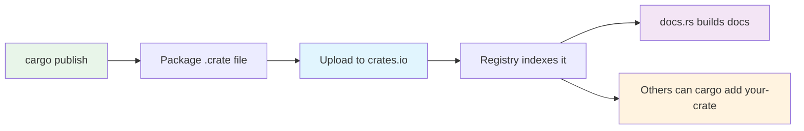
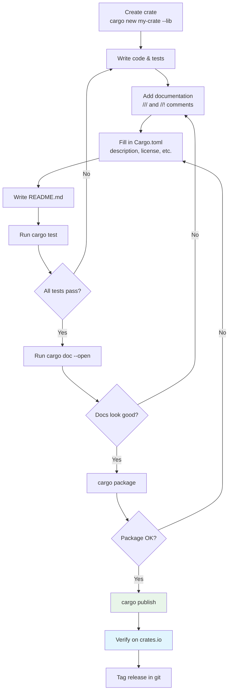

# Publishing to crates.io — Sharing with the World 🌍

> **"Making useful libraries available to the Rust community is one of the most rewarding things you can do as a Rustacean."**
> — *The Cargo Book*

---

## Table of Contents

- [What Is crates.io?](#what-is-cratesio)
- [Getting Started](#getting-started)
- [Preparing Your Crate](#preparing-your-crate)
- [Documentation with Doc Comments](#documentation-with-doc-comments)
- [Doc-Tests](#doc-tests)
- [Semantic Versioning](#semantic-versioning)
- [Publishing Your Crate](#publishing-your-crate)
- [After Publishing](#after-publishing)
- [Yanking Versions](#yanking-versions)
- [The Publish Workflow](#the-publish-workflow)
- [Good Crate Practices](#good-crate-practices)
- [Common Mistakes](#common-mistakes)
- [Try It Yourself](#try-it-yourself)
- [Summary](#summary)

---

## What Is crates.io?

**crates.io** is Rust's official package registry — the central place where Rust developers share their libraries. It's equivalent to:

| Language | Registry |
|----------|----------|
| Rust | crates.io |
| JavaScript | npmjs.com |
| Python | PyPI (pypi.org) |
| Ruby | RubyGems (rubygems.org) |
| Java | Maven Central |

```
 Your computer                    crates.io                  Other developers
 ┌──────────────┐   cargo pub   ┌──────────────┐   cargo    ┌──────────────┐
 │  my_crate    │──────lish───→│              │←──add─────│              │
 │  src/lib.rs  │               │  Registry    │            │  their_app   │
 │  Cargo.toml  │               │  of crates   │────────────│  Cargo.toml  │
 └──────────────┘               │              │  download  │  depends on  │
                                 └──────────────┘            │  my_crate    │
                                       │                     └──────────────┘
                                       ▼
                                 ┌──────────────┐
                                 │   docs.rs    │
                                 │  auto-gen    │
                                 │  docs for    │
                                 │  every crate │
                                 └──────────────┘
```

As of 2025, crates.io hosts over **150,000 crates** with billions of downloads.

---

## Getting Started

### Step 1: Create a crates.io Account

1. Go to [crates.io](https://crates.io)
2. Click "Log in with GitHub"
3. Authorize the crates.io application

### Step 2: Get Your API Token

1. Go to [crates.io/settings/tokens](https://crates.io/settings/tokens)
2. Click "New Token"
3. Give it a name like "my-laptop"
4. Copy the token

### Step 3: Log In from the Terminal

```bash
cargo login your-api-token-here
# This saves the token to ~/.cargo/credentials.toml
```

You only need to do this once per computer. The token is stored locally and used for all future publishes.

---

## Preparing Your Crate

Before publishing, your `Cargo.toml` needs specific fields:

### Required Fields

```toml
[package]
name = "my-awesome-crate"       # Must be unique on crates.io
version = "0.1.0"               # Semantic version
edition = "2021"                 # Rust edition
description = "A brief description of what this crate does"  # REQUIRED
license = "MIT OR Apache-2.0"   # REQUIRED — SPDX expression
```

### Recommended Fields

```toml
[package]
name = "my-awesome-crate"
version = "0.1.0"
edition = "2021"
authors = ["Your Name <you@example.com>"]
description = "A crate that does amazing things with data"
license = "MIT OR Apache-2.0"
repository = "https://github.com/username/my-awesome-crate"
homepage = "https://github.com/username/my-awesome-crate"
documentation = "https://docs.rs/my-awesome-crate"
readme = "README.md"
keywords = ["data", "parser", "fast"]     # up to 5
categories = ["data-structures"]          # from crates.io categories list
rust-version = "1.70"                     # minimum supported Rust version
exclude = ["tests/fixtures/*", ".github/*"]  # files to exclude from package
```

### Anatomy of a Publishable Crate

```
 my-awesome-crate/
 ├── Cargo.toml          ← Complete metadata
 ├── README.md           ← Displayed on crates.io
 ├── LICENSE-MIT         ← License file
 ├── LICENSE-APACHE      ← Dual license (common in Rust)
 ├── CHANGELOG.md        ← Version history
 ├── src/
 │   ├── lib.rs          ← Crate root with //! docs
 │   ├── parser.rs       ← Module files
 │   └── types.rs
 ├── examples/
 │   └── basic.rs        ← cargo run --example basic
 ├── benches/
 │   └── benchmark.rs    ← cargo bench
 └── tests/
     └── integration.rs  ← cargo test
```

---

## Documentation with Doc Comments

Rust has two kinds of doc comments:

### `///` — Documents the Next Item

```rust
/// A 2D point in Cartesian coordinates.
///
/// # Examples
///
/// ```
/// use my_crate::Point;
///
/// let p = Point::new(3.0, 4.0);
/// assert_eq!(p.distance_from_origin(), 5.0);
/// ```
pub struct Point {
    /// The x-coordinate.
    pub x: f64,
    /// The y-coordinate.
    pub y: f64,
}

impl Point {
    /// Creates a new `Point` at the given coordinates.
    ///
    /// # Arguments
    ///
    /// * `x` - The x-coordinate
    /// * `y` - The y-coordinate
    ///
    /// # Examples
    ///
    /// ```
    /// use my_crate::Point;
    ///
    /// let origin = Point::new(0.0, 0.0);
    /// assert_eq!(origin.x, 0.0);
    /// assert_eq!(origin.y, 0.0);
    /// ```
    pub fn new(x: f64, y: f64) -> Self {
        Point { x, y }
    }

    /// Calculates the distance from this point to the origin (0, 0).
    ///
    /// Uses the Pythagorean theorem: `sqrt(x^2 + y^2)`.
    ///
    /// # Examples
    ///
    /// ```
    /// use my_crate::Point;
    ///
    /// let p = Point::new(3.0, 4.0);
    /// assert!((p.distance_from_origin() - 5.0).abs() < f64::EPSILON);
    /// ```
    pub fn distance_from_origin(&self) -> f64 {
        (self.x * self.x + self.y * self.y).sqrt()
    }
}
```

### `//!` — Documents the Enclosing Item (Module/Crate)

```rust
//! # My Awesome Crate
//!
//! `my_awesome_crate` provides utilities for working with 2D geometry.
//!
//! ## Quick Start
//!
//! ```
//! use my_awesome_crate::Point;
//!
//! let a = Point::new(0.0, 0.0);
//! let b = Point::new(3.0, 4.0);
//! println!("Distance from origin: {}", b.distance_from_origin());
//! ```
//!
//! ## Features
//!
//! - Create and manipulate 2D points
//! - Calculate distances
//! - Zero dependencies

pub mod point;
pub use point::Point;
```

### Common Doc Sections

```rust
/// Short one-line description.
///
/// Longer description that can span
/// multiple paragraphs.
///
/// # Examples
///
/// ```
/// // Runnable example code
/// ```
///
/// # Panics
///
/// Describe when this function panics.
///
/// # Errors
///
/// Describe when this function returns an error.
///
/// # Safety
///
/// (For unsafe functions) Describe the safety requirements.
pub fn my_function() {}
```

### Generating Docs Locally

```bash
# Generate and open documentation
cargo doc --open

# Include private items too (useful during development)
cargo doc --document-private-items --open
```

---

## Doc-Tests

One of Rust's best features: code in doc comments is **automatically tested**!

```rust
/// Divides two numbers.
///
/// # Examples
///
/// ```
/// use my_crate::divide;
///
/// assert_eq!(divide(10.0, 2.0), Some(5.0));
/// assert_eq!(divide(10.0, 0.0), None);
/// ```
///
/// # Edge Cases
///
/// ```
/// use my_crate::divide;
///
/// // Very small divisor
/// let result = divide(1.0, 0.001);
/// assert!(result.is_some());
/// ```
pub fn divide(a: f64, b: f64) -> Option<f64> {
    if b == 0.0 { None } else { Some(a / b) }
}
```

Run doc-tests with:

```bash
cargo test --doc
```

### Doc-Test Tricks

```rust
/// ```
/// // Lines starting with # are hidden from docs but still compiled
/// # use my_crate::Point;
/// # fn main() {
/// let p = Point::new(1.0, 2.0);
/// println!("Point: ({}, {})", p.x, p.y);
/// # }
/// ```

/// ```should_panic
/// // This example is expected to panic
/// my_crate::divide_or_panic(1.0, 0.0);
/// ```

/// ```no_run
/// // This compiles but doesn't run (useful for network/file examples)
/// let data = my_crate::fetch_from_server("https://example.com");
/// ```

/// ```ignore
/// // This is completely ignored by the test runner
/// // Useful for pseudocode or incomplete examples
/// let magic = do_something_complex();
/// ```
```

---

## Semantic Versioning

Rust uses **Semantic Versioning** (semver) for all crate versions:

```
 version = "1.2.3"
              │ │ │
              │ │ └── PATCH: bug fixes (backward compatible)
              │ └──── MINOR: new features (backward compatible)
              └────── MAJOR: breaking changes
```

### The Rules

```
 ┌─────────────────────────────────────────────────────────────┐
 │  WHEN TO BUMP WHAT                                          │
 │                                                              │
 │  PATCH (0.1.0 → 0.1.1):                                    │
 │    • Bug fixes                                               │
 │    • Performance improvements                                │
 │    • Documentation updates                                   │
 │                                                              │
 │  MINOR (0.1.0 → 0.2.0):                                    │
 │    • New public functions, structs, or methods               │
 │    • New optional features                                   │
 │    • Deprecations (old API still works)                      │
 │                                                              │
 │  MAJOR (0.1.0 → 1.0.0 or 1.0.0 → 2.0.0):                  │
 │    • Removing public items                                   │
 │    • Changing function signatures                            │
 │    • Changing behavior in breaking ways                      │
 │    • Changing minimum Rust version                           │
 └─────────────────────────────────────────────────────────────┘
```

### Pre-1.0 Versions

Versions below 1.0.0 have special rules:

```
 0.x.y versions (pre-1.0):
 
 • 0.1.0 → 0.2.0: MINOR bump = breaking change allowed
 • 0.1.0 → 0.1.1: PATCH bump = backward compatible only
 
 Pre-1.0 crates are considered "unstable" —
 the API may change between minor versions.
```

### How Cargo Interprets Version Requirements

```toml
[dependencies]
# "Compatible with" (caret, the default):
serde = "1.0"         # means >=1.0.0, <2.0.0
serde = "1.2.3"       # means >=1.2.3, <2.0.0
serde = "0.9"         # means >=0.9.0, <0.10.0

# Exact:
serde = "=1.0.193"    # exactly this version

# Range:
serde = ">=1.0, <1.5" # at least 1.0, less than 1.5

# Tilde (patch-level only):
serde = "~1.0.3"      # means >=1.0.3, <1.1.0

# Wildcard:
serde = "1.*"          # means >=1.0.0, <2.0.0
```

---

## Publishing Your Crate

### Pre-Publish Checklist

```
 ┌────────────────────────────────────────────┐
 │  BEFORE YOU PUBLISH:                       │
 │                                             │
 │  □ Cargo.toml has description & license     │
 │  □ All tests pass (cargo test)              │
 │  □ Doc-tests pass (cargo test --doc)        │
 │  □ Docs look good (cargo doc --open)        │
 │  □ No secrets in the code                   │
 │  □ README.md exists and is helpful          │
 │  □ License file exists                      │
 │  □ Version number is correct                │
 │  □ cargo package succeeds (dry run)         │
 └────────────────────────────────────────────┘
```

### Step-by-Step Publishing

```bash
# 1. Run all tests
cargo test

# 2. Check that packaging works (dry run)
cargo package --list    # see what files will be included
cargo package           # create the .crate file locally

# 3. Publish!
cargo publish

# 4. Verify on crates.io
# Visit: https://crates.io/crates/your-crate-name
```

### What Happens When You Publish



---

## After Publishing

### docs.rs Automatic Documentation

After publishing, [docs.rs](https://docs.rs) automatically builds and hosts your documentation:

```
 https://docs.rs/your-crate-name/
 https://docs.rs/your-crate-name/0.1.0/   ← specific version
```

Everything you wrote in `///` and `//!` comments becomes searchable, browsable documentation — for free!

### Users Can Now Depend on Your Crate

```toml
# In someone else's Cargo.toml:
[dependencies]
your-crate-name = "0.1"

# Or with cargo add:
# cargo add your-crate-name
```

### Publishing a New Version

When you have improvements:

```bash
# 1. Update version in Cargo.toml
#    version = "0.1.0" → "0.1.1" (bug fix)
#    version = "0.1.0" → "0.2.0" (new feature)

# 2. Update CHANGELOG.md

# 3. Commit and tag
git commit -am "Release v0.1.1"
git tag v0.1.1

# 4. Publish
cargo publish

# 5. Push the tag
git push && git push --tags
```

---

## Yanking Versions

If you publish a version with a serious bug, you can **yank** it:

```bash
# Yank a specific version
cargo yank --version 0.1.1

# Undo a yank
cargo yank --version 0.1.1 --undo
```

**What yanking does:**
- Existing projects that already depend on 0.1.1 **continue to work** (their Cargo.lock still references it)
- New projects **cannot** add a dependency on the yanked version
- It's a soft delete — the code is still on crates.io, just not selectable for new projects

```
 ┌────────────────────────────────────────────────────────────┐
 │  YANKING IS NOT DELETION                                    │
 │                                                              │
 │  Published crates are PERMANENT on crates.io.                │
 │  You cannot delete a published version.                      │
 │  You cannot re-publish the same version with different code. │
 │                                                              │
 │  Yank = "don't let new projects use this version"           │
 │  It does NOT remove the version from the registry.           │
 └────────────────────────────────────────────────────────────┘
```

---

## The Publish Workflow

Here's the complete workflow from creating a crate to publishing it:



---

## Good Crate Practices

### 1. Write a Great README

Your README is the first thing people see on crates.io. Include:

```markdown
# my-crate

Short description of what it does.

## Installation

```toml
[dependencies]
my-crate = "0.1"
```

## Quick Start

```rust
use my_crate::Widget;

let w = Widget::new();
w.do_thing();
```

## License

MIT OR Apache-2.0
```

### 2. Choose a Good Name

```
 ✅ Good names:
 • serde (serialize/deserialize)
 • tokio (Tokyo + I/O)
 • clap (Command Line Argument Parser)
 • rand (random)

 ❌ Bad names:
 • my-utils (too generic)
 • bob-stuff (not descriptive)
 • super-cool-library (unprofessional)
 • a (too short)
```

### 3. Use the Dual License

Most Rust crates use the dual MIT/Apache-2.0 license (the same as Rust itself):

```toml
license = "MIT OR Apache-2.0"
```

Include both `LICENSE-MIT` and `LICENSE-APACHE` files.

### 4. Keep Your Public API Small

```rust
// ✅ Only expose what users need
pub fn parse(input: &str) -> Result<Data, Error> { ... }
pub struct Data { ... }
pub struct Error { ... }

// Keep implementation details private
fn tokenize(input: &str) -> Vec<Token> { ... }
fn validate(tokens: &[Token]) -> bool { ... }
struct Token { ... }
```

### 5. Add Examples

```
examples/
├── basic.rs         # cargo run --example basic
├── advanced.rs      # cargo run --example advanced
└── with_config.rs   # cargo run --example with_config
```

```rust
// examples/basic.rs
use my_crate::Parser;

fn main() {
    let parser = Parser::new();
    let result = parser.parse("hello world");
    println!("Parsed: {result:?}");
}
```

### 6. Use Categories and Keywords

```toml
# Keywords help people SEARCH for your crate
keywords = ["parser", "json", "fast", "zero-copy"]

# Categories help people BROWSE crates.io
categories = ["parsing", "encoding"]
```

Browse available categories at [crates.io/categories](https://crates.io/categories).

---

## Common Mistakes

### Mistake 1: Missing Required Fields

```bash
$ cargo publish
error: the following fields are required:
  - description
  - license (or license-file)
```

Fix: add `description` and `license` to `Cargo.toml`.

### Mistake 2: Name Already Taken

```bash
$ cargo publish
error: crate `my-crate` already exists on crates.io
```

Names are first-come, first-served. Check availability at crates.io before committing to a name. Use `cargo search my-crate` to check.

### Mistake 3: Publishing Secrets

```rust
// ❌ NEVER publish code with real secrets
const API_KEY: &str = "sk-1234567890abcdef";
```

Use environment variables or config files instead. Add sensitive files to `.gitignore` and use `exclude` in `Cargo.toml`:

```toml
[package]
exclude = [".env", "secrets/", "*.key"]
```

### Mistake 4: Breaking Semver

```toml
# Version 0.1.0 had this function:
pub fn process(data: &str) -> String

# Version 0.1.1 changed the signature — BREAKING!
pub fn process(data: &str, options: &Options) -> Result<String, Error>
```

Changing a public function signature is a **breaking change** and requires a MAJOR version bump (or MINOR if pre-1.0).

### Mistake 5: No Documentation

```rust
// ❌ No docs — users have to read your source code
pub fn frobnicate(x: &mut Vec<u8>, n: usize) -> bool {
    // ... 50 lines of code ...
}

// ✅ With docs — users understand immediately
/// Processes the first `n` bytes of `x` using the frobnication algorithm.
///
/// Returns `true` if the buffer was modified, `false` if no changes were needed.
///
/// # Examples
///
/// ```
/// let mut data = vec![1, 2, 3, 4, 5];
/// assert!(my_crate::frobnicate(&mut data, 3));
/// ```
pub fn frobnicate(x: &mut Vec<u8>, n: usize) -> bool {
    // ...
}
```

---

## Try It Yourself

### Exercise 1: Write Complete Documentation

Add `///` documentation to this module, including examples in every public item:

```rust
//! A simple temperature conversion library.
//!
//! # Examples
//!
//! ```
//! use temp_convert::{celsius_to_fahrenheit, fahrenheit_to_celsius};
//!
//! let f = celsius_to_fahrenheit(100.0);
//! assert_eq!(f, 212.0);
//!
//! let c = fahrenheit_to_celsius(32.0);
//! assert_eq!(c, 0.0);
//! ```

/// Converts a temperature from Celsius to Fahrenheit.
///
/// # Formula
///
/// `F = C * 9/5 + 32`
///
/// # Examples
///
/// ```
/// use temp_convert::celsius_to_fahrenheit;
///
/// assert_eq!(celsius_to_fahrenheit(0.0), 32.0);
/// assert_eq!(celsius_to_fahrenheit(100.0), 212.0);
/// assert_eq!(celsius_to_fahrenheit(-40.0), -40.0);
/// ```
pub fn celsius_to_fahrenheit(celsius: f64) -> f64 {
    celsius * 9.0 / 5.0 + 32.0
}

/// Converts a temperature from Fahrenheit to Celsius.
///
/// # Formula
///
/// `C = (F - 32) * 5/9`
///
/// # Examples
///
/// ```
/// use temp_convert::fahrenheit_to_celsius;
///
/// assert_eq!(fahrenheit_to_celsius(32.0), 0.0);
/// assert_eq!(fahrenheit_to_celsius(212.0), 100.0);
/// assert_eq!(fahrenheit_to_celsius(-40.0), -40.0);
/// ```
pub fn fahrenheit_to_celsius(fahrenheit: f64) -> f64 {
    (fahrenheit - 32.0) * 5.0 / 9.0
}

/// Converts Celsius to Kelvin.
///
/// # Panics
///
/// Panics if the result would be below absolute zero (below -273.15 C).
///
/// # Examples
///
/// ```
/// use temp_convert::celsius_to_kelvin;
///
/// assert_eq!(celsius_to_kelvin(0.0), 273.15);
/// assert_eq!(celsius_to_kelvin(100.0), 373.15);
/// ```
///
/// ```should_panic
/// use temp_convert::celsius_to_kelvin;
///
/// celsius_to_kelvin(-300.0); // panics: below absolute zero
/// ```
pub fn celsius_to_kelvin(celsius: f64) -> f64 {
    let kelvin = celsius + 273.15;
    assert!(kelvin >= 0.0, "Temperature below absolute zero");
    kelvin
}
```

Run `cargo test --doc` to verify all doc-tests pass, then `cargo doc --open` to preview.

### Exercise 2: Create a Publishable Cargo.toml

Write a complete `Cargo.toml` for a hypothetical crate called `text-stats` that analyzes text:

```toml
[package]
name = "text-stats"
version = "0.1.0"
edition = "2021"
authors = ["Your Name <you@example.com>"]
description = "Fast text analysis: word count, character frequency, readability scores"
license = "MIT OR Apache-2.0"
repository = "https://github.com/username/text-stats"
homepage = "https://github.com/username/text-stats"
documentation = "https://docs.rs/text-stats"
readme = "README.md"
keywords = ["text", "analysis", "statistics", "nlp"]
categories = ["text-processing"]
rust-version = "1.70"
exclude = [".github/*", "tests/fixtures/large_*"]

[dependencies]
unicode-segmentation = "1.10"

[dev-dependencies]
criterion = "0.5"
```

### Exercise 3: Dry Run a Publish

Create a small library crate and go through the full publish preparation (without actually publishing):

```bash
cargo new practice-crate --lib
cd practice-crate
# Edit src/lib.rs with documentation
# Edit Cargo.toml with all required fields
cargo test
cargo test --doc
cargo doc --open
cargo package --list   # see what would be included
cargo package          # create the .crate file
cargo publish --dry-run  # simulate publishing
```

---

## Summary

| Concept | Description |
|---------|-------------|
| **crates.io** | Rust's official package registry for sharing crates |
| **cargo login** | Authenticate with your crates.io API token |
| **`///` doc comments** | Document the next item (function, struct, etc.) |
| **`//!` doc comments** | Document the enclosing module or crate |
| **Doc-tests** | Code in doc comments is automatically tested by `cargo test` |
| **Semantic versioning** | MAJOR.MINOR.PATCH — rules for when to bump each |
| **cargo package** | Create a .crate file (dry run for publishing) |
| **cargo publish** | Upload your crate to crates.io |
| **cargo yank** | Prevent new projects from depending on a specific version |
| **docs.rs** | Automatic documentation hosting for every published crate |
| **Permanent** | Published versions cannot be deleted or overwritten |
| **README.md** | Displayed on the crates.io page for your crate |

### Key Takeaway

> Publishing a crate is permanent and public — take the time to write good documentation, choose the right version, and follow semver. Your `///` doc comments become your crate's documentation on docs.rs, and your doc-tests ensure the examples always work. A well-documented crate with a clear README and proper metadata is a gift to the Rust community.

---

<p align="center">
  <strong>Tutorial 7 of 7 — Stage 10: Modules & Crates</strong>
</p>

<p align="center">
  <a href="./06-workspaces.md">← Previous: Cargo Workspaces</a> | <a href="../11-testing/">Next: Stage 11 — Testing →</a>
</p>
